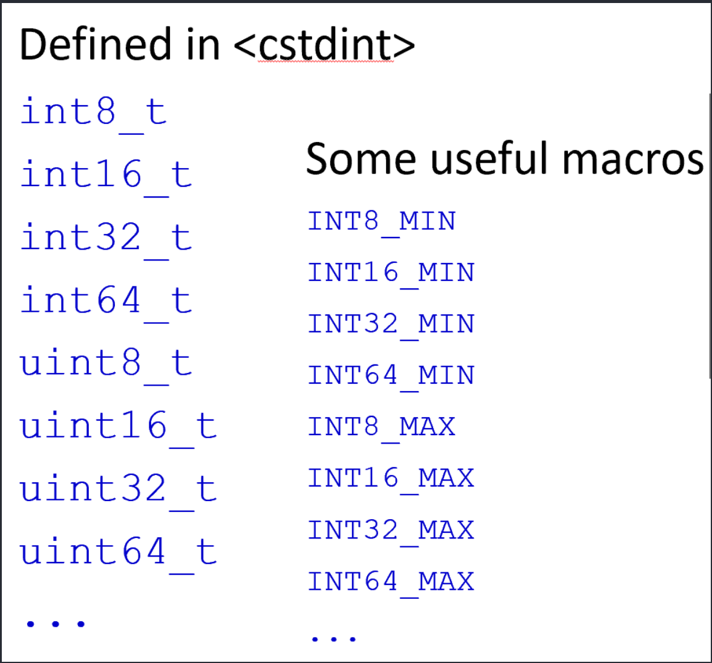

# C/C++：从基础语法到优化策略
[**视频地址**](https://www.bilibili.com/video/BV1Vf4y1P7pq)
[**项目GitHub**](https://github.com/ShiqiYu/CPP)
[**Ubuntu Mirror**](https://mirrors.sustech.edu.cn/help/ubuntu.html#introduction)

## Lecture 1


### gcc 常用代码
```bash
g++ Test.cpp --std=c++11 -o Test&&./Test
```
## Lecture 2

### size_t

* Computer memory keeps increasing

* 32-bit int was enough in the past to for data length

* But now it is not.

* Unsigned integer

* Type of the result of sizeof operator

* Can store the maximum size of a theoretically possible object of any type

* 32-bit, or 64-bit

### Fixed width integer types (since C++11)
<!--  -->

#### intmax.cpp

```cpp
#include <iostream>
#include <cstdint>
using namespace std;
int main()
{
    cout << "INT8_MAX=" << INT8_MAX << endl;
}
```
* other examples

```cpp
6.02e23L // long double 
6.02e23f // float 
6.02e23 // double
```
* auto is placeholder type specifier. 
* The type of the variable will be deduced from its initializer.
```cpp
auto a = 2; // type of a is int
auto bc = 2.3; // type of b is double
auto c ; //valid in C, error in C++
auto d = a * 1.2; 
auto a = 2; // type of a is int
```
* Question: will a be converted to a double type variable?
```cpp
a = 2.3;
```
* No! 2.3 will be converted to a int 2, then assigned to a
### Data type conversions
#### conversion.cpp
```cpp
int num_int1 = 9; // initializing an int value to num_int1
int num_int2 = 'C'; // implicit conversion 隐式类型转换 将8位转换为32位
int num_int3 = (int)'C'; // explicit conversion, C-style
int num_int4 = int('C'); // explicit conversion, function style
int num_int5 = 2.8; //implicit conversion
float num_float = 2.3; //implicit conversion from double to float
short num_short = 650000; 
```
## Lecture 3
### Non-Boolean Expressions
* They will be converted to bool implicitly if it is feasible.
```cpp
float count = 0.2f;
if (count) //not recommend to use a float-point number
    cout << "There are some." << endl;
```
* Pointers are also frequently used as conditions
```cpp
int * p = new int[1024];
if (!p) // if(p == NULL)
    cout << "Memory allocation failed." << endl;
```
## Lecture 4
### Arrays of unknown size
* The number is not specified in the declaration. 
```cpp
int num_array[ ] = {1, 2, 3, 4}; // the type of num_array is "array of 4 int"
```
* The arguments of a function
```cpp
float array_sum(float values[], size_t length);
float array_sum(float *values, size_t length);
```
### Array-style strings
* An array-style string (null-terminated strings/arrays of characters) is a series of characters stored in bytes in memory.

* This kind of strings can be declared as follows

#### initchar.cpp

  数组类型的字符串要用\0来结束
```cpp
char rabbit[16] = {'P', 'e', 't', 'e', 'r'};
char bad_pig[9] = {'P', 'e', 'p', 'p', 'a', ' ', 'P', 'i', 'g’}; //a bad one!
char good_pig[10] = {'P', 'e', 'p', 'p', 'a', ' ', 'P', 'i', 'g', '\0'};
```
* size_t strlen( const char *str );
Returns the number of characters, the first NULL will not be included.
```cpp
char name[10] = {'Y', 'u', '\0', 'S', '.', '0'};
cout << strlen(name) << endl;
```
* 字符串的其它特点
```cpp
#include <iostream>
using namespace std;
int main()
{
    int num_array1[5] = {0,1}; // fixed length array, initialized to {0,1,0,0,0}  
    cout << "sizeof(num_array1) = " << sizeof(num_array1) << endl;

    int len = 0;
    while ( len < 10 )
    {
        int num_array2[len]; //variable-length array 不可初始化
        cout << "len = " << len;
        cout << ", sizeof(num_array2)) = " << sizeof(num_array2) << endl;
        len ++;
    }
}
```
* 不检查边界是否超出
```cpp
int num_array[5]; 
for(int idx = -1; idx <= 5; idx++)
    num_array[idx] = idx * idx;
for(int idx = -1; idx <= 5; idx++)
    cout << num_array[idx] << endl;
```
* 多维数组的初始化
```cpp
void init_2d_array(float mat[][], //error
              size_t rows, size_t cols)
void init_2d_array(float mat[][3], 
              size_t rows, size_t cols)
```
#### array_sum.cpp

```cpp
float array_sum(const float values[], size_t length)
{
    float sum = 0.0f;
    for (int i = 0; i < length; i++)
    {
        sum += values[i];
        //values[i] = 0; //error
    }
    return sum;
}

int main()
{
    float values[4] = {1.1f, 2.2f, 3.3f, 4.4f};
    float sum = array_sum(values, 4);
}
```

```cpp
const wchar_t[] s5 = L"ABCD"; 
const char16_t[] s9 = u”ABCD"; //since C++11
const char32_t[] s6 = U”ABCD"; //since C++11
```

### string.h
* Copy
```cpp
char* strcpy( char* dest, const char* src );
// Safer one: count取dest与src的最小值
char *strncpy(char *dest, const char *src, size_t count);
```
* Concatenate: appends a copy of src to dest
```cpp
char *strcat( char *dest, const char *src );
```
* Compare
```cpp
int strcmp( const char *lhs, const char *rhs );
```
### string class

* Null-terminated strings are easy to be out of bound, and to cause problems.
* string class provides functions to manipulate and examinate strings.
```cpp
std::string str1 = "Hello";
std::string str2 = "SUSTech";
std::string result = str1 + ", " + str2;
```
* Different types of strings
```cpp
std::string 
std::wstring 
std::u8string //(C++20)
std::u16string //(C++11)
std::u32string //(C++11)
```
* string类没有越界检查

### struct
```c
struct Student{
    char name[4];
    int born;
    bool male; 
};
struct Student stu;

strcpy(stu.name, "Yu");
stu.born = 2000;
stu.male = true;

struct Student stu = {"Yu", 2000, true};

struct Student students[100];
students[50].born = 2002; 
```

### 求某个点的L1范数
```cpp
#include <iostream>
using namespace std;

enum color {WHITE, BLACK, RED, GREEN, BLUE, YELLOW, NUM_COLORS};
enum datatype {TYPE_INT8=1, TYPE_INT16=2, TYPE_INT32=4, TYPE_INT64=8};

struct Point{
    enum datatype type;
    union {
        std::int8_t data8[3];
        std::int16_t data16[3];
        std::int32_t data32[3];
        std::int64_t data64[3];
    };
};

size_t datawidth(struct Point pt)
{
    return size_t(pt.type) * 3;
}

int64_t l1norm(struct Point pt)
{
    int64_t result = 0;
    switch(pt.type)
    {
        case (TYPE_INT8): 
            result = abs(pt.data8[0]) + abs(pt.data8[1]) + abs(pt.data8[2]);
            break;
        case (TYPE_INT16): 
            result = abs(pt.data16[0]) + abs(pt.data16[1]) + abs(pt.data16[2]);
            break;
        case (TYPE_INT32): 
            result = abs(pt.data32[0]) + abs(pt.data32[1]) + abs(pt.data32[2]);
            break;
        case (TYPE_INT64): 
            result = abs(pt.data64[0]) + abs(pt.data64[1]) + abs(pt.data64[2]);
            break;
    }
    return result;
}

int main()
{
    enum color pen_color = RED;
    pen_color = color(3); //convert int to enum
    cout << "We have " << NUM_COLORS << " pens." << endl;
    //pen_color += 1; //error!
    int color_index = pen_color;
    color_index += 1;
    cout << "color_index = " << color_index << endl;

    //declaration and initialization
    struct Point point1 = {.type=TYPE_INT8, .data8={-2,3,4}};
    struct Point point2 = {.type=TYPE_INT32, .data32={1,-2,3}};
    
    cout << "Data width = " << datawidth(point1) << endl;
    cout << "Data width = " << datawidth(point2) << endl;

    cout << "L1 norm = " << l1norm(point1) << endl;
    cout << "L1 norm = " << l1norm(point2) << endl;

    return 0;
}
```
### typedef
* typedef can create an alias for a type.
* It can be used to replace a possibly complex type name.

```cpp
typedef int myint;

typedef unsigned char vec3b[3];

typedef struct _rgb_struct{
//name _rgb_struct can be omit
    unsigned char r;
    unsigned char g;
    unsigned char b;
} rgb_struct;
myint num = 32;
unsigned char color[3];
vec3b color = {255, 0, 255}; 

rgb_struct rgb = {0, 255, 128};

#if defined(_LP64) 
typedef int wchar_t; 
#else 
typedef long wchar_t; 
#endif
```

## Lecture 5
### Pointers

```cpp
#include<iostream>
using namespace std;
int main()
{
    int num = 10;
    int *p1 = NULL;
    p1 = &num;
    cout<<*p1<<" "<<p1<<endl;
    return 0;
}
```

```cpp
#include <iostream>
#include <cstring>
using namespace std;

struct Student
{
    char name[4];
    int born;
    bool male; 
};

int main()
{
    Student stu = {"Yu", 2000, true};
    Student * pStu = &stu;

    cout << stu.name << " was born in " << stu.born 
         << ". Gender: " << (stu.male ? "male" : "female") << endl;

    strncpy(pStu->name, "Li", 4);
    pStu->born = 2001;
    (*pStu).born = 2002;
    pStu->male = false;

    cout << stu.name << " was born in " << stu.born 
         << ". Gender: " << (stu.male ? "male" : "female") << endl;
    
    printf("Address of stu: %p\n", pStu); //C style
    cout << "Address of stu: " << pStu << endl; //C++ style
    cout << "Address of stu: " << &stu << endl;
    cout << "Address of member name: " << &(pStu->name) << endl;
    cout << "Address of member born: " << &(pStu->born) << endl;
    cout << "Address of member male: " << &(pStu->male) << endl;

    cout << "sizeof(pStu) = " << sizeof(pStu) << endl;
    
    return 0;
}
```

```cpp
int num = 1;
int another = 2;
//You cannot change the value the p1 points to through p1
const int * p1 = &num;
// 不能用指针修改num的值
*p1 = 3; //error
num = 3; //okay
//You cannot change value of p2 (address) p2只能指向num
int * const p2 = &num;
*p2 = 3; //okay
p2 = &another; //error
//You cannot change either of them
const int* const p3 = &num;
```

```cpp
int foo(const char * p)
{
    // the value that p points to cannot be changed
    // play a trick?
    // 不能将const指针赋给普通指针
    char * p2 = p; //syntax error
    //...
    return 0;
}
int numbers[4] = {0, 1, 2, 3};
// 这里增加的是一个元素 不是一个字节
int * p = numbers + 1;
p++;
*p = 20;
*(p-1) = 10;
p[1] = 30;
```

#### Arithmetic.cpp

```cpp
#include <iostream>
using namespace std;
// 宏定义
#define PRINT_ARRAY(array, n) \
for (int idx = 0; idx < (n); idx++) \
    cout << "array[" << idx << "] = " << (array)[idx] << endl;

int main()
{
    int numbers[4] = {0, 1, 2, 3};
    PRINT_ARRAY(numbers, 4)

    int * p = numbers + 1; // point to the element with value 1
    p++; // point to the element with value 2

    cout << "numbers = " << numbers << endl;
    cout << "p = " << p << endl;

    *p = 20; //change 2 to 20
    *(p-1) = 10; //change 1 to 10
    p[1] = 30; //change 3 to 30

    PRINT_ARRAY(numbers, 4)

    return 0;
}
```
### Memoey Allocation

```cpp
//Allocate size bytes of uninitialized storage.
void* malloc( size_t size )
//Allocate 4 bytes and convert the pointer to (int *) explicitly.
int * p1 = (int*) malloc (4);
//Question: 不好 仅针对这个例子没问题 只越界1个字节
int * p1 = (int*) malloc (3);
```
### Memory leak

```cpp
// The dynamically allocated memory must be deallocated explicitly!
void free( void* ptr );
// 此处内存泄漏了
p = (int *) malloc(4 * sizeof(int));
// ...
p = (int *) malloc(8 * sizeof(int));
// ...
free (p);

void foo()
{
    int* p = (int *) malloc( sizeof(int));
    // 释放内存前直接return 函数结束 内存泄漏
    return;
} //memory leak
```

```cpp
#include <stdio.h>
#include <stdlib.h>

void foo()
{
    int* p = (int *) malloc( sizeof(int));
    return;
} //memory leak

int main()
{
    int * p = NULL;
    
    p = (int *) malloc(4 * sizeof(int));
    // some statements
    p = (int *) malloc(8 * sizeof(int));
    // some statements
    free (p);
    // the first memory will not be freed

    for(int i = 0; i < 1024; i++)
    {
        p = (int *) malloc(1024 * 1024 * 1024);
    }
    printf("End\n");

    return 0;
}
// 申请1TB内存并没有崩溃 操作系统作了优化
```

```cpp
// C++风格动态申请内存
//allocate an int, default initializer (do nothing)
int * p1 = new int; 
//allocate an int, initialized to 0
int * p2 = new int();
//allocate an int, initialized to 5
int * p3 = new int(5); 
//allocate an int, initialized to 0
int * p4 = new int{};//C++11 
//allocate an int, initialized to 5
int * p5 = new int {5};//C++11
//allocate a Student object, default initializer
Student * ps1 = new Student;
//allocate a Student object, initialize the members
Student * ps2 = new Student {"Yu", 2020, 1}; //C++11

//allocate 16 int, default initializer (do nothing) 
int * pa1 = new int[16];
//allocate 16 int, zero initialized 
int * pa2 = new int[16]();
//allocate 16 int, zero initialized 
// 花括号里什么都不写，默认置0
int * pa3 = new int[16]{}; //C++11
//allocate 16 int, the first 3 element are initialized to 1,2,3, the rest 0
int * pa4 = new int[16]{1,2,3}; //C++11

//allocate memory for 16 Student objects, default initializer
Student * psa1 = new Student[16];
//allocate memory for 16 Student objects, the first two are explicitly initialized
Student * psa2 = new Student[16]{{"Li", 2000,1}, {"Yu", 2001,1}}; //C++11

//deallocate memory
delete p1;
//deallocate memory
delete ps1;
//deallocate the memory of the array
delete pa1;
//deallocate the memory of the array
delete []pa2;
//deallocate the memory of the array, and call the destructor of the first element
delete psa1;
//deallocate the memory of the array, and call the destructors of all the elements
delete []psa2;

```
## Lecture 6
### Return statement

```cpp
/*The return type can be a fundamental type or a compound type.
Pass by value:
Fundamental types: the value of a constant/variable is copied
Pointers: the address is copied
Structures: the whole structure is copied
float maxa = matrix_max(matA);
*/
Matrix * pMat = create_matrix(4,5);
// 函数需要先检查是否正确 分配内存失败等
Matrix * create_matrix(int rows, int cols)
{
    Matrix * p = new Matrix{rows, cols};
    p->pData = new float[p->rows * p->cols]{1.f, 2.f, 3.f};
    // you should check if the memory is allocated successfully
    // and don’t forget to release the memory
    // 最后记得delete
    return p;
}
// If we have a lot to return
// Such as a matrix addition function (A+B->C)
// A suggested prototype:
// To use references to avoid data copying
// To use const parameters to avoid the input data is modified
// To use non-const reference parameters to receive the output
bool matrix_add(const Matrix & matA, const Matrix & matB, Matrix & matC)
{
    // check the dimensions of the three matrices
    // re-create matC if needed
    // do: matC = matA + matB
    // return true if everything is right
}
```
* 函数参数不要是占空间太大的数组，运行时要拷贝，消耗时间空间
### 内联函数与宏的对比

```cpp
#include <iostream>
using namespace std;

inline float max_function(float a, float b)
{
    if (a > b)
        return a;
    else
        return b;
}

//#define MAX_MACRO(a, b) a>b ? a : b
// 一定要加括号
// 宏容易出现不易发现的错误
// 宏可以适用多种数据类型
#define MAX_MACRO(a, b) (a)>(b) ? (a) : (b)

int main()
{
    int num1 = 20;
    int num2 = 30;
    int maxv = max_function(num1, num2);
    cout << maxv << endl;

    maxv = MAX_MACRO(num1, num2);
    cout << maxv << endl;

    maxv = MAX_MACRO(num1++, num2++);
    cout << maxv << endl;
    cout << "num1=" << num1 << endl;
    cout << "num2=" << num2 << endl;

    num1 = 0xAB09;
    num2 = 0xEF08;
    maxv = MAX_MACRO(num1&0xFF, num2&0xFF);
    cout << maxv << endl;

    return 0;
}
```
### OpenCV 中为了跨平台对内联函数的定义


## Lecture 7
### Function Templates
```cpp
#include <iostream>
#include <typeinfo>
using namespace std;

template<typename T>
T sum(T x, T y)
{
    cout << "The input type is " << typeid(T).name() << endl;
    return x +
     y;
}
```
* Explicitly instantiate
```cpp
template double sum<double>(double, double);
```
### function-pointer
* norm_ptr is a pointer, a function pointer.
* The function should have two float parameters, and returns float.

```cpp
#include <iostream>
#include <cmath>
using namespace std;

float norm_l1(float x, float y); //declaration
float norm_l2(float x, float y); //declaration
float (*norm_ptr)(float x, float y); //norm_ptr is a function pointer

int main()
{
    norm_ptr = norm_l1; //Pointer norm_ptr is pointing to norm_l1
    cout << "L1 norm of (-3, 4) = " << norm_ptr(-3.0f, 4.0f) << endl;

    norm_ptr = &norm_l2; //Pointer norm_ptr is pointing to norm_l2
    cout << "L2 norm of (-3, 4) = " << (*norm_ptr)(-3.0f, 4.0f) << endl;

    return 0;
}

float norm_l1(float x, float y)
{
    return fabs(x) + fabs(y);
}

float norm_l2(float x, float y)
{
    return sqrt(x * x + y * y);
}
```
* A function pointer can be an argument and pass to a function.

```cpp
void qsort( void *ptr, size_t count, size_t size,
int (*comp)(const void *,const void *));
// To sort some customized types, such as 
struct Point;
struct Person;
```
### Recursive Functions

* Pros.
    * Good at tree traversal

    * Less lines of source code
* Cons.
    * Consume more stack memory
    * May be slow.
    * Difficult to implement and debug

### Some Tips on Optimization

* Choose an appropriate algorithm

* Clear and simple code for the compiler to optimize

* Optimize code for memory

* Do not copy large memory

* No printf()/cout in loops

* Table lookup (sin(), cos() ...)
## Lecture 8 C++ with ARM
### 常见指令集
* SIMD, OpenMP
* SIMD: Single instruction, multiple data
* Intel: MMX, SSE, SSE2, AVX, AVX2, AVX512
* ARM: NEON
* RISC-V: RVV(RISC-V Vector Extension)

```bash
cat /proc/cpuinfo
cat /proc/meminfo
uname -a
top
rm a -rf
// 新建一个build文件夹
// 进入后先使用cmake ..
cmake .. 
// 成功后使用make
make 
cmake .. -DCMKE_BUILD_TYPE=Release
```

```cmake
cmake_minimum_required(VERSION 3.12)

add_definitions(-DWITH_NEON)
#add_definitions(-DWITH_AVX2)

project(dotp)

ADD_EXECUTABLE(dotp main.cpp matoperation.cpp)

find_package(OpenMP)
if(OpenMP_CXX_FOUND)
    message("OpenMP found.")
    target_link_libraries(dotp PUBLIC OpenMP::OpenMP_CXX)
endif()
```

## Lecture 9
### student.hpp

类的声明写在hpp里 写在类内的是inline function

```cpp
class Student
{
  private:
    char name[4];
    int born;
    bool male; 
  public:
    void setName(const char * s)
    {
        strncpy(name, s, sizeof(name));
    }
    void setBorn(int b)
    {
        born = b;
    }
    void setGender(bool isMale);
    void printInfo();
};
```
### stduent.cpp

定义写在cpp里 c++一般文件名都用小写

```cpp
void Student::setGender(bool isMale)
{
    male = isMale;
}
void Student::printInfo()
{
    cout << "Name: " << name << endl;
    cout << "Born in " << born << endl;
    cout << "Gender: " << (male ? "Male" : "Female") << endl;
}

```
### const Variables Statements for constants

```cpp
#define VALUE 100
const int value = 100;
// 下面两行一个意思
// 指的是 指针指向的内容不能通过指针去修改
const int * p_int;
int const * p_int;
// 指的是p_int指针所指的内容的地址不能修改 内容可以改
int * const p_int;
void func(const int *);
void func(const int &); 
```
### 静态函数与静态成员

```cpp
#include <iostream>
#include <cstring>

using namespace std;

class Student
{
  private:
    //static size_t student_total; // declaration only
    inline static size_t student_total = 0; //C++17, definition outside isn't needed
    char * name;
    int born;
    bool male; 
  public:
    Student()
    {
        student_total++;
        name = new char[1024]{0};
        born = 0;
        male = false;
        cout << "Constructor: Person(): student_total = " << student_total << endl;
    }
    Student(const char * initName, int initBorn, bool isMale)
    {
        student_total++;
        name =  new char[1024];
        setName(initName);
        born = initBorn;
        male = isMale;
        cout << "Constructor: Person(const char, int , bool): student_total = " << student_total << endl;
    }
    ~Student()
    {
        student_total--;
        cout << "To destroy object: " << name ;
        cout << ". Then " << student_total << " students are left" << endl;
        delete [] name;
    }

    void setName(const char * s)
    {
        strncpy(name, s, 1024);
    }
    void setBorn(int b)
    {
        born = b;
    }
    static size_t getTotal() {return student_total;}
    // the declarations, the definitions are out of the class
    void setGender(bool isMale);
    void printInfo();
};

void Student::setGender(bool isMale)
{
    male = isMale;
}
void Student::printInfo()
{
    std::cout << "Name: " << name << std::endl;
    std::cout << "Born in " << born << std::endl;
    std::cout << "Gender: " << (male ? "Male" : "Female") << std::endl;
}

//size_t Student::student_total = 0; // definition it here

int main()
{
    cout << "---We have " << Student::getTotal() << " students---" << endl;

    Student * class1 = new Student[3]{
        {"Tom", 2000, true},
        {"Bob", 2001, true},
        {"Amy", 2002, false},
    };

    cout << "---We have " << Student::getTotal() << " students---" << endl;

    Student yu("Yu", 2000, true);

    cout << "---We have " << Student::getTotal() << " students---" << endl;

    class1[1].printInfo();
    delete []class1;

    cout << "---We have " << Student::getTotal() << " students---" << endl;

    return 0;
}
```
### string类 字符串连接

```cpp
#include <iostream>
#include <string>

int main()
{
    std::string s("Hello ");
    s += "C";
    s.operator+=(" and CPP!");

    std::cout << s << std::endl;
    return 0;
}
```
## Lecture 10
### Function overloading & Operator overloading
#### Ex1

```cpp
#pragma once
#include <iostream>

class MyTime
{
    int hours;
    int minutes;
  public:
    MyTime(): hours(0), minutes(0){}
    MyTime(int h, int m): hours(h), minutes(m){}

    MyTime operator+(const MyTime & t) const
    {
        MyTime sum;
        sum.minutes = this->minutes + t.minutes;
        sum.hours = this->hours + t.hours;

        sum.hours +=  sum.minutes / 60;
        sum.minutes %= 60;
        
        return sum;
    }
    MyTime & operator+=(const MyTime & t) 
    {
        this->minutes += t.minutes;
        this->hours += t.hours;

        this->hours +=  this->minutes / 60;
        this->minutes %= 60;
        
        return *this;
    }
    std::string getTime() const
    {
        return std::to_string(this->hours) + " hours and " 
                + std::to_string(this->minutes) + " minutes.";
    }
};
```

```cpp
MyTime operator+(int m) const
{
    MyTime sum;
    sum.minutes = this->minutes + m;
    sum.hours = this->hours;
    sum.hours += sum.minutes / 60;
    sum.minutes %= 60;
    return sum;
}
```

```cpp
MyTime operator+(const std::string str) const
{
    MyTime sum = *this;
    if(str=="one hour")
        sum.hours = this->hours + 1;
    else
        std::cerr<< "Only \"one hour\" is supported." << std::endl;
    return sum;
}
```
### friend Functions
* 运算符的重载可以满足t1+20，不能满足20+t1，需要使用友元函数

```cpp
class MyTime
{
  // ...
  public:
    friend MyTime operator+(int m, const MyTime & t)
    {
        return t + m;
    }
};
```
* 也可以类里边声名，类外边定义，不用加作用域标识符

```cpp
class MyTime
{
  // ...
  public:
    friend MyTime operator+(int m, const MyTime & t);
};

MyTime operator+(int m, const MyTime & t)
{
    return t + m;
}
```

```cpp
friend std::ostream & operator<<(std::ostream & os, const MyTime & t)
{
    std::string str = std::to_string(t.hours) + " hours and " 
    + std::to_string(t.minutes) + " minutes.";
    os << str;
    return os;
}
friend std::istream &operator>>(std::istream & is, MyTime & t)
{
    is >> t.hours >> t.minutes;
    t.hours +=  t.minutes / 60;
    t.minutes %= 60;
    return is;
}
```
* 自定义强制类型转换 运算符的重载

```cpp
// 隐式的implicit显式的explicit
//implicit conversion
operator int() const
{
    return this->hours * 60 + this->minutes;
}
// 必须显式类型转换
//explicit conversion
explicit operator float() const
{
    return float(this->hours * 60 + this->minutes);
}

MyTime t1(1, 20);
int minutes = t1; //implicit conversion
float f = float(t1); //explicit conversion. 

// 构造函数将整数转换为mytime对象
MyTime(int m): hours(0), minutes(m)
{
    std::cout << "Constructor MyTime(int)" << std::endl;
    this->hours +=  this->minutes / 60;
    this->minutes %= 60;
}
```

```cpp
// prefix increment
    MyTime& operator++()
    {
        this->minutes++;
        this->hours += this->minutes / 60;
        this->minutes = this->minutes % 60;
        return *this; 
    }
 
    // postfix increment
    MyTime operator++(int)
    {
        MyTime old = *this; // keep the old value
        operator++();  // prefix increment
        return old; 
    }
```
* 但实际上 Argument 专用于 Actual Argument（实际参数，实参），Parameter 专用于 Formal Parameter（形式参数，形参）。
## Lecture 11
### Ex1 会导致内存泄漏 

```cpp
#pragma once

#include <iostream>
#include <cstring>

class MyString
{
  private:
    int buf_len;
    char * characters;
  public:
    MyString(int buf_len = 64, const char * data = NULL)
    {
        std::cout << "Constructor(int, char*)" << std::endl;
        this->buf_len = 0;
        this->characters = NULL;
        create(buf_len, data);
    }
    ~MyString()
    {
        delete []this->characters;
    }
    bool create(int buf_len,  const char * data)
    {
        this->buf_len = buf_len;

        if( this->buf_len != 0)
        {
            this->characters = new char[this->buf_len]{};
            if(data)
                strncpy(this->characters, data, this->buf_len);
        }
    
        return true;
    }
    friend std::ostream & operator<<(std::ostream & os, const MyString & ms)
    {
        os << "buf_len = " << ms.buf_len;
        os << ", characters = " << static_cast<void*>(ms.characters);
        os << " [" << ms.characters << "]";
        return os;
    }
};
```
### Ex2 不会内存泄漏

```cpp
#pragma once
#include <iostream>
#include <cstring>

class MyString
{
  private:
    int buf_len;
    char * characters;
  public:
    MyString(int buf_len = 64, const char * data = NULL)
    {
        std::cout << "Constructor(int, char*)" << std::endl;
        this->buf_len = 0;
        this->characters = NULL;
        create(buf_len, data);
    }
    MyString(const MyString & ms)
    {
        std::cout << "Constructor(MyString&)" << std::endl;
        this->buf_len = 0;
        this->characters = NULL;
        create(ms.buf_len, ms.characters);
    }
    ~MyString()
    {
        release();
    }
    MyString & operator=(const MyString &ms)
    {
        create(ms.buf_len, ms.characters);
        return *this;
    }
    bool create(int buf_len,  const char * data)
    {
        release();

        this->buf_len = buf_len;

        if( this->buf_len != 0)
        {
            this->characters = new char[this->buf_len]{};
        }
        if(data)
            strncpy(this->characters, data, this->buf_len);

        return true;
    }
    bool release()
    {
        this->buf_len = 0;
        if(this->characters!=NULL)
        {
            delete []this->characters;
            this->characters = NULL;
        }
        return 0;
    }
    friend std::ostream & operator<<(std::ostream & os, const MyString & ms)
    {
        os << "buf_len = " << ms.buf_len;
        os << ", characters = " << static_cast<void*>(ms.characters);
        os << " [" << ms.characters << "]";
        return os;
    }
};
```
### Smart-ptr
* Smart pointers are used to make sure that an object can be deleted when it is no longer used. 😍

* Several shared pointers can share/point to the same object.

* The object is destroyed when no shared_ptr points to it.

```cpp
std::shared_ptr<MyTime> mt1(new MyTime(10));
std::shared_ptr<MyTime> mt2 = mt1;
auto mt1 = std::make_shared<MyTime>(1, 70);
```
* shared-ptr

```cpp
#include <iostream>
#include <memory>

class MyTime
{
    int hours;
    int minutes;
  public:
    MyTime(): hours(0), minutes(0)
    {
        std::cout << "Constructor MyTime()" << std::endl;
    }
    MyTime(int m): hours(0), minutes(m)
    {
        std::cout << "Constructor MyTime(int)" << std::endl;
        this->hours +=  this->minutes / 60;
        this->minutes %= 60;
    }
    MyTime(int h, int m): hours(h), minutes(m)
    {
        std::cout << "Constructor MyTime(int,int)" << std::endl;
        this->hours +=  this->minutes / 60;
        this->minutes %= 60;
    }
    ~MyTime()
    {
        std::cout << "Destructor MyTime(). Bye!" << std::endl;
    }
    MyTime operator+(int m) const
    {
        MyTime sum;
        sum.minutes = this->minutes + m;
        sum.hours = this->hours;
        sum.hours +=  sum.minutes / 60;
        sum.minutes %= 60;
        return sum;
    }
    friend std::ostream & operator<<(std::ostream & os, const MyTime & t)
    {
        std::string str = std::to_string(t.hours) + " hours and " 
                        + std::to_string(t.minutes) + " minutes.";
        os << str;
        return os;
    }
};

int main()
{
    // std::shared_ptr<MyTime> mt0 = new MyTime(0,70); //error
    // MyTime * mt1 = std::make_shared<MyTime>(1, 70); //error
    // {
    //     std::shared_ptr<MyTime> mt1(new MyTime(10));
    //     std::cout << *mt1 << std::endl;
    // }

    {
        std::shared_ptr<MyTime> mt1 = std::make_shared<MyTime>(1, 70);
        std::shared_ptr<MyTime> mt2 = mt1;
        std::shared_ptr<MyTime> mt3 = mt2;

        std::cout << "mt1: " << *mt1 << std::endl;
        std::cout << "mt2: " << *mt2 << std::endl;
        std::cout << "mt3: " << *mt3 << std::endl;
        std::cout << "use_count() = " << mt2.use_count() << std::endl;

        {
            auto mt4 = mt3;
            *mt4 = *mt4 + 50;
            std::cout << "use_count() = " << mt3.use_count() << std::endl;
        }
        std::cout << "mt3: " << *mt3 << std::endl;
        std::cout << "use_count() = " << mt3.use_count() << std::endl;
    }

    return 0;
}
```
## Project 3: Matrix Structure and Multiplication in C

**You can only use C, nor C++, in the project.** The project is an improvement of Project 2, but only `float` matrix structure is needed to implement.

### Requirements

1. The programming language can only be C, not C++. Please save your source code into `*.c` files, and compile them using a C compiler such as gcc (not g++). Try to use Makefile or CMake to manage your source code.

1. Design a `struct` for matrices, and the `struct` should contain the data of a matrix, the number of columns, the number of rows, etc. 

1. Implement some functions to 
    * create a matrix
    * delete a matrix
    * copy a matrix (copy the data from a matrix to another)
    * multiply two matrices
    * some other functions needed


1. When you run the program as follows, it will output the result into an output file such as `out32.txt`. The data files are the same with those in Project 2.

    ```bash
    $./matmul mat-A-32.txt mat-B-32.txt out32.txt
    ```
    ```bash
    $./matmul mat-A-256.txt mat-B-256.txt out256.txt
    ```
    ```bash
    $./matmul mat-A-2048.txt mat-B-2048.txt out2048.txt
    ```

1. Try to improve the speed of matrix multiplication. Introduce how you improve it in the report. You should explicitly introduce the differences between this one and Project 2.

1. Compare the speed of your implementation with OpenBLAS (https://www.openblas.net/).

### Rules:

1. Please submit your project report before its deadline. After the deadline, **23:59 on Oct. 24**, (even 1 second), **0 score!**.
1. Please submit the files as: report.pdf, source1.c, source2.c, header.h. I think you do not need more than 5 files for the project. Please do **NOT** put the files into a compressed one.
1. You score will also depend on the quality of your source code and your report. Your report should be easy to understand and describe your work well, especially the highlights of your work.
1. Please pay more attention to your code style. After all this is not ACM-ICPC contest. You have enough time to write code with both correct result and good code style. You will get deduction if your code style is terrible. You can read Google C++ Style Guide (http://google.github.io/styleguide/cppguide.html ) or some other guide for code style.

### Tips
* Use size_t for mat.cols and mat.rows
* Use memcpy() to copy data. Element assignment has a lower efficiency.
* Use 1D array (float*) nor 2D array (float**) for matrix data.
* Redundant computation in loops
* Do parameter checking in functions: null pointers, dimension matching in matrix operations, etc
* Do not bind the create matrix function with file I/O.
* File name: head.h, source1.c, source2.c, source3.c
* Good implementation VS good homework

### References

#### matrix.h

```c
#ifndef _MATRIX_H
#define _MATRIX_H

#include <stdbool.h> //for bool

typedef struct Matrix_{ //use typedef to simplify type name
    size_t rows; // use size_t, not int
    size_t cols; // use size_t, not int
    float * data;
} Matrix;

Matrix * createMat(size_t rows, size_t cols);
bool releaseMat(Matrix * p);
bool add(const Matrix * input1, const Matrix * input2, Matrix *output);

#endif
```
#### matrix.c

```c
#include <stdlib.h>
#include <stdio.h>
#include "matrix.h"

// return NULL if failed
Matrix * createMat(size_t rows, size_t cols)
{
    Matrix * p = NULL;

    if(rows == 0 || cols == 0)
    {
        fprintf(stderr, "rows and/or cols is 0.\n");
        return NULL;
    }
    // allocate memory
    p = (Matrix *) malloc(sizeof(Matrix));
    if( p == NULL )
    {
        fprintf(stderr, "Failed to allocate memory for a matrix.\n");
        return NULL;
    }
    p->rows = rows;
    p->cols = cols;
    p->data = (float*) malloc( p->rows * p->cols * sizeof(float));

    if(p->data == NULL)
    {
        fprintf(stderr, "Failed to allocate memory for the matrix data.\n");
        free(p); //Don't forget to free memory here!
        return NULL;
    }

    return p;
}

bool releaseMat(Matrix * p)
{
    //don't forget to check a pointer before using it
    if (!p) return false;

    if(p->data) free(p->data);

    free(p);

    return true;
}

bool add(const Matrix * input1, const Matrix * input2, Matrix *output)
{
    // You much check all parameters carefully first
    // It's important, and can save a lot of time on debuging
    if(input1 == NULL)
    {
        //use stderr for error messages
        fprintf(stderr, "File %s, Line %d, Function %s(): The 1st parameter is NULL.\n", __FILE__, __LINE__, __FUNCTION__);
        return false;
    }
    else if(input1->data == NULL )
    {
        fprintf(stderr, "%s(): The 1st parameter has no valid data.\n", __FUNCTION__);
        return false;
    }

    if(input2 == NULL)
    {
        fprintf(stderr, "File %s, Line %d, Function %s(): The 2nd parameter is NULL.\n", __FILE__, __LINE__, __FUNCTION__);
        return false;
    }
    else if(input2->data == NULL )
    {
        fprintf(stderr, "%s(): The 2nd parameter has no valid data.\n", __FUNCTION__);
        return false;
    }

    if(output == NULL)
    {
        fprintf(stderr, "File %s, Line %d, Function %s(): The 3rd parameter is NULL.\n", __FILE__, __LINE__, __FUNCTION__);
        return false;
    }
    else if(output->data == NULL )
    {
        fprintf(stderr, "%s(): The 3rd parameter has no valid data.\n", __FUNCTION__);
        return false;
    }

    if( input1->rows != input2->rows || input2->rows != output->rows ||
        input1->cols != input2->cols || input2->cols != output->cols)
    {
        fprintf(stderr, "The input and the output do not match. They should have the same size.\n");
        fprintf(stderr, "Their sizes are (%zu, %zu), (%zu, %zu) and (%zu, %zu)\n", 
                input1->rows, input1->cols,
                input2->rows, input2->cols,
                output->rows, output->cols);
        return false;
    }

    //version 1, the best one
    size_t length = input1->rows * input1->cols;
    const float * p1 = input1->data;
    const float * p2 = input2->data;
    float * p3 = output->data;
    for(size_t i = 0; i < length; i++)
        *(p3++) = *(p1++) + *(p2++);
    
    // //version 2
    // for(size_t r = 0; r < input1->rows; r++)
    // {
    //     // to calculate (cols * r) here, don't put it into the inner loop
    //     const float * p1 = input1->data + input1->cols * r;
    //     const float * p2 = input2->data + input2->cols * r;
    //     float * p3 = output->data +  + output->cols * r;

    //     for(size_t c = 0; c < input1->cols; c++)
    //         *(p3++) = *(p1++) + *(p2++);
    // }

    // //version 3, a bad one
    // for(size_t r = 0; r < input1->rows; r++)
    // {
    //     for(size_t c = 0; c < input1->cols; c++)
    //         output->data[output->cols * r + c] =
    //         input1->data[input1->cols * r + c] +
    //         input2->data[input2->cols * r + c];
    // }

    return true;
}

```
#### main.c

```c
#include <stdio.h>
#include "matrix.h"

int main()
{
    Matrix * matA = createMat(2, 3);
    Matrix * matB = createMat(2, 3);
    Matrix * matC = createMat(2, 3);
    Matrix * matD = createMat(3, 2);
    Matrix * matNULL = NULL;

    //initialization
    //You should have your own method to do it
    matA->data[3] = 2.3f;
    matB->data[3] = 3.1f;

    if(! add(matA, matB, matC))
        fprintf(stderr, "Matrix addition failed.");
    else
    {
        //You can have a better method to show the results
        printf("result=%f\n", matC->data[3]);
    }

    //more tests
    add(matA, matB, matD);

    add(matNULL, matB, matC);

    return 0;
}
```
## 写代码时的套路

* 每次进入一个函数，先进行参数的检查，参数是否为null，参数的data是否为null，一般在创建时赋为null，方便检查

* 如果为null，使用stderr打印错误信息

* 真正项目开发时使用宏，debug模式打印错误信息，release模式不打印，防止被用户看到

```cpp
//use stderr for error messages
fprintf(stderr, "File %s,
Line %d, Function %s(): The 1st parameter is NULL.\n",
__FILE__, __LINE__, __FUNCTION__);
```
* 比如add函数只做加法的工作，不要在add中申请内存,也不要将将计算结果赋给返回值

* 使用bool类型的好处：进入函数先进行参数检查，如果出错直接返回false退出

```c
bool add(const Matrix * input1, const Matrix * input2, Matrix *output);
```
## Lecture 12

### Inheritance and Dynamic Memory Allocation

If a base class uses dynamic memory allocation, and redefines a copy constructor and assignment operator

* Case 1: If no dynamic memory allocation in the derived class, no special operations are needed

* Case 2: if dynamic memory is allocated in the derived class, you should redefine a copy constructor and an assignment operator.

## Lecture 13
### Non-Type Parameters
#### nonetypeparam.cpp

```cpp
#include <iostream>
using namespace std;

// Class Template
template<typename T, size_t rows, size_t cols>
class Mat
{
    T data[rows][cols];
  public:
    Mat(){}
    //// the default copy constructor will copy each element of a static array member
    //// so we do not 'delete' the copy constructor
    //// the same with the assignment operator
    // Mat(const Mat&) = delete;
    // Mat& operator=(const Mat&) = delete;
    T getElement(size_t r, size_t c);
    bool setElement(size_t r, size_t c, T value);
};
template<typename T, size_t rows, size_t cols>
T Mat<T, rows, cols>::getElement(size_t r, size_t c)
{
    if ( r >= rows || c >= cols)
    {
        cerr << "getElement(): indices are out of range" << endl;
        return 0;
    }
    return data[r][c];
}
template<typename T, size_t rows, size_t cols>
bool Mat<T, rows, cols>::setElement(size_t r, size_t c, T value)
{
    if ( r >= rows || c >= cols)
    {
        cerr << "setElement(): Indices are out of range" << endl;
        return false;
    }

    data[r][c] = value;
    return true;
}

template class Mat<int, 2, 2>; // Explicitly instantiate template Mat<int, 2, 2>
typedef Mat<int, 2, 2> Mat22i;

//template Mat<float, 3, 1> will be instantiate implicitly

int main()
{
    Mat22i mat;

    mat.setElement(2, 3, 256);
    cout << mat.getElement(2, 3) << endl;

    mat.setElement(1, 1, 256);
    cout << mat.getElement(1, 1) << endl;

    Mat<float, 3, 1> vec;
    vec.setElement(2, 0, 3.14159f);
    cout << vec.getElement(2, 0) << endl;

    Mat<float, 3, 1> vec2(vec);
    cout << vec2.getElement(2, 0) << endl;

    // vec2 = mat; //error

    return 0;
}
```
### Class Template Specialization
#### specialization.cpp

```cpp
#include <iostream>
using namespace std;

// Class Template
template<typename T>
class MyVector
{
    size_t length;
    T * data;
  public:
    MyVector(size_t length): length(length)
    {
        data = new T[length * sizeof(T)]{};
    }
    ~MyVector()
    {
        delete [] data;
    }
    MyVector(const MyVector&) = delete;
    MyVector& operator=(const MyVector&) = delete;
    T getElement(size_t index);
    bool setElement(size_t index, T value);
};
template <typename T>
T MyVector<T>::getElement(size_t index)
{
    if (index >= this->length)
    {
        cerr << "getElement(): Indices are out of range" << endl;
        return 0;
    }
    return data[index];
}
template <typename T>
bool MyVector<T>::setElement(size_t index, T value)
{
    if (index >= this->length)
    {
        cerr << "setElement(): Indices are out of range" << endl;
        return false;
    }

    data[ index ] = value;
    return true;
}

template class MyVector<int>; // Explicitly instantiate template Mat<int>

// class specialization
template<>
class MyVector<bool>
{
    size_t length;
    unsigned char * data;
  public:
    MyVector(size_t length): length(length)
    {
        int num_bytes =  (length - 1) / 8 + 1;
        data = new unsigned char[num_bytes]{};
    }
    ~MyVector()
    {
        delete [] data;
    }
    MyVector(const MyVector&) = delete;
    MyVector& operator=(const MyVector&) = delete;
    bool getElement(size_t index);
    bool setElement(size_t index, bool value);
};
bool MyVector<bool>::getElement(size_t index)
{
    if (index >= this->length)
    {
        cerr << "getElement(): Indices are out of range" << endl;
        return 0;
    }
    size_t byte_id = index / 8;
    size_t bit_id = index % 8;
    unsigned char mask = (1 << bit_id);
    return bool(data[byte_id] & mask) ;
}
bool MyVector<bool>::setElement(size_t index, bool value)
{
    if (index >= this->length)
    {
        cerr << "setElement(): Indices are out of range" << endl;
        return false;
    }

    size_t byte_id = index / 8;
    size_t bit_id = index % 8;
    unsigned char mask = (1 << bit_id);

    if (value)
        data[byte_id] |= mask; 
    else 
        data[byte_id] &= ~mask;

    return true;
}

int main()
{
    MyVector<int> vec(16);
    vec.setElement(3, 256);
    cout << vec.getElement(3) << endl;
    
    MyVector<bool> boolvec(17);
    boolvec.setElement(15, false);
    boolvec.setElement(16, true);

    cout << boolvec.getElement(15) << endl;
    cout << boolvec.getElement(16) << endl;
    return 0;
}
```
## Lecture 14

### Output Stream and Error Stream

* Send contents into streams in C and C++

```cpp
fprintf(stdout, "Info: ...\n", ...);
printf("Info: ... \n", ...);

fprintf(stderr, "Error: ...\n", ...);


std::cout << "Info: ..." << std::endl;
std::cerr << "Error: ..." << std::endl;
```
#### stderr.c

```c
#include <stdio.h>

void div2(int n)
{
    if( n % 2 != 0)
    {
        fprintf(stderr, "Error: The input must be an even number. Here it's %d\n", n);
    }
    else
    {
        int result = n / 2;
        fprintf(stdout, "Info: The result is %d\n", result);
    }
    return;
}

int main()
{
    for(int n = -5; n <= 5; n++)
        div2(n);
    return 0;
}
```
#### stderr.cpp

```cpp
#include <iostream>

void div2(int n)
{
    if( n % 2 != 0)
    {
        std::cerr << "Error: The input must be an even number. Here it's " << n << "." << std::endl;
    }
    else
    {
        int result = n / 2;
        std::cout << "Info: The result is " << result << "." << std::endl;
    }
    return;
}

int main()
{
    for(int n = -5; n <= 5; n++)
        div2(n);
    return 0;
}
```

```bash
less 文本文件查看器
./a.out | less
./program | less
// 一个尖括号 如果文件存在，销毁源文件创建新的
./program > output.log
./program 1> output.log
// 两个尖括号 如果文件存在，新的内容直接在后边写
./program >> output.log
./program > /dev/null
./program 2> error.log
./program > output.log 2> error.log
./program &> all.log
./program > all.log 2>&1
cat output.log
把所有log类型的文件都删掉
rm *.log
g++ assert.cpp -DNDEBUG
```
* pipeline 

* redirection
### Assert

#### assert.cpp

```cpp
#include <iostream>
#define NDEBUGE
#include <cassert>

int main(int argc, char ** argv)
{
    assert( argc == 2);
    std::cout << "This is an assert example." << std::endl;
    return 0;
}
```
* 浮点数尽量不要用==    两个浮点数的差小于1e-8即可

```cpp
float ratio(float a, float b)
{
    if (fabs(a + b) < FLT_EPSILON)
    {
        std::cerr << "Error ..." << std::endl;
        std::abort();
    }
    return (a - b) / (a + b);
}

float ratio(float a, float b)
{
    if (a < 0)
        throw 1;
    if (b < 0)
        throw 2;
    if (fabs(a + b) < FLT_EPSILON)
        throw "Error ...";
    return (a - b) / (a + b);
}

try{
    z = ratio(x,y);
}
catch(const char * msg)
{...}
catch(int eid)
{...}

```
### Error Handling
#### error4.cpp

```cpp
#include <iostream>
#include <cstdlib>
#include <cfloat>

float ratio(float a, float b)
{
    if (a < 0)
        throw 1;
    if (b < 0)
        throw 2;
    if (fabs(a + b) < FLT_EPSILON)
        throw "The sum of the two arguments is close to zero.";

    return (a - b) / (a + b);
}

int main()
{
    float x = 0.f;
    float y = 0.f;
    float z = 0.f;

    std::cout << "Please input two numbers <q to quit>:";
    while (std::cin >> x >> y)
    {
        try{
            z = ratio(x,y);
            std::cout << "ratio(" << x << ", " << y<< ") = " << z << std::endl;
        }
        catch(const char * msg)
        {
            std::cerr << "Call ratio() failed: " << msg << std::endl;
            std::cerr << "I give you another chance." << std::endl;
        }
        catch(int eid)
        {
            if (eid == 1)
                std::cerr << "Call ratio() failed: the 1st argument should be positive." << std::endl;
            else if (eid == 2)
                std::cerr << "Call ratio() failed: the 2nd argument should be positive." << std::endl;
            else
                std::cerr << "Call ratio() failed: unrecognized error code." << std::endl;

            std::cerr << "I give you another chance." << std::endl;
        }

        std::cout << "Please input two numbers <q to quit>:";
    }
    std::cout << "Bye!" << std::endl;
    return 0;
}
```

```cpp
int main()
{
    runSomething1();
    try
    {
        runSomething2();
    }
    runSomeOthers();
    // 真的就是三个点
    catch(...)
    {
         std::cerr << "Unrecognized Exception" << std::endl;
     }
     return 0;
}
```
#### nothrow.cpp

```cpp
#include <iostream>
#include <cstdlib>
using namespace std;

int main()
{
    size_t length = 80000000000L;
    int * p = NULL;
    
    try {
        cout << "Trying to allocate a big block of memory" << endl;
        p = new int[length];
        //p = new(nothrow) int[length];
        cout << "No exception." << endl;
    }
    catch (std::bad_alloc & ba)
    {
        cout << "bad_alloc exception!" << endl;
        cout << ba.what() << endl;
    }
    
    if(p)
        cout << "Memory successfully allocated." << endl;
    else
        cout << "So bad, null pointer." << endl;

    // for(size_t i = 0; i < length; i++)
    //     p[i] = i;
    // size_t sum;
    // for(size_t i = 0; i < length; i++)
    //     sum += p[i];
    // cout << "Sum = " << sum << endl;
    if(p)
        delete [] p;
    return 0;
}

```
