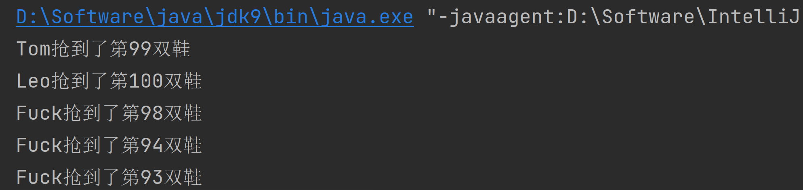

# OOP Java

## for each语句

```java
for ( 变量类型  变量名 : 数组名 ) {
    需要执行的循环语句;
}
```

```java
for(Transaction t:collection)
{ StdOut.println(t);  }
```

## 封装

* 把数据和对数据的操作放在一起，用这些操作把数据掩盖起来
  
* 所有的成员变量用private修饰符，只能在当前类访问

* 如果别的类想用，用setter和getter

* 所有的public方法，只用来实现这个类的对象或类自己要提供的服务

* 不直接访问数据，除非对数据的访问就是这个类及对象的服务

* 为每一个成员变量提供用于读写的get/set方法也是不合适的设计

```Java
// hour是成员变量，Display是它的类型
// 修饰符是private,只能在Display类中使用,在Clock类中就不能使用
private Display hour = new Display(24);
// 一个类的成员变量可以是其他类的对象
private Display minute = new Display(60);
```

## 继承

* 子类从父类得到父类的所有成员变量和成员方法，构造方法除外
* 子类不能直接继承父类的构造方法，自己写
* 子类方法可以重写，添加/修改自己的新特性
* 只有C++支持多继承
* 如果加父类方法final，不能被子类重写，修饰方法
* 子类得到父类的变量与方法，不一定可用，看修饰符

### 修饰符


## 多态

* 父类new子类，向上转型  

## 属性

* 类中的所有变量和方法成为属性

## 静态变量 静态方法 

* 用类名操作 
* 给整个类使用，与对象无关，用类名访问
* 常量，或者不能更改的成员变量成员函数

## 构造方法

#### 无参构造器

```Java
public Animal(){}
```

* 单独写一个，初始化对象

#### 构造方法的重载

```java
public Animal(int age, String name, String variety, String food) {
    this.age = age;
    this.name = name;
    this.variety = variety;
    this.food = food;
} 
```

```java
//多重继承  最下层的，不能被继承
public final class Labrador extends com.xinhai.bean.Dogs {
    @Override
    public boolean isGuideBlindness() {
        return true;
    }

    @Override
    public void barking() {
        System.out.println("叫");
    }
}
```

## 抽象类

* abstract 抽象类，对具体事物进行抽象
* 抽象类中可以没有抽象方法，为了不能new一个对象出来

## 抽象方法

* 子类中所有抽象方法必须重写
* 抽象方法没有内容(方法体)
* 有抽象方法，类必须是抽象的
* 继承自抽象类的子类必须覆盖父类中的抽象函数(实现抽象函数)

## 接口 

* 接口是纯抽象类(特殊的class)
* 里边的所有成员函数都是抽象函数,不用加abstract
* 所有成员函数都是 public static final 加了final永远不能被改
* 不能new一个接口
* 接口针对行为进行抽象,动作,不是属性
* 没有姓名，年龄等属性
* 类用extends，接口用implements(实现)
* 接口里的所有方法都要实现
* 接口可以继承接口，但不能继承类
* 接口不能实现接口
* 设计程序时先定义接口，再实现类
* 任何需要才函数间传入传出的一定是接口而不是具体的类

```Java
public class Westerner implements Human {
    @Override
    public void eat() {
        System.out.println("吃西餐");
    }

    @Override
    public void run() {
        System.out.println("大步跑");
    }

}
```

## 包裹类型

* Integer  String  是一个对象

## 数据与表现分离

* 程序的业务逻辑与表现无关
* View只管根据Field画出图形

* Field只管数据的存放 

```
import包名.类名
```

## 匿名内部类

* 在new对象的时候给出的类的定义形成匿名类
* 匿名类可以继承某类，与可以实现某接口
* Swing的消息机制广泛使用内部类

# MVC设计模式

* 数据、表现、控制三者分离，各司其职
* M=Model(模型)
* V=View(表现)
* C=Control(控制)
* 模型：保存和维护数据，提供接口让外部修改数据，通知表现需要刷新
* 表现：从模型获得数据，根据数据画出表现
* 控制：从用户得到输入，根据输入调整数据

```Java
FileOutputStream  // 只能写字节
```

# Stream/Reader/Scanner的选择

* 数据是二进制的：InputStream
* 不是二进制，表达文本：Reader
* 不是二进制，不表达文本，表达数据：Scanner

# Math类

工具类，方法多为静态，类直接用，不需要每次都new一个对象

# ThreadLocalRandom类

Returns a pseudorandom double value between the specified origin (inclusive) and bound (exclusive).

```java
import java.util.concurrent.ThreadLocalRandom;

public class Main {
    public static void main(String[] args) {
        double i = ThreadLocalRandom.current().nextDouble(0.5, 1.0);
        System.out.printf("i = %.2f", i);
    }
}
```

# ResizingArrayStack

```java
/******************************************************************************
 *  Compilation:  javac ResizingArrayStack.java
 *  Execution:    java ResizingArrayStack < input.txt
 *  Dependencies: StdIn.java StdOut.java
 *  Data files:   https://algs4.cs.princeton.edu/13stacks/tobe.txt
 *  
 *  Stack implementation with a resizing array.
 *
 *  % more tobe.txt 
 *  to be or not to - be - - that - - - is
 *
 *  % java ResizingArrayStack < tobe.txt
 *  to be not that or be (2 left on stack)
 *
 ******************************************************************************/

import java.util.Iterator;
import java.util.NoSuchElementException;

/**
 *  The {@code ResizingArrayStack} class represents a last-in-first-out (LIFO) stack
 *  of generic items.
 *  It supports the usual <em>push</em> and <em>pop</em> operations, along with methods
 *  for peeking at the top item, testing if the stack is empty, and iterating through
 *  the items in LIFO order.
 *  <p>
 *  This implementation uses a resizing array, which double the underlying array
 *  when it is full and halves the underlying array when it is one-quarter full.
 *  The <em>push</em> and <em>pop</em> operations take constant amortized time.
 *  The <em>size</em>, <em>peek</em>, and <em>is-empty</em> operations takes
 *  constant time in the worst case. 
 *  <p>
 *  For additional documentation,
 *  see <a href="https://algs4.cs.princeton.edu/13stacks">Section 1.3</a> of
 *  <i>Algorithms, 4th Edition</i> by Robert Sedgewick and Kevin Wayne.
 *
 *  @author Robert Sedgewick
 *  @author Kevin Wayne
 */
public class ResizingArrayStack<Item> implements Iterable<Item> {

    // initial capacity of underlying resizing array
    private static final int INIT_CAPACITY = 8;

    private Item[] a;         // array of items
    private int n;            // number of elements on stack


    /**
     * Initializes an empty stack.
     */
    public ResizingArrayStack() {
        a = (Item[]) new Object[INIT_CAPACITY];
        n = 0;
    }

    /**
     * Is this stack empty?
     * @return true if this stack is empty; false otherwise
     */
    public boolean isEmpty() {
        return n == 0;
    }

    /**
     * Returns the number of items in the stack.
     * @return the number of items in the stack
     */
    public int size() {
        return n;
    }


    // resize the underlying array holding the elements
    private void resize(int capacity) {
        assert capacity >= n;

        // textbook implementation
        Item[] copy = (Item[]) new Object[capacity];
        for (int i = 0; i < n; i++) {
            copy[i] = a[i];
        }
        a = copy;

       // alternative implementation
       // a = java.util.Arrays.copyOf(a, capacity);
    }


    /**
     * Adds the item to this stack.
     * @param item the item to add
     */
    public void push(Item item) {
        if (n == a.length) resize(2*a.length);    // double size of array if necessary
        a[n++] = item;                            // add item
    }

    /**
     * Removes and returns the item most recently added to this stack.
     * @return the item most recently added
     * @throws java.util.NoSuchElementException if this stack is empty
     */
    public Item pop() {
        if (isEmpty()) throw new NoSuchElementException("Stack underflow");
        Item item = a[n-1];
        // Java的垃圾回收策略是回收所有无法被访问的对象的内存，pop时被弹出的元素的引用仍在数组中，但永远无法被访问
        a[n-1] = null;                              // to avoid loitering (避免对象游离，将被弹出的对象设为null)
        n--;
        // shrink size of array if necessary
        if (n > 0 && n == a.length/4) resize(a.length/2);
        return item;
    }


    /**
     * Returns (but does not remove) the item most recently added to this stack.
     * @return the item most recently added to this stack
     * @throws java.util.NoSuchElementException if this stack is empty
     */
    public Item peek() {
        if (isEmpty()) throw new NoSuchElementException("Stack underflow");
        return a[n-1];
    }

    /**
     * Returns an iterator to this stack that iterates through the items in LIFO order.
     * @return an iterator to this stack that iterates through the items in LIFO order.
     */
    public Iterator<Item> iterator() {
        return new ReverseArrayIterator();
    }

    // an iterator, doesn't implement remove() since it's optional
    private class ReverseArrayIterator implements Iterator<Item> {
        private int i;

        public ReverseArrayIterator() {
            i = n-1;
        }

        public boolean hasNext() {
            return i >= 0;
        }

        public void remove() {
            throw new UnsupportedOperationException();
        }

        public Item next() {
            if (!hasNext()) throw new NoSuchElementException();
            return a[i--];
        }
    }


    /**
     * Unit tests the {@code Stack} data type.
     *
     * @param args the command-line arguments
     */
    public static void main(String[] args) {
        ResizingArrayStack<String> stack = new ResizingArrayStack<String>();
        while (!StdIn.isEmpty()) {
            String item = StdIn.readString();
            if (!item.equals("-")) stack.push(item);
            else if (!stack.isEmpty()) StdOut.print(stack.pop() + " ");
        }
        StdOut.println("(" + stack.size() + " left on stack)");
    }
}
```

# StringBuilder和StringBuffer类

```java
public void demo() {
        StringBuilder stringBuilder = new StringBuilder();
        stringBuilder.append("Hello");
    	// 链式调用
        stringBuilder.append(" world").append("!");
        System.out.println(stringBuilder);
        stringBuilder.trimToSize();// 置空字符串序列
    }
```

# I/O Stream

* A program uses an *input stream* to read data from a source, one item at a time

* A program uses an *output stream* to write data to a destination, one item at time

# 数据结构

```java
// 成员变量，名称为notes，类型为ArrayList(类名)
// 容器类(泛型类),用来存放String的ArrayList
// 容器类型<元素类型>
private ArrayList<String> notes = new ArrayList<>();
```

```Java
// HashMap 散列表,一种容器,里边的内容(Integer, String)必须是对象,不能是int
// 成对出现, k:key(键)一定是唯一的,只会留下最后一个放进去的 v:value(值)
private HashMap<Integer, String> coinNames = new HashMap<>();
```

```Java
// 遍历输出HashMap的每个值
for (Integer k : coinNames.keySet()) {
    String s = coinNames.get(k);
    System.out.println(s);
}
```

```Java
// HashSet 集合容器,不能有重复的元素,没有顺序
HashSet<String> s = new HashSet<>();
s.add("first");
s.add("second");
s.add("first");
```

# 最大公约数

```Java
package com.google.demo;

import java.util.Scanner;

/**
 * 辗转相除法(欧几里德算法)
 */
public class Main {

    public static void main(String[] args) {
        // write your code here
        Scanner in = new Scanner(System.in);
        int number_a = in.nextInt();
        int number_b = in.nextInt();
        int oa=number_a;
        int ob=number_b;
        if (number_a < number_b) {
            int t = number_b;
            number_b = number_a;
            number_a = t;
        }
        while (number_b != 0) {
            int r = number_a % number_b;
            System.out.println(number_a+","+number_b+","+r);
            number_a = number_b;
            number_b = r;
        }
        System.out.println(oa+" 和 "+ob+"的最大公约数 = " + number_a);
    }
}
```

# 线性筛法求素数

```Java
import java.util.Scanner;

public class Main {
    public static void main(String[] args) {
        Scanner in = new Scanner(System.in);
        /**
         * 求前五十个素数
         */
//        int[] primes = new int[50];
//        primes[0] = 2;
//        int cnt = 1;
//        Main_LOOP:
//        for (int x = 3; cnt < primes.length; x++) {
//            for (int i = 0; i < cnt; i++) {
//                if (x % primes[i] == 0) {
//                    continue Main_LOOP;
//                }
//            }
//            primes[cnt++]=x;
//        }
//        for (int k:primes){
//            System.out.println(k+" ");
//        }
        /**
         * 线性筛法求素数
         */
        boolean[] isPrime = new boolean[1000];
        for (int i = 0; i < isPrime.length; i++) {
            isPrime[i] = true;
        }
        for (int i = 2; i < isPrime.length; i++) {
            if (isPrime[i]) {
                for (int k = 2; i * k < isPrime.length; k++) {
                    isPrime[i * k] = false;
                }
            }
        }
        for (int i = 2; i < isPrime.length; i++) {
            if (isPrime[i]) {
                System.out.print(i + " ");
            }
        }
    }
}
```

```java
// 遍历输出字符串a中的每个元素s
        for (String s : a) {
            System.out.println(s);
        }
```

```Java
import java.util.ArrayList;

public class NoteBook {
    // 成员变量，名称为notes，类型为ArrayList(类名)
    // 容器类(泛型类),用来存放String的ArrayList
    // 容器类型<元素类型>
    private ArrayList<String> notes = new ArrayList<>();

    // 定义接口
    public void add(String s) {
        notes.add(s);
    }

    // 添加到某个索引位置的前面
    public void add(String s, int location) {
        notes.add(location, s);
    }

    public int getSize() {
        return notes.size();
    }

    public String getNote(int index) {
        return notes.get(index);
    }

    public void removeNote(int index) {
        notes.remove(index);
    }

    public String[] list() {
        String[] a = new String[notes.size()];
//        for (int i = 0; i < notes.size(); i++) {
//            a[i] = notes.get(i);
//        }
        notes.toArray(a);
        return a;
    }

}
```

# C语言

如p指向f[0]，下列表达式的含义：

*p++ 即*(p++)，先操作*p（即f[0]），再p=p+1指向f[1]；

*++p 即*(++p)，先操作p=p+1（指向f[1]），再*p（即f[1]）；

(*p)++ 即f[0]++。

## 用函数交换两个数

```C
#include<stdio.h>

// & 某个变量的地址
// * 访问某个指针的值

// 原型和函数调用时形参把地址当做值，应被声明为指针
void interchange(int *u, int *v);

int main(void) {
    int x = 5, y = 10;
    printf("Originally x = %d and y = %d.\n", x, y);
    interchange(&x, &y);// 函数调用传递的是它们的地址
    printf("Now x = %d and y = %d.\n", x, y);

    return 0;
}

void interchange(int *u, int *v) {
    int temp;
    temp = *u; // u的值是&x,u指向x,*u表示x的值
    *u = *v;
    *v = temp;
}
```

## 动态内存分配

```C
#include <stdio.h>
#include "stdlib.h"
// #include <malloc.h>

int main() {
    int number;
    int *a;
    int i;
    printf("输入数量:");
    scanf("%d", &number);
    // int a[number]; C99only
    a = (int *) malloc(number * sizeof(int));
    // malloc向系统要空间
    // 后续操作把a当做数组
    // 运行时才确定大小的数组
    // 动态内存分配
    for (i = 0; i < number; i++) {
        scanf("%d", &a[i]);
    }
    for (i = number - 1; i >= 0; i--) {
        printf("%d ", a[i]);
    }
    free(a);// 释放
    return 0;
}
```

## 二维数组

```C
初始化时必须写出第二维度的大小
char a[][10]={"hello"};
a[0] ->[10]
```

```C
#include <stdio.h>

int main(int argc, char const *argv[]) {
    int i;
    for (i = 0; i < argc; i++) {
        printf("%d:%s\n", i, argv[i]);
    }
    return 0;
}
```

```C
int main(int argc, char const *argv[]) {
    char line[] = "Hello";
    printf("strlen=%lu\n", strlen(line));// 5
    printf("sizeof=%lu\n", sizeof(line));// 6因为有\n
    return 0;
}
```

```C
#include <stdio.h>
#include "string.h"

// 这个函数作用于strlen()相同
int mylen(const char *s) {
    int index = 0;
    while (s[index] != '\0') {
        index++;
    }
    return index;
}

int main(int argc, char const *argv[]) {
    char line[] = "Hello";
    printf("strlen=%lu\n", mylen(line));
    printf("sizeof=%lu\n", sizeof(line));
    return 0;
}
```

## strcmp

```C
// 当做数组
int mycmp(const char *s1, const char *s2) {
    int index = 0;
    while (s1[index] == s2[index] && s1[index] != '\0') {
//        if (s1[index] != s2[index]) {
//            break;
//        } else if (s1[index] == '\0') {
//            break;
//        }
        index++;
    }
```

```C
int mycmp(const char *s1, const char *s2) {
//    int index = 0;
//    while (s1[index] == s2[index] && s1[index] != '\0') {
//        index++;
//    }
//    return s1[index] - s2[index];
    while (*s1 == *s2 && *s1 != '\0') {
        s1++;
        s2++;
    }
    return *s1 - *s2;
}
```

## strcpy

```C
//  数组版
char *mycpy(char *dst, const char *src) {
    int idx = 0;
    while (src[idx]) {
        dst[idx] = src[idx];
        idx++;
    }
    dst[idx] = '\0';
    return dst;
}
```

```C
// 指针版
char *mycpy(char *dst, const char *src) {
    char *ret = dst;
    while (*src) {
        *dst++ = *src++;
    }
    *dst = '\0';
    return dst;
}
```

## 常量符号化

用符号而不是具体的数字表示符号中的数字

## 结构类型

### 枚举

```C
enum 枚举类型名{名字1,名字2,...,名字n};
// 等同于
// const int red=0;
// const int yellow=1;
// const int green=2;
// 声名新的数据类型
enum colors{red,yellow,green};
```

## 结构体

```C
#include <stdio.h>

int main(int argc, char const *argv[]) {
    struct date {
        int month;
        int day;
        int year;
    };
    struct date today;
    struct date days;
    today = (struct date) {8, 10, 2021};
    days = today;
    printf("Today is %i-%i-%i\n", today.year, today.month, today.day);
    printf("Today is %i-%i-%i\n", days.year, days.month, days.day);
    return 0;
}
```

```C
// 不是结构指针传递参数，这样不好，占空间和时间
// 结构变量本身不是地址
#include <stdio.h>

struct point {
    int x;
    int y;
};

struct point getStruct(void);

void output(struct point);

int main(int argc, char const *argv[]) {
    struct point y = {0, 0};
    y = getStruct();
    output(y);
}

struct point getStruct(void) {
    struct point p;
    scanf("%d", &p.x);
    scanf("%d", &p.y);
    printf("%d, %d\n", p.x, p.y);
    return p;
}

void output(struct point p) {
    printf("%d, %d", p.x, p.y);
}
```

## 指向结构的指针

```C
struct date *p = &myday;
// -> 表示指针所指的结构变量中的成员,左边一定是一个指针
p->month = 12;
```

```C
#include <stdio.h>

struct point {
    int x;
    int y;
};

struct point *getStruct(struct point *);

void output(struct point);

void print(const struct point *p);

int main(int argc, char const *argv[]) {
    struct point y = {0, 0};
    getStruct(&y);
    output(y);
    output(*getStruct(&y));
    print(getStruct(&y));
    getStruct(&y)->x = 0;
    *getStruct(&y) = (struct point) {1, 2};
}

struct point *getStruct(struct point *p) {
    scanf("%d", &p->x);
    scanf("%d", &p->y);
    printf("%d, %d\n", p->x, p->y);
    return p;
}

void output(struct point p) {
    printf("%d, %d", p.x, p.y);
}

void print(const struct point *p) {
    printf("%d, %d", p->x, p->y);
}
```

```c
typedef struct {
    int month;
    int day;
    int year;
} Date;
Date d = {8, 10, 2021};
```

```C
struct {
    int month;
    int day;
    int year;
} Date;// 为没有名字的struct声名了一个叫Date的变量
Date d = {8, 10, 2021};
```

## 可变数组

```C
#include <stdlib.h>
#include <stdio.h>
#include "array.h"

const int BLOCK_SIZE = 20;
//typedef struct {
//    int *array;
//    int size;
//} Array;

// 创建可变数组
Array array_create(int init_size) {
    Array a;
    a.size = init_size;
    a.array = (int *) malloc(sizeof(int) * a.size);
    return a;// 返回一个制造出来的结构体
}

// 释放可变数组
void array_free(Array *a) {
    free(a->array);
    a->size = 0;
    a->array = NULL;
}

// 数据访问
// 封装 main函数不直接接触数据
int array_size(const Array *a) {
    return a->size;
}

int *array_at(Array *a, int index) {
    if (index >= a->size) {
        array_inflate(a, (index / BLOCK_SIZE + 1) * BLOCK_SIZE - a->size);
    }
    return &(a->array[index]);
}

int array_get(const Array *a, int index) {
    return a->array[index];
}

void array_set(Array *a, int index, int value) {
    a->array[index] = value;
}

// 可变数组的自动增长
void array_inflate(Array *a, int more_size) {
    int *p = (int *) malloc(sizeof(int) * (a->size + more_size));
    int i;
    // 下面的for循环用memcpy函数效率更高
    for (i = 0; i < a->size; i++) {
        p[i] = a->array[i];
    }
    free(a->array);
    a->array = p;
    a->size += more_size;
}

int main(int argc, char const *argv[]) {
    Array a = array_create(100);
    printf("%d\n", array_size(&a));
    // *array_at(&a, 0) = 10;
    // 与下面一行相同含义
    array_set(&a, 0, 10);
    // *array_at(&a, 0)
    // 与下面一行输出相同内容
    printf("%d\n", array_get(&a, 0));
    int number = 0;
    int cnt = 0;
    while (number != -1) {
        scanf("%d", &number);
        if (number != -1) {
            array_set(&a, cnt++, number);
        }
    }
    array_free(&a);
}
// Created by leo on 2021/8/10.
```

## 链表

```C
#include <stdio.h>
#include "stdlib.h"
#include "node.h"

//typedef struct _node {
//    int value;
//    struct _node *next;
//} Node;

typedef struct _list {
    Node *head;
    Node *tail;
} List;

void add(List *pList, int number);

void print(List *pList);

int main(int argc, const char *argv[]) {
    List list;
    list.head = list.tail = NULL;
    int number;
    do {
        scanf("%d", &number);
        if (number != -1) {
            add(&list, number);
        }
    } while (number != -1);
    print(&list);
    scanf("%d", &number);
    // 查找链表元素
    Node *p;
    int isFound = 0;
    for (p = list.head; p; p = p->next) {
        if (p->value == number) {
            printf("找到了\n");
            isFound = 1;
            break;
        }
    }
    if (!isFound) {
        printf("没找到\n");
    }
    // 删除链表元素
    Node *q;
    for (q = NULL, p = list.head; p; q = p, p = p->next) {
        if (p->value == number) {
            if (q) {
                q->next = p->next;
            } else {
                list.head = p->next;
            }
            free(p);
            break;
        }
    }
    // 清除链表
    for (p = list.head; p; p = q) {
        q = p->next;
        free(p);
    }
    return 0;
}

// 添加链表元素
void add(List *pList, int number) {
    // add to linked-list
    Node *p = (Node *) malloc(sizeof(Node));
    p->value = number;
    p->next = NULL;
    // find the last
    // TODO
    Node *last = pList->head;
    if (last) {
        while (last->next) {
            last = last->next;
        }
        // attach
        last->next = p;
    } else {
        pList->head = p;
    }
}

// 打印链表元素
void print(List *pList) {
    Node *p;
    // 遍历列表
    for (p = pList->head; p; p = p->next) {
        printf("%d\t", p->value);
    }
    printf("\n");
}
```

## 链表存储films

```c
// list.h
#ifndef LIST_H_
#define LIST_H_

#include <stdbool.h>

#define TSIZE 45
struct film {
    char title[TSIZE];
    int rating;
};

typedef struct film Item;

typedef struct node {
    Item item;
    struct node *next;
} Node;

typedef Node *List;

void InitializeList(List *plist);

bool ListIsEmpty(const List *plist);

bool ListIsFull(const List *plist);

unsigned int ListItemCount(const List *plist);

bool AddItem(Item item, List *plist);

void Traverse(const List *plist, void (*pfun)(Item item));

void EmptyTheList(List *plist);

#endif
```

```c
// list.h
#include <stdlib.h>
#include <stdio.h>
#include "list.h"

static void CopyToNode(Item item, Node *ponde);

/**
 * 把list类型的变量设置为NULL
 * @param plist
 */
void InitializeList(List *plist) {
    *plist = NULL;
}

bool ListIsEmpty(const List *plist) {
    if (*plist == NULL) {
        return true;
    } else {
        return false;
    }
}

bool ListIsFull(const List *plist) {
    Node *pt;
    bool full;

    pt = (Node *) malloc(sizeof(Node));
    if (pt == NULL) {
        full = true;
    } else {
        full = false;
    }
    free(pt);

    return full;
}

unsigned int ListItemCount(const List *plist) {
    unsigned int count = 0;
    // 设置链表的开始
    Node *pnode = *plist;
    while (pnode != NULL) {
        ++count;
        // 设置下一个节点
        pnode = pnode->next;
    }

    return count;
}

bool AddItem(Item item, List *plist) {
    Node *pnew;
    Node *scan = *plist;

    pnew = (Node *) malloc(sizeof(Node));
    if (pnew == NULL) {
        return false; // 失败时退出函数
    }

    CopyToNode(item, pnew);
    pnew->next = NULL;
    if (scan == NULL) {  // 空链表
        *plist = pnew;   // pnew放在链表的开头
    } else {
        while (scan->next != NULL) {
            scan = scan->next; // 找到链表的末尾
        }
        scan->next = pnew;     // 把pnew添加到链表的末尾
    }
    return true;
}

void Traverse(const List *plist, void (*pfun)(Item item)) {
    Node *pnode = *plist;

    while (pnode != NULL) {
        (*pfun)(pnode->item);
        pnode = pnode->next;
    }
}

void EmptyTheList(List *plist) {
    Node *psave;

    while (*plist != NULL) {
        psave = (*plist)->next;  // 保存下一个节点的地址
        free(*plist);            // 释放当前节点
        *plist = psave;          // 前进至下一个节点
    }
}

/**
 * 把item类型的值拷贝到item类型的变量里
 * @param item
 * @param ponde
 */
static void CopyToNode(Item item, Node *ponde) {
    ponde->item = item;
}
```

```c
// film.c
#include <stdio.h>
#include <stdlib.h>
#include <string.h>
#include "list.h"

void show_movies(Item item);

char *s_gets(char *st, int n);

int main(void) {
    List movies;
    Item temp;

    InitializeList(&movies);
    if (ListIsFull(&movies)) {
        fprintf(stderr, "No memory available! Bye!\n");
        exit(1);
    }
    puts("Enter first movie title:");
    while (s_gets(temp.title, TSIZE) != NULL && temp.title[0] != '\0') {
        puts("Enter your rating <0-10>:");
        scanf("%d", &temp.rating);
        while (getchar() != '\n')
            continue;
        if (AddItem(temp, &movies) == false) {
            fprintf(stderr, "Problem allocating memory\n");
            break;
        }
        if (ListIsFull(&movies)) {
            puts("The list is now full.");
            break;
        }
        puts("Enter next movie title (empty line to stop):");
    }

    if (ListIsEmpty(&movies)) {
        printf("No data entered. ");
    } else {
        printf("Here is the movie list:\n");
        Traverse(&movies, show_movies);
    }
    printf("You entered %d movies.\n", ListItemCount(&movies));

    EmptyTheList(&movies);
    printf("Bye!\n");

    return 0;
}

void show_movies(Item item) {
    printf("Movie: %s Rating: %d\n", item.title, item.rating);
}

char *s_gets(char *st, int n) {
    char *ret_val;
    char *find;

    ret_val = fgets(st, n, stdin);
    if (ret_val) {
        find = strchr(st, '\n');
        if (find) {
            *find = '\0';
        } else {
            while (getchar() != '\n')
                continue;
        }
    }
    return ret_val;
}
```

## Queue

```c
// queue.h
#ifndef _QUEUE_H_
#define _QUEUE_H_

#include <stdbool.h>

typedef int Item;
typedef int item;
#define MAXQUEUE 10;

typedef struct node {
    Item item;
    struct node *next;
} Node;

typedef struct queue {
    Node *front;
    Node *rear;
    int items;
} Queue;

void InitializeQueue(Queue *pq);

bool QueueIsFull(const Queue *pq);

bool QueueIsEmpty(const Queue *pq);

int QueueItemCount(const Queue *pq);

bool EnQueue(Item item, Queue *pq);

bool DeQueue(Item *pitem, Queue *pq);

void EmptyTheQueue(Queue *pq);

#endif 
```

```c
// queue.c
#include <stdio.h>
#include <stdlib.h>
#include "queue.h"

static void CopyToNode(Item item, Node *pn);

static void CopyToItem(Node *pn, Item *pi);

void InitializeQueue(Queue *pq) {
    pq->front = pq->rear = NULL;
    pq->items = 0;
}

bool QueueIsFull(const Queue *pq) {
    return pq->items == MAXQUEUE;
}

bool QueueIsEmpty(const Queue *pq) {
    return pq->items == 0;
}

int QueueItemCount(const Queue *pq) {
    return pq->items;
}

bool EnQueue(Item item, Queue *pq) {
    Node *pnew;

    if (QueueIsFull(pq))
        return false;
    pnew = (Node *) malloc(sizeof(Node));
    if (pnew == NULL) {
        fprintf(stderr, "Unable to allocate memory!\n");
        exit(1);
    }
    CopyToNode(item, pnew);
    pnew->next = NULL;
    if (QueueIsEmpty(pq))
        pq->front = pnew;
    else
        pq->rear->next = pnew;
    pq->rear = pnew;
    pq->items++;

    return true;
}

bool DeQueue(Item *pitem, Queue *pq) {
    Node *pt;

    if (QueueIsEmpty(pq))
        return false;
    CopyToItem(pq->front, pitem);
    pt = pq->front;
    pq->front = pq->front->next;
    free(pt);
    pq->items--;
    if (pq->items == 0)
        pq->rear = NULL;

    return true;
}

void EmptyTheQueue(Queue *pq) {
    Item dummy;
    while (!QueueIsEmpty(pq))
        DeQueue(&dummy, pq);
}

static void CopyToNode(Item item, Node *pn) {
    pn->item = item;
}

static void CopyToItem(Node *pn, Item *pi) {
    *pi = pn->item;
}
```

```C
// use_q.c
#include <stdio.h>
#include "queue.h"

int main(void) {
    Queue line;
    Item temp;
    char ch;

    InitializeQueue(&line);
    puts("Testing the Queue interface. Type a to add a value,");
    puts("type d to delete a value, and type q to quit.");
    while ((ch = getchar()) != 'q') {
        if (ch != 'a' && ch != 'd')
            continue;
        if (ch == 'a') {
            printf("Integer to add: ");
            scanf("%d", &temp);
            if (!QueueIsFull(&line)) {
                printf("Putting %d into queue.\n", temp);
                EnQueue(temp, &line);
            } else {
                puts("Queue is full!");
            }
        } else {
            if (QueueIsEmpty(&line))
                puts("Nothing to delete!");
            else {
                DeQueue(&temp, &line);
                printf("Removing %d from queue.\n", temp);
            }
        }
        printf("%d items in queue\n", QueueItemCount(&line));
        printf("Type a to add, d to delete, q to quit: ");
    }
    EmptyTheQueue(&line);
    puts("Bye!");

    return 0;
}
```

## 静态本地变量

特殊的全局变量，位于相同的内存区域

具有全局的生存区，函数内的局部作用域

**返回本地变量的地址是危险的**

不要用全局变量在函数间传递参数和结果


自己写的->用“”

系统自带的->用<>


## Frank Java 多线程抢Nike

```Java
// Class NikeThread
public class NikeThread implements Runnable {
    private int nike = 100;

    @Override
    public void run() {
        while (true) {
            if (nike > 0) {
                System.out.println(Thread.currentThread().getName() + "抢到了第" + (nike--) + "双鞋");
            }
        }
    }
}

// Class Main
public class Main {
    public static void main(String[] args) {
        NikeThread nikeThread = new NikeThread();
        new Thread(nikeThread, "Leo").start();
        new Thread(nikeThread, "Mike").start();
        new Thread(nikeThread, "Fuck").start();
        new Thread(nikeThread, "Tom").start();
    }
}
```


* 添加了守护线程

```Java
//  Class Main
public static void main(String[] args) {
    NikeThread nikeThread = new NikeThread();
    DaemonThread daemonThread = new DaemonThread();
    Thread dThread = new Thread(daemonThread);
    dThread.setDaemon(true);
    System.out.println(dThread.isDaemon());
    dThread.start();
    new Thread(nikeThread, "Leo").start();
    new Thread(nikeThread, "Mike").start();
    new Thread(nikeThread, "Fuck").start();
    new Thread(nikeThread, "Tom").start();
}
// Class DaemonThread
public class DaemonThread implements Runnable {
    @Override
    public void run() {
        System.out.println("守护线程");
    }
}
```
```Java
// nikeThread.java
package com.leo.demo;

import java.util.concurrent.locks.Lock;
import java.util.concurrent.locks.ReentrantLock;

public class NikeThread implements Runnable {
    private int nike = 10;
    Lock reentrantLock = new ReentrantLock();

    @Override
    public void run() {
        while (true) {
            reentrantLock.lock();
            if (nike > 0) {
                // 线程非安全不同步
                try {
                    Thread.sleep(100);
                } catch (InterruptedException e) {
                    e.printStackTrace();
                }
                System.out.println(Thread.currentThread().getName()
                        + "抢到了第" + (nike--) + "双鞋");
            }
            reentrantLock.unlock();
        }
    }
}
```

<!-- @import "[TOC]" {cmd="toc" depthFrom=1 depthTo=6 orderedList=false} -->

<!-- code_chunk_output -->

- [OOP Java](#oop-java)
  - [封装](#封装)
  - [继承](#继承)
    - [修饰符](#修饰符)
  - [多态](#多态)
  - [属性](#属性)
  - [静态变量 静态方法](#静态变量-静态方法)
  - [构造方法](#构造方法)
      - [无参构造器](#无参构造器)
      - [构造方法的重载](#构造方法的重载)
  - [抽象类](#抽象类)
  - [抽象方法](#抽象方法)
  - [接口](#接口)
  - [包裹类型](#包裹类型)
  - [数据与表现分离](#数据与表现分离)
  - [匿名内部类](#匿名内部类)
- [MVC设计模式](#mvc设计模式)
- [Stream/Reader/Scanner的选择](#streamreaderscanner的选择)
- [Math类](#math类)
- [ThreadLocalRandom类](#threadlocalrandom类)
- [数据结构](#数据结构)
- [最大公约数](#最大公约数)
- [线性筛法求素数](#线性筛法求素数)
- [C语言](#c语言)
  - [用函数交换两个数](#用函数交换两个数)
  - [动态内存分配](#动态内存分配)
  - [二维数组](#二维数组)
  - [strcmp](#strcmp)
  - [strcpy](#strcpy)
  - [常量符号化](#常量符号化)
  - [结构类型](#结构类型)
    - [枚举](#枚举)
  - [结构体](#结构体)
  - [指向结构的指针](#指向结构的指针)
  - [可变数组](#可变数组)
  - [链表](#链表)
  - [链表存储films](#链表存储films)
  - [Queue](#queue)
  - [静态本地变量](#静态本地变量)

<!-- /code_chunk_output -->
