# 算法笔记

## 十二届蓝桥杯C++ B组

### A题：空间(5分)
小蓝准备用 256MB 的内存空间开一个数组，数组的每个元素都是 32 位二进制整数，如果不考虑程序占用的空间和维护内存需要的辅助空间，请问256MB 的空间可以存储多少个 32 位二进制整数？

解：256MB = 256 * 1024 * 1024 * 8 / 32 = 256 * 1024 * 1024 / 4 = 67108864
* 在cpp中直接算会溢出

### B题：卡片(5分)
小蓝有很多数字卡片，每张卡片上都是数字0到9。

小蓝准备用这些卡片来拼一些数，他想从1开始拼出正整数，每拼一个，就保存起来，卡片就不能用来拼其它数了。

小蓝想知道自己能从1拼到多少。例如，当小蓝有30张卡片，其中0到9各3张，则小蓝可以拼出1到10，但是拼11时卡片1已经只有一张了，不够拼出11。

现在小蓝手里有0到9的卡片各2021张，共20210张，请问小蓝可以从1拼到多少？

```cpp
#include<iostream>
using namespace std;
int a[10] = {0};
bool f(int x) {
    while(x) {
        int temp = x % 10;
        x /= 10;
        if(a[temp] > 0) {
            a[temp]--;
        } else {
            return false;
        }
    }
    return true;
}
int main() {
    for(int i = 0; i < 10; i++) {
        a[i] = 2021;
    }
    int cnt = 1;
    while(true) {
        if(f(cnt)) {
            cnt++;
        } else {
            break;
        }
    }
    cout<<cnt-1<<endl;
    return 0;
}
```
答案 3181

### C题：直线(10分)
在平面直角坐标系中，两点可以确定一条直线。如果有多点在一条直线上，那么这些点中任意两点确定的直线是同一条。

给定平面上2×3个整点{(x, y)|0 ≤ x < 2, 0 ≤ y < 3, x ∈ Z, y ∈ Z}，即横坐标是0到1(包含0和1)之间的整数、纵坐标是0到2(包含0和2)之间的整数的点。
这些点一共确定了11条不同的直线。

给定平面上20×21个整点{(x, y)|0 ≤ x < 20, 0 ≤ y < 21, x ∈ Z, y ∈ Z}，即横坐标是0到19(包含0和19)之间的整数、纵坐标是0到20(包含0和20)之间的整数的点。请问这些点一共确定了多少条不同的直线。

```cpp
#include<iostream>
#include<cstring>
#include<cmath>
#include<map>
#include<algorithm>
using namespace std;
typedef pair<double, double> PII;
PII l[200000];
int main() {
    int n = 0;
    for(int x1 = 0; x1 < 20; x1++) {
        for(int y1 = 0; y1 < 21; y1++) {
            for(int x2 = 0; x2 < 20; x2++) {
                for(int y2 = 0; y2 <21; y2++) {
                    if(x1 != x2) {
                        double k = (double) (y2 - y1) / (x2 - x1);
                        double b = y1 - k * x1;
                        l[n++] = {k, b};
                    }
                }
            }
        }
    }
    sort(l, l + n);
    int res = 21;
    for(int i = 1; i < n; i++) {
        if(fabs(l[i].first-l[i-1].first) > 1e-8 || fabs(l[i].second - l[i-1].second) > 1e-8) {
            res++;
        }
    }
    cout<<res<<endl;
    return 0;
}
```
答案：40257

### D题：货物摆放(10分)
小蓝有一个超大的仓库，可以摆放很多货物。

现在，小蓝有 n 箱货物要摆放在仓库，每箱货物都是规则的正方体。小蓝规定了长、宽、高三个互相垂直的方向，每箱货物的边都必须严格平行于长、宽、高。

小蓝希望所有的货物最终摆成一个大的立方体。即在长、宽、高的方向上分别堆 L、W、H 的货物，满足 n = L × W × H。

给定 n，请问有多少种堆放货物的方案满足要求。

例如，当 n = 4 时，有以下 6 种方案：1×1×4、1×2×2、1×4×1、2×1×2、 2 × 2 × 1、4 × 1 × 1。

请问，当 n = 2021041820210418 （注意有 16 位数字）时，总共有多少种方案？

```cpp
#include<iostream>
#include<vector>
using namespace std;
typedef long long ll;
vector<ll>num;
int main() {
    ll n = 2021041820210418;
    for(ll i = 1; i * i <= n; i++) {
        if(n % i == 0) {
            num.push_back(i);
            if(n / i != i) {
              num.push_back(n / i);
            }
        }
    }
    int res = 0;
    // int l = num.size();
    // for(int i = 0; i < l; i++) {
    //     for(int j = 0; j < l; j++) {
    //         for(int k = 0; k < l; k++) {
    //             if(num[i] * num[j] * num[k] == n) {
    //                 res++;
    //             }
    //         }
    //     }
    // }
    // for(vector<ll>::iterator i = num.begin(); i != num.end(); i++) {
    //     for(vector<ll>::iterator j = num.begin(); j != num.end(); j++) {
    //         for(vector<ll>::iterator k = num.begin(); k != num.end(); k++) {
    //             if((*i) * (*j) * (*k) == n ) {
    //                 res++;
    //             }
    //         }
    //     }
    // }
    for (auto a: num)
        for (auto b: num)
            for (auto c: num)
                if (a * b * c == n)
                    res ++;
    cout<<res<<endl;
    return 0;
}
```
答案： 2430

### E题：路径(15分)
小蓝学习了最短路径之后特别高兴，他定义了一个特别的图，希望找到图中的最短路径。

小蓝的图由 2021 个结点组成，依次编号 1 至 2021。

对于两个不同的结点 a, b，如果 a 和 b 的差的绝对值大于 21，则两个结点之间没有边相连；如果 a 和 b 的差的绝对值小于等于 21，则两个点之间有一条长度为 a 和 b 的最小公倍数的无向边相连。

例如：结点 1 和结点 23 之间没有边相连；结点 3 和结点 24 之间有一条无向边，长度为 24；结点 15 和结点 25 之间有一条无向边，长度为 75。

请计算，结点 1 和结点 2021 之间的最短路径长度是多少。

```cpp
#include<cstdio>
#include<cstring> // memset函数需要 不建议使用
#include<algorithm> // fill函数需要

using namespace std;

const int MAXV = 2025; // 最大顶点数
const int INF = 0x3f3f3f3f; // 本题不能用0x3fffffff 不知道为什么

int n = 2021, G[MAXV][MAXV]; // n顶点数 邻接矩阵表示图
int d[MAXV]; // 用于存放最短路径
bool visited[MAXV] = {false};

int gcd(int a, int b) {
    return !b ? a : gcd(b, a % b);
}

// 构造图
void initGraph() {
    fill(G[0], G[0] + MAXV * MAXV, INF);
    for (int i = 1; i <= n; i++)
        G[i][i] = 0;
    for (int i = 1; i <= n; i++) {
        for (int j = i + 1; j <= n && j <= i + 21; j++) {
            int w = i * j / gcd(i, j); // 最小公倍数
            G[i][j] = G[j][i] = w; // 无向图
        }
    }
}

void Dijkstra(int s) { // s为起点
    fill(d, d + MAXV, INF);
    d[s] = 0; // 起点到自身的距离为0
    for (int i = 1; i <= n; i++) {
        int u = -1, MIN = INF; // u使d[u]最小，MIN存放最小的d[u]
        for (int j = 1; j <= n; j++) { // 找到未访问的顶点中d[]最小的
            if (!visited[j] && d[j] < MIN) {
                u = j;
                MIN = d[j];
            }
        }
        if (u == -1) return;
        visited[u] = true;
        for (int v = 1; v <= n; v++) {
            // 如果v未访问 && u能到达v && 以u为中介点可使d[v]更优
            if (!visited[v] && G[u][v] != INF && d[u] + G[u][v] < d[v]) {
                d[v] = G[u][v] + d[u]; // 优化d[v]
            }
        }
    }
}

// 网上的方法
void Dijkstra2(int s) {
    memset(d, INF, sizeof(d));
    d[s] = 0;
    for (int i = 1; i <= n; i++) {
        int x = 0;
        for (int j = 1; j <= n; j++) {
            if (!visited[j] && d[j] < d[x]) {
                x = j;
            }
        }
        visited[x] = true;
        for (int j = max(1, x - 21); j <= min(n, x + 21); j++) {
            //剪值，只有这些点有边
            d[j] = min(d[j], d[x] + G[x][j]);
        }
    }
}

int main() {
    initGraph();
    Dijkstra(1);
//    Dijkstra2(1);
    printf("%d\n", d[n]);
    return 0;
}
```
答案：10266837

### F题：时间显示(15分)
时间限制：1.0s 内存限制：256.0MB

小蓝要和朋友合作开发一个时间显示的网站。在服务器上，朋友已经获取了当前的时间，用一个整数表示，值为从1970年1月1日00 : 00 : 00到当前时刻经过的毫秒数。

现在，小蓝要在客户端显示出这个时间。小蓝不用显示出年月日，只需要显示出时分秒即可，毫秒也不用显示，直接舍去即可。

给定一个用整数表示的时间，请将这个时间对应的时分秒输出。

【输入格式】

输入一行包含一个整数，表示时间。

【输出格式】

输出时分秒表示的当前时间，格式形如HH : MM : SS，其中HH表示时，值为0到23，MM表示分，值为0到59，SS表示秒，值为0到59。时、分、秒不足两位时补前导0。

【样例输入 1】
```
46800999
```
【样例输出 1】
```
13:00:00
```
【样例输入 2】
```
1618708103123
```
【样例输出 2】
```
01:08:23
```
【评测用例规模与约定】

对于所有评测用例，给定的时间为不超过10^18的正整数。

```cpp
#include <iostream>
#include <cstdio>
typedef long long ll;
using namespace std;
int main()
{
  ll n;
  cin >> n;
  n /= 1000; // 舍去毫秒 此时n的单位为秒
  int h = n / 3600 % 24; // 除3600后单位为小时，%24约掉前面的天数
  int m = n / 60 % 60; // 除60后单位为分钟，%60约掉前面的
  int s = n % 60;
  printf("%02d:%02d:%02d\n", h, m, s);
  return 0;
}
```
### G题：砝码称重(20分)
时间限制：1.0s 内存限制：256.0MB

【问题描述】
你有一架天平和 N 个砝码，这 N 个砝码重量依次是 W1, W2, · · · , WN。

请你计算一共可以称出多少种不同的重量？

注意砝码可以放在天平两边。

【输入格式】

输入的第一行包含一个整数 N。

第二行包含 N 个整数：W1, W2, W3, · · · , WN。

【输出格式】

输出一个整数代表答案。

【样例输入】
```
3
1 4 6
```
【样例输出】
```
10
```

【样例说明】

能称出的 10 种重量是：1、2、3、4、5、6、7、9、10、11。

1 = 1；

2 = 6 − 4 (天平一边放 6，另一边放 4)；

3 = 4 − 1；

4 = 4；

5 = 6 − 1；

6 = 6；

7 = 1 + 6；

9 = 4 + 6 − 1；

10 = 4 + 6；

11 = 1 + 4 + 6。

【评测用例规模与约定】

对于 50% 的评测用例，1 ≤ N ≤ 15。

对于所有评测用例，1 ≤ N ≤ 100，N 个砝码总重不超过 100000。

```cpp
```

## PAT甲级

### 1076 Forwards on Weibo (30 分)
Weibo is known as the Chinese version of Twitter. One user on Weibo may have many followers, and may follow many other users as well. Hence a social network is formed with followers relations. When a user makes a post on Weibo, all his/her followers can view and forward his/her post, which can then be forwarded again by their followers. Now given a social network, you are supposed to calculate the maximum potential amount of forwards for any specific user, assuming that only L levels of indirect followers are counted.

**Input Specification:**
Each input file contains one test case. For each case, the first line contains 2 positive integers: N (≤1000), the number of users; and L (≤6), the number of levels of indirect followers that are counted. Hence it is assumed that all the users are numbered from 1 to N. Then N lines follow, each in the format:
```
M[i] user_list[i]
```
where M[i] (≤100) is the total number of people that user[i] follows; and user_list[i] is a list of the M[i] users that followed by user[i]. It is guaranteed that no one can follow oneself. All the numbers are separated by a space.

Then finally a positive K is given, followed by K UserID's for query.

**Output Specification:**
For each UserID, you are supposed to print in one line the maximum potential amount of forwards this user can trigger, assuming that everyone who can view the initial post will forward it once, and that only L levels of indirect followers are counted.

**Sample Input:**
```
7 3 共有7个用户 转发层数上限为3
3 2 3 4 一号用户关注了二三四号用户
0 二号用户没有关注
2 5 6 三号用户关注了五六号用户
2 3 1 四号用户关注了三一号用户
2 3 4 ...
1 4
1 5
2 2 6
```

**Sample Output:**
```
4
5
```
**Reference:**

```cpp
// BFS搜索有向图
#include<cstdio>
#include<cstring>
#include<vector>
#include<queue>

using namespace std;
const int MAXV = 1010;
struct Node {
    int id;
    int layer;
};
vector<Node> Adj[MAXV];
bool inq[MAXV] = {false};

int BFS(int s, int L) {// s为起始结点 L为层数上限
    int numForward = 0; // 转发数
    queue<Node> q;
    Node start;
    start.id = s;
    start.layer = 0;
    q.push(start);
    inq[start.id] = true;
    while (!q.empty()) {
        Node topNode = q.front();
        q.pop();
        int u = topNode.id;
        for (int i = 0; i < Adj[u].size(); i++) {
            Node next = Adj[u][i];
            next.layer = topNode.layer + 1;
            if (!inq[next.id] && next.layer <= L) {
                q.push(next);
                inq[next.id] = true;
                numForward++;
            }
        }
    }
    return numForward;
}

int main() {
    Node user;
    int n, L, numFollow, idFollow;
    scanf("%d%d", &n, &L);
    for (int i = 1; i <= n; i++) {
        user.id = i;
        scanf("%d", &numFollow); // i号用户关注的人数
        for (int j = 0; j < numFollow; j++) {
            scanf("%d", &idFollow); // i号用户关注的用户的编号
            Adj[idFollow].push_back(user); // 边idFollow -> i
        }
    }
    int nunQuery, s;
    scanf("%d", &nunQuery); // 查询个数
    for (int i = 0; i < nunQuery; i++) {
        memset(inq, false, sizeof(inq)); // inq数组初始化
        scanf("%d", &s); // 起始结点编号
        int numForward = BFS(s, L); // 返回转发数
        printf("%d\n", numForward);
    }
    return 0;
}
```

* cin cout 所花费的时间远大于printf和scanf 
* 不要在一段代码中同时使用cin和scanf，可能会出问题

## 四种基本数据类型


## long long

* 如果题目要求10^9以内或32位整数，就用int，如果10^{18}以内或64位整数，就用long long
*  float 有效精度6至7位 double 15至16位
*  尽量用double 不用float
*  小写字母比大写字母的ASCII码大32

## 自增运算符


## 位运算符


## scanf格式符
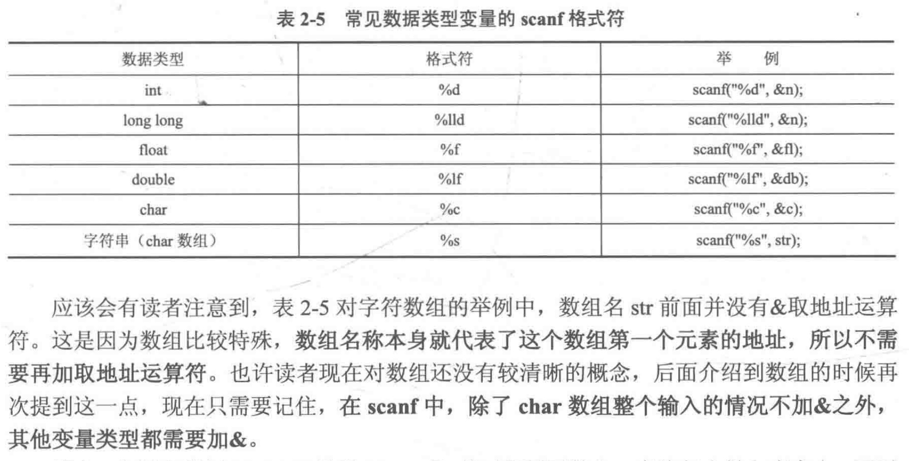

## 常用的数学函数
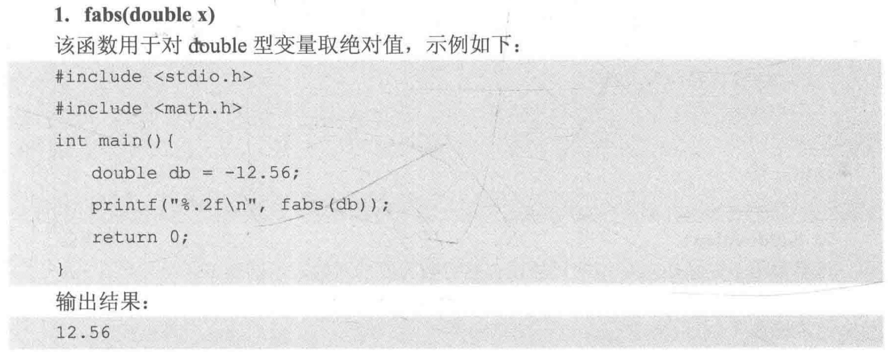
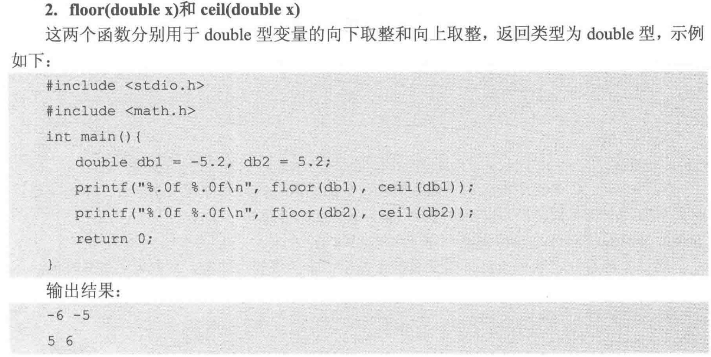
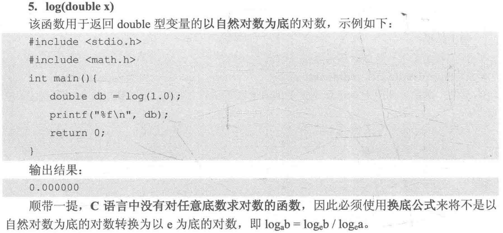


* 数组可以作为参数，但不可以作为返回类型 需要将返回的数组作为参数传进去 

## 用函数交换两个变量的值
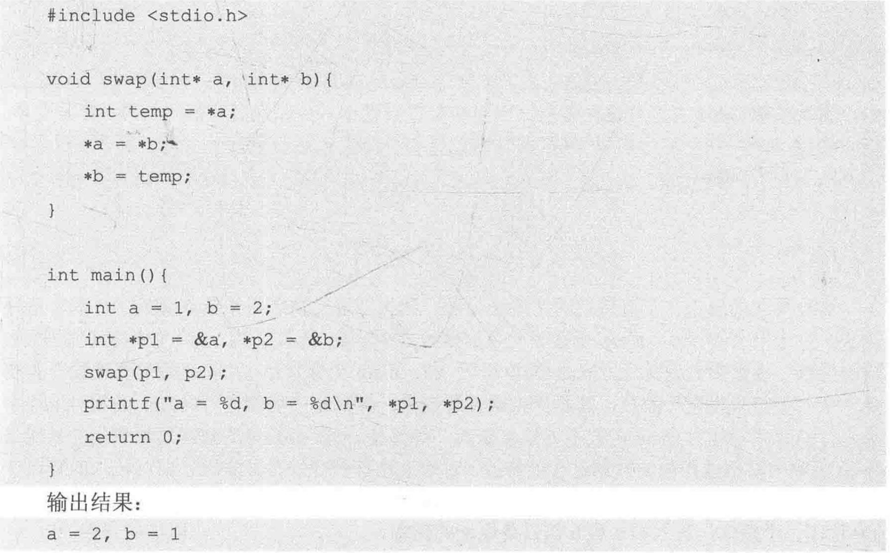
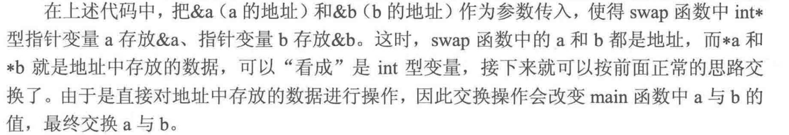
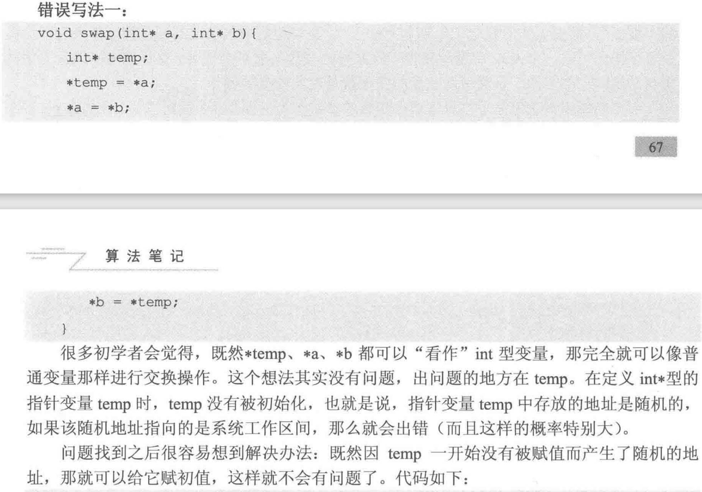
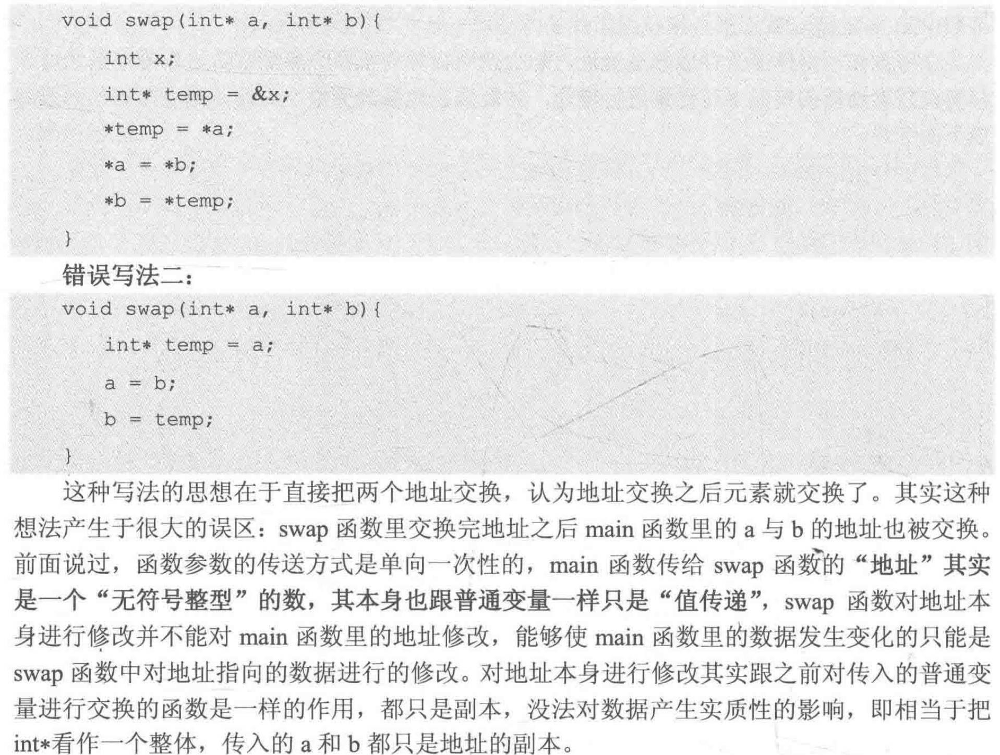
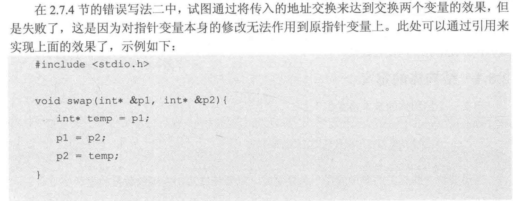
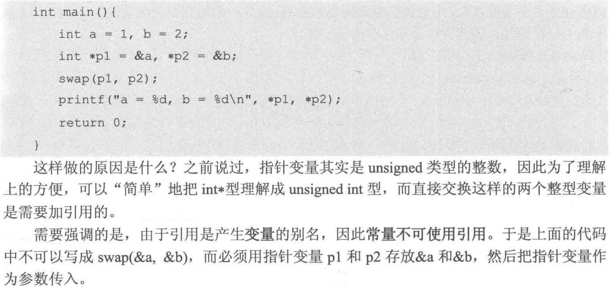

## 结构体的构造函数
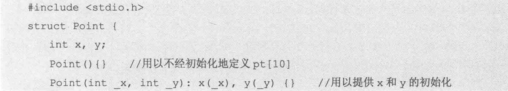
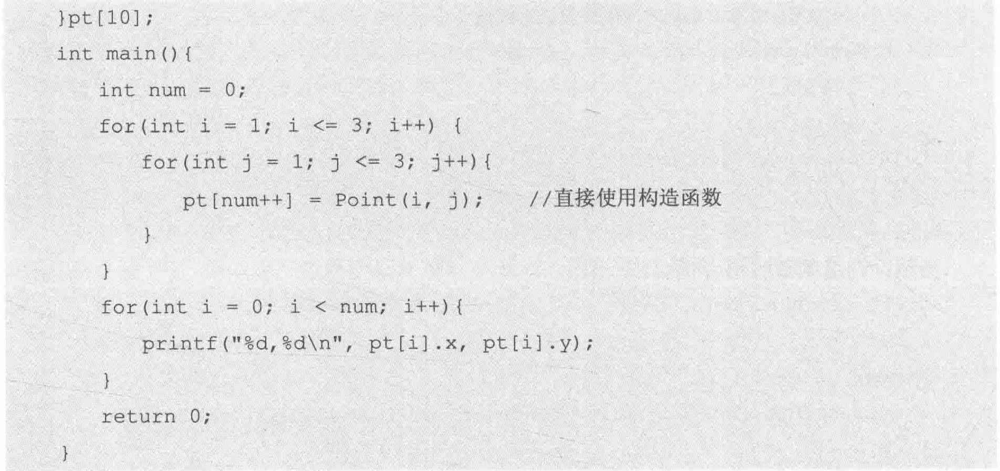

## 浮点数的比较
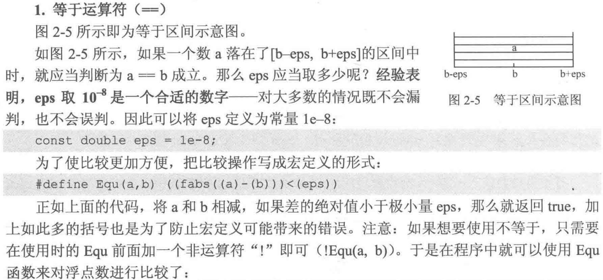
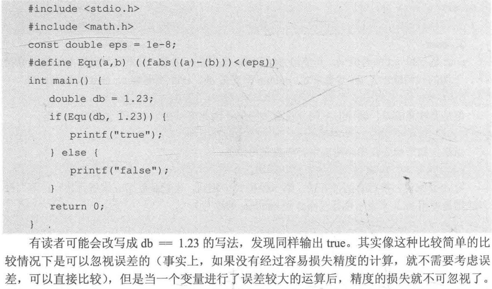

```cpp
// 上面的输出false 下面的输出true
#include<cstdio>
#include<cmath>
const double eps = 1e-8;
#define Equ(a,b) ((fabs((a)-(b)))<(eps))
int main()
{
    double db1 = 4 * asin(sqrt(2.0) / 2);
    double db2 = 3 * asin(sqrt(3.0) / 2);
    if(db1 == db2) {
        printf("true\n");
    } else {
        printf("false\n");
    }
    if(Equ(db1,db2)) {
        printf("true\n");
    } else {
        printf("false\n");
    }
    return 0;
}
```

```cpp
const double eps = 1e-8;
const double Pi = acos(-1.0);
#define Equ(a,b) ((fabs((a)-(b)))<(eps))
#define More(a,b) (((a)-(b))>(eps))
#define Less(a,b) (((a)-(b))<(-eps))
#define MoreEqu(a,b) (((a)-(b))>(-eps))
#define LessEqu(a,b) (((a)-(b))<(eps))
```

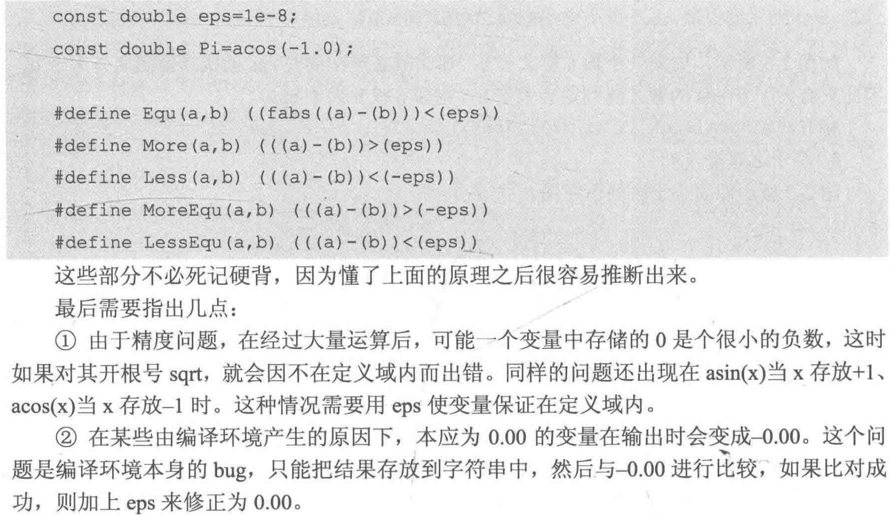

## 无穷大
int型变量的取值范围：[-2^31, 2^31 - 1]  ->  [-2147483648, 2147483647]

0x7fffffff = 2147483647 = (2^31 - 1) = (1 << 31) - 1

0x3fffffff = 1073741823 = (2^30 - 1) = (1 << 30) - 1

0x3f3f3f3f = 1061109567

* 使用memset赋值
memset是按字节赋值的，它能够对数组清零 

```cpp
// 全部赋值0
memset(arr, 0, sizeof(arr));  // 0的每个字节都是0 
// 全部赋值-1
memset(arr, -1, sizeof(arr)); // -1在计算机中的表示形式为111...每个字节都是11111111）
// 全部赋值无穷大
memset(arr, 0x3f, sizeof(arr));

// 不推荐使用下面的宏定义
#define INF1 0x7fffffff
#define INE2 0x3fffffff
#define INF3 0x3f3f3f3f

// 我们只是设置一个常量而已，使用 const 就好
const int INF4 = 0x7fffffff;
const int INF5 = 0x3fffffff;
const int INF6 = 0x3f3f3f3f;
```

## C++ algorithm中的sort函数
* sort(首元素地址,尾元素地址的下一个地址,比较函数(选填))

```cpp
#include<iostream>
#include<algorithm>
using namespace std;
bool cmp(int a,int b) {
    return a>b; // 可以理解为a>b时把a放到b前面
}
int main(void)
{
    int a[5] = {3,1,4,2};
    sort(a,a+4,cmp);
    for(int i = 0;i<4;i++) {
        cout<<a[i]<<" ";
    }
    return 0;
}
```

```cpp
#include<iostream>
#include<algorithm>
using namespace std;
struct node{
    int x;
    int y;
}ssd[10];

bool cmp(node a,node b){
    if(a.x!=b.x) return a.x>b.x; // x不等时按x从大到小排序
    else return a.y<b.y; // x相等时按y从小到大排序
}
int main()
{
    ssd[0].x = 2;
    ssd[0].y = 2;
    ssd[1].x = 1;
    ssd[1].y = 3;
    ssd[2].x = 2;
    ssd[2].y = 1;
    sort(ssd,ssd + 3,cmp);
    for(int i = 0;i<3;i++) {
        printf("%d %d\n",ssd[i].x,ssd[i].y);
    }
    return 0;
}
// 输出
2 1
2 2
1 3
```
### 容器的排序 
STL中只有vector,string,deque可以用sort()函数,因为set,map使用红黑树存储,本身有序
* vector
```cpp
#include <cstdio>
#include <vector>
#include <algorithm>
using namespace std;
bool cmp(int a, int b)
{
    return a > b;
}
int main()
{
    vector<int> vi;
    vi.push_back(3);
    vi.push_back(1);
    vi.push_back(2);
    sort(vi.begin(), vi.end(), cmp);
    for (int i = 0; i < 3; i++)
    {
        printf("%d ", vi[i]);
    }
    return 0;
}
```

* string

```cpp
#include <iostream>
#include <string>
#include <algorithm>
using namespace std;
bool cmp(string str1, string str2)
{ //按string的长度从小到大排序
    return str1.length() < str2.length();
}
int main()
{
    string str[3] = {"bbbb", "cc", "aaa"};
    sort(str, str + 3, cmp);
    for (int i = 0; i < 3; i++)
    {
        cout << str[i] << endl;
    }
    return 0;
}
// 输出
cc
aaa
bbbb
```

## n皇后问题
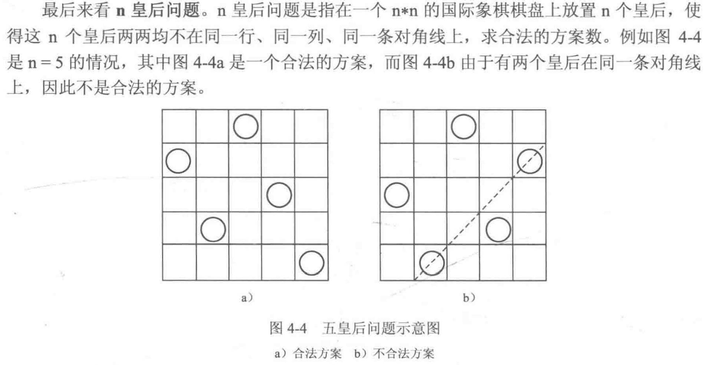
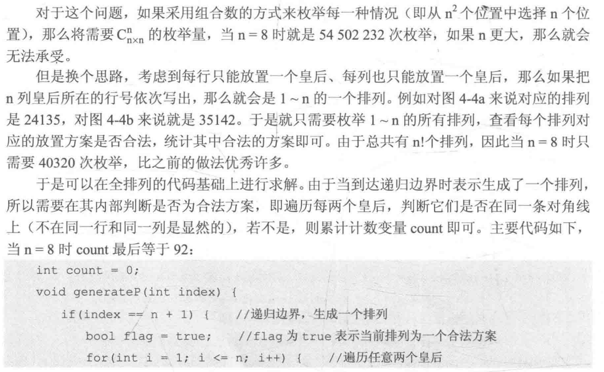
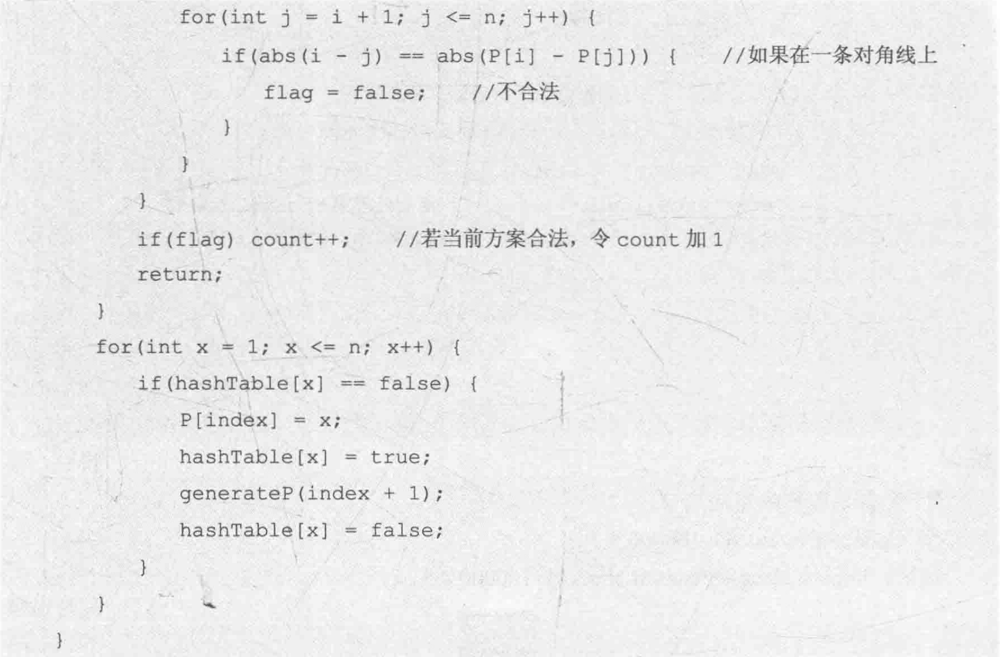
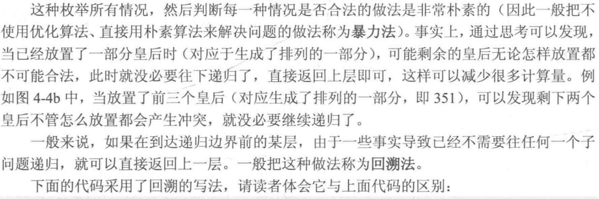
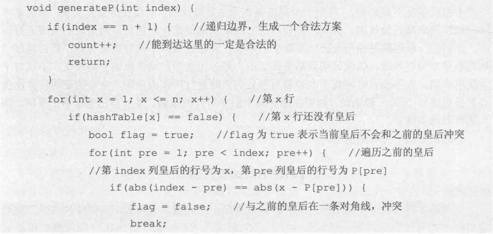
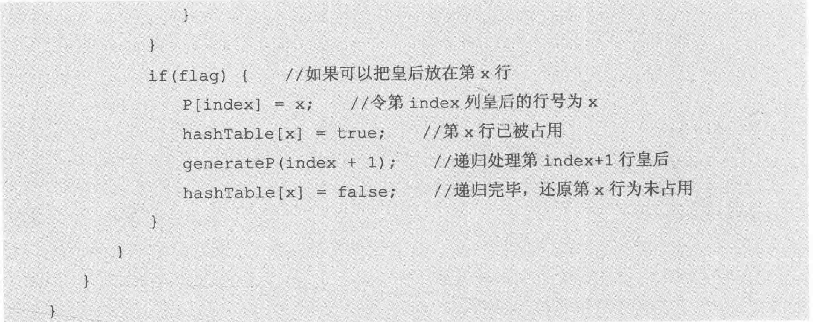

## 二分幂

```cpp
typedef long long LL;
LL binaryPow(LL a, LL b, LL m) {
    // a ^ b % m
    if(b == 0) return 1;
    if(b % 2 == 1) return a * binaryPow(a, b - 1, m);
    else {
        LL mul = binaryPow(a, b / 2, m);
        return mul * mul % m;
    }
}
// if(b % 2 == 1)可以替换为 if(b & 1) 位与操作 判断b的末位是否为1
```

## C语言生成随机数

```cpp
#include<stdio.h>
#include<stdlib.h>
#include<time.h>
int main() {
    srand((unsigned)time(NULL));
    for(int i = 0; i <  10; i++) {
        printf("%d", rand());
    }
    return 0;
}

// rand() % (b - a + 1)的范围是[0,b-a], rand() % (b - a + 1) + a 的范围是[a, b]
// 如果想要生成范围大于RAND_MAX的随机数 
(int)((double)rand() / 32767 * (b - a + 1) + a)

#include<stdio.h>
#include<stdlib.h>
#include<time.h>
#include<math.h>
int main() {
    srand((unsigned)time(NULL));
    printf("%d %d\n", INT_MIN, INT_MAX);
    printf("%d\n",RAND_MAX);
    for(int i = 0; i < 10; i++) {
        // [10000,60000]
        printf("%d ", (int)(round(1.0*rand() / RAND_MAX * 50000 + 10000)));
    }
    return 0;
}
```

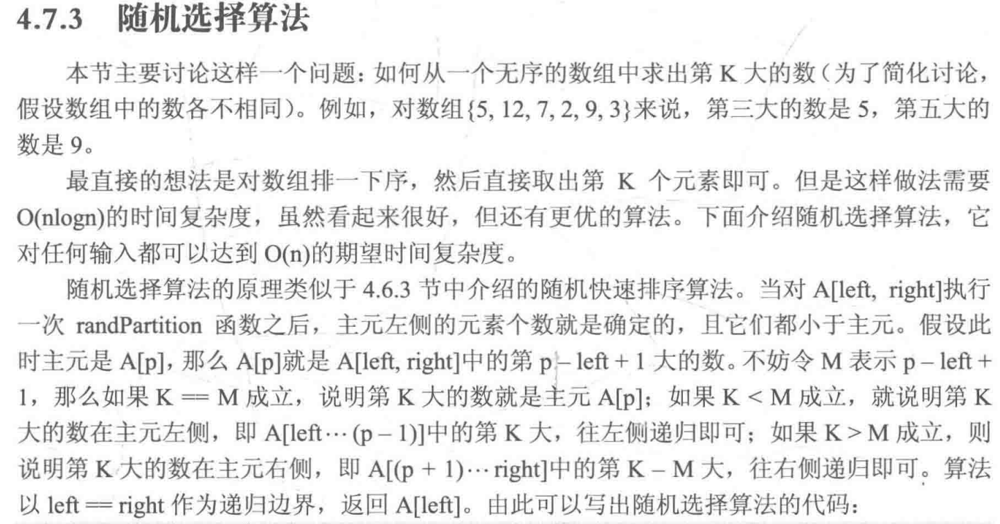
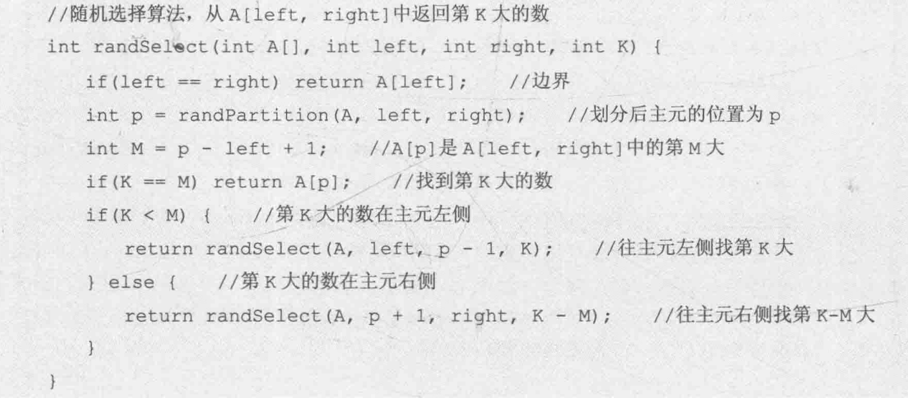

## quickSort.cpp

```cpp
int Partition(int A[], int left, int right) {
    // 对区间[left, right]进行划分
    int temp = A[left];
    while(left < right) {
        while(left < right && A[right] > temp) right--;
        A[left] = A[right];
        while(left < right && A[left] <= temp) left++;
        A[right] = A[left];
    }
    A[left] = temp;
    return left;
}

int randPartition(int A[], int left, int right) {
    int p = (round(1.0 * rand() / RAND_MAX * (right - left)+left));
    swap(A[p], A[left]);
    // 对区间[left, right]进行划分
    int temp = A[left];
    while(left < right) {
        while(left < right && A[right] > temp) right--;
        A[left] = A[right];
        while(left < right && A[left] <= temp) left++;
        A[right] = A[left];
    }
    A[left] = temp;
    return left;
}

void quickSort(int A[], int left, int right) {
    if(left < right) {
        int pos = Partition(A,left,right);
        quickSort(A, left, pos - 1);
        quickSort(A, pos + 1, right);
    }
}
```

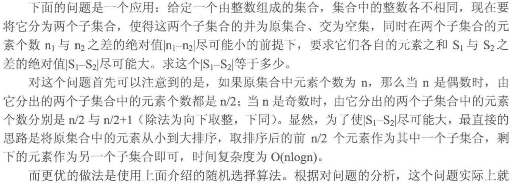


```cpp
#include<cstdio>
#include<cstdlib>
#include<ctime>
#include<algorithm>
#include<cmath>
using namespace std;
const int MAXN = 100010;
int A[MAXN], n;
int randPartition(int A[], int left, int right) {
    int p = (round(1.0 * rand() / RAND_MAX * (right - left) + left));
    swap(A[p], A[left]);
    // 对区间[left, right]进行划分
    int temp = A[left];
    while(left < right) {
        while(left < right && A[right] > temp) right--;
        A[left] = A[right];
        while(left < right && A[left] <= temp) left++;
        A[right] = A[left];
    }
    A[left] = temp;
    return left;
}

void randSelect(int A[], int left, int right, int K) {
    // 随机选择算法 从A[left, right]中返回第K大的数
    if(left == right) return;
    int p = randPartition(A, left, right);
    int M = p -left + 1; // A[p]是A[left, right]中的第M大
    if(K == M) return; // 找到第K大的元素
    if(K < M) { // 第K大的数在主元左侧
        randSelect(A, left, p - 1, K);
    } else { // 第K大的数在主元右侧
        randSelect(A, p + 1, right, K - M);
    }
}

int main() {
    srand((unsigned)time(NULL));
    // sum和sum1记录所有整数之和与切分后前n/2个元素之和
    int sum = 0, sum1 = 0;
    scanf("%d", &n);// 整数个数
    for(int i = 0; i < n; i++) {
        scanf("%d", &A[i]);
        sum +=A[i];
    }
    randSelect(A, 0, n - 1, n / 2);
    for(int i = 0; i < n / 2; i++) {
        sum1 += A[i];
    }
    printf("%d\n", (sum - sum1) -sum1);
    return 0;
}
```
## 最大公约数 gcd(a, b) = gcd(b, a % b) 
## 最小公倍数 lcm(a, b) = a / (b * d)  (d是a与b的最大公约数)

```c
// 最大公约数
int gcd(int a, int b) {
    return !b ? a : gcd(b, a % b);
}
```

## 分数

```cpp
struct Fraction {
    long long up, down;
};
int gcd(int a, int b) {
    return !b ? a : gcd(b, a % b);
}
// (1) 确保down为非负数，如果分数为复数，则使分子为负
// (2) 若分数为0，则规定分子为0，分母为1
// (3) 分子和分母没有除了1以外的公约数

Fraction reduction(Fraction res) {
    if(res.down < 0) {
        res.down = -res.down;
        res.up = -res.up;
    }
    if(res.up == 0) {
        res.down = 1;
    } else {
        int d = gcd(abs(res.up), abs(res.down));
        res.up /= d;
        res.down /= d;
    }
    return res;
}

Fraction add(Fraction f1, Fraction f2) {
    Fraction res;
    res.up = f1.up * f2.down + f2.up * f1.down;
    res.down = f1.down * f2.down;
    return reduction(res);
}

Fraction minu(Fraction f1, Fraction f2) {
    Fraction res;
    res.up = f1.up * f2.down - f2.up * f1.down;
    res.down = f1.down * f2.down;
    return reduction(res);
}

Fraction multi(Fraction f1, Fraction f2) {
    Fraction res;
    res.up = f1.up * f2.up;
    res.down = f1.down * f2.down;
    return reduction(res);
}

Fraction divide(Fraction f1, Fraction f2) {
    Fraction res;
    res.up = f1.up * f2.down;
    res.down = f1.down * f2.up;
    return reduction(res);
}

void Print(Fraction r) {
    r = reduction(r);
    if(r.down == 1) printf("%lld", r.up);
    else if(abs(r.up) > r.down) {
        printf("%lld %lld %lld", r.up / r.down, abs(r.up) % r.down, r.down);
    } else {
        printf("%lld/%lld", r.up, r.down);
    }
}
```

## 求素数
### 法一

```cpp
#include<cstdio>
#include<cmath>
#define MAXN 10001
bool isPrime(int n) {
    if(n <= 1) return false;
    int sqr = (int) sqrt(1.0 * n);
    for(int i = 2; i <= sqr; i++) {
        if(n % i == 0) return false;
    }
    return true;
}
int prime[MAXN], pNum = 0;
bool p[MAXN] = {0};
void findPrime() {
    for(int i = 0; i < MAXN; i++) {
        if(isPrime(i) == true) {
            prime[pNum++] = i;
            p[i] = true;
        }
    }
}

int main() {
    findPrime();
    for(int i = 0; i < pNum; i++) {
        printf("%04d ",prime[i]);
    }
    printf("\n");
    return 0;
}
```

### 法二 线性筛法 

```cpp
#include<cstdio>
const int MAXN = 10001;
int prime[MAXN], pNum = 0;
bool p[MAXN] = {0};
void Find_Prime() {
    for(int i = 2; i < MAXN; i++) {
        if(p[i] == false) {
            prime[pNum++] = i;
            for(int j = i + i; j < MAXN; j += i) {
                // 筛去所有i的倍数
                p[j] = true;
            }
        }
    }
}

int main() {
    Find_Prime();
    for(int i = 0; i < pNum; i++) {
        printf("%d ", prime[i]);
    }
    printf("\n");
    return 0;
}
```

## STL

### set
```cpp
#include<stdio.h>
#include<set>

using namespace std;
int main() {
    set<int> st;
    st.insert(3);
    st.insert(5);
    st.insert(2);
    st.insert(3);

    for(set<int>::iterator it = st.begin(); it != st.end(); it++) {
        printf("%d",*it);// 235
    }
    return 0;
}
```
### map
```cpp
#include<stdio.h>
#include<map>
using namespace std;
int main() {
    map<char, int> mp;
    mp['m'] = 20;
    mp['r'] = 30;
    mp['a'] = 40;
    for(map<char, int>::iterator it = mp.begin(); it != mp.end(); it ++) {
        printf("%c %d\n", it->first, it->second);
    }
    return 0;
}
```

### priority_queue

```cpp
#include<stdio.h>
#include<queue>
using namespace std;
int main() {
    // 想让优先队列总是把最小的元素放在队首
    priority_queue<int, vector<int>, greater<int>>q;
    q.push(3);
    q.push(4);
    q.push(5);
    printf("%d",q.top());
    return 0;
}
```

```cpp
#include<iostream>
#include<string>
#include<queue>
using namespace std;
struct fruit {
    string name;
    int price;
    friend bool operator < (fruit f1, fruit f2) {
        return f1.price < f2.price;
    }
}f1, f2, f3;

int main() {
    priority_queue<fruit>q;
    f1.name = "桃子";
    f1.price = 3;
    f2.name = "栗子";
    f2.price = 4;
    f3.name = "苹果";
    f3.price = 1;
    q.push(f1);
    q.push(f2);
    q.push(f3);
    cout<< q.top().name << " "<< q.top().price<<endl;
    return 0;
}
```
### pair
```cpp
#include<iostream>
#include<utility>
#include<string>
using namespace std;
// 使用pair 需要添加上面的头文件 因为map中包含pair 所以添加map也可以
int main() {
    // 定义一个pair 并初始化
    pair<string, int> p1,p2,p3;
    p1.first = "haha";
    p1.second = 5;
    cout<<p1.first<<" "<<p1.second<<endl;
    p2 = make_pair("xixi", 6);
    cout<<p2.first<<" "<<p2.second<<endl;
    p3 = pair<string, int>("ababa",7);
    cout<<p3.first<<" "<<p3.second<<endl;
    cout<<(p1<p2)<<endl;
    return 0;
}
```
* pair 作为map的键值对来进行插入
```cpp
#include<iostream>
#include<map>
#include<string>
using namespace std;
int main() {
    map<string, int> mp;
    mp.insert(make_pair("abb", 5));
    mp.insert(pair<string, int>("lalala", 55));
    for(map<string, int>::iterator it = mp.begin(); it != mp.end(); it++) {
        cout<<it->first<<" "<<it->second<<endl;
    }
    return 0;
}
```
## Algorithm头文件中的常用函数
### abs()
* abs(x) 返回整数x的绝对值，浮点型应使用<math.h>中的fabs()

### 并查集
```cpp
// 并查集
// 初始化
void init() {
    for(int i = 1; i <= N; i++) {
        father[i] = i;
    }
}

// 查找其根结点 
// 递推版
int findFather(int x) {
    while(x != father[x]) {
        x = father[x];
    }
    return x;
}

// 递归版
int findFatherR(int x) {
    if(x == father[x]) return x;
    else return findFatherR(father[x]);
}

// 合并
void Union(int a, int b) {
    int faA = findFather(a);
    int faB = findFather(b);
    if(faA != faB) {
        father[faA] = faB;
    }
}

// 路径压缩
int findFatherC(int x) {
    int a = x;
    while (x != father[x]) {
        x = father[x];
    }

    while(a != father[a]) {
        int z = a;
        a = father[a];
    }
}

// 递归版
int findFatherCR(int v) {
    if(v == father[v]) return v;
    else {
        int F = findFatherCR(father[v]);
        father[v] = F;
        return F;
    }
}
```

## 图
* 邻接矩阵存储只适用于顶点数不超过1000的图
* 在边数超过1000的情况下，一般用邻接表来存储图
* 如果是不带权图，可以直接将vector的元素类型定义为int

```cpp
vector<int> Adj[N];
Adj[1].push_back(3);
```

* 存放带权图，需要定义结构体Node

```cpp
struct Node {
    int v;// 边的终点编号
    int w;// 边的权值
    Node(int _v, int _w) : v(_v), w(_w) {}
};
vector<Node> Adj[N];
Adj[1].push_back(Node(3, 4));
```
### DFS搜索
* DFS搜索 邻接矩阵版

```cpp
const int MAXV = 1000;
const int INF = 0x3f3f3f3f;
// 邻接矩阵版 带权图 INF为最大值 表示两个顶点间无边
int n, G[MAXV][MAXV];// n为顶点数，MAXV为最大顶点数
bool visited[MAXV] = {false};

void DFS(int u, int depth) {
    visited[u] = true;
    // 此处可写要对u进行的操作
    // 下面对所有从u出发能到达的分支顶点进行枚举
    for(int v = 0; v < n; v++) {
        if(visited[v] == false && G[u][v] != INF) { // 如果v没有被访问过且u可达v
            DFS(v, depth + 1); // 访问v，深度+1
        }
    }
}

void DFSTraverse() {// 遍历图G
    for(int u = 0; u < n; u++) {
        if(visited[u] == false) {
            DFS(u, 1);
        }
    }
}
```
* DFS搜索 邻接表版

```cpp
const int MAXV = 1000;
const int INF = 0x3f3f3f3f;
vector<int> Adj[MAXV];
int n;// 顶点数
bool visited[MAXV] = {false};

void DFS(int u, int depth) {
    visited[u] = true;
    // 此处可写要对u进行的操作
    for(int i = 0; i < Adj[u].size(); i++) { // 遍历u点出发所有可达的点
        int v = Adj[u][i];
        if(visited[v] == false) {
            DFS(v, depth + 1);
        }
    }
}

void DFSTraverse() {
    for(int u = 0; u < n; u++) {
        if(visited[u] == false) {
            DFS(u, 1);
        }
    }
}
```

### BFS搜索
* BFS搜索 邻接矩阵版

```cpp
const int MAXV = 1000;
const int INF = 0x3f3f3f3f;

int n, G[MAXV][MAXV];
bool inq[MAXV] = {false};

void BFS(int u) { // 遍历u所在的连通块
    queue<int> q;
    q.push(u); // 初始点u入队
    inq[u] = true;
    while(!q.empty()) {
        int u = q.front(); // 取出队首元素
        q.pop(); // 队首元素出队
        for(int v = 0; v < n; v++) {
            // 如果u的邻接点v没有入队
            if(inq[v] == false && G[u][v] != INF) {
                q.push(v);
                inq[v] = true;
            }
        }
    }
}

void BFSTraverse() {
    for(int u = 0; u < n; u++) {
        if(inq[u] == false) {
            BFS(q);
        }
    }
}
```
* BFS搜索 邻接表版

```cpp
const int MAXV = 1000;
const int INF = 0x3f3f3f3f;
vector<int> Adj[MAXV]; // Adj[u]存放从顶点u出发所有可以到达的顶点
int n; // n为顶点数 MAXV为最大顶点数
bool inq[MAXV] = false;

void BFS(int u) {
    queue<int> q;
    q.push(u);
    inq[u] = true;
    while(!q.empty()) {
        int u = q.front();
        q.pop();
        for(int i = 0; i < Adj[u].size(); i++) {
            int v = Adj[u][i];
            if(inq[v] == false) {
                q.push(v);
                inq[v] = true;
            }
        }
    }
}

void BFSTraverse() {
    for(int u = 0; u < n; u++) {
        if(inq[u] == false) {
            BFS(q);
        }
    }
}
```
* 输出该连通块内所有其他顶点的层号

```cpp
struct Node{
    int v; // 顶点编号
    int layer; // 顶点层号
};
vector<Node> Adj[N];

void BFS(int s) { // s为起始顶点编号
    queue<Node> q;
    Node start; // 起始顶点
    start.v = s; // 起始顶点编号
    start.layer = 0; // 起始顶点层号为0
    q.push(start);
    inq[start.v] = true;
    while(!q.empty()) {
        Node topNode = q.front();
        q.pop();
        int u = topNode.v;
        for(int i = 0; i < Adj[u].size(); i++) {
            Node next = Adj[u][i];
            next.layer = topNode.layer + 1;
            if(inq[next.v] == false) {
                q.push(next);
                inq[next.v] = true;
            }
        }
    }
}
```

### 最短路径

#### Dijkstra

* 邻接矩阵版 适用于v不超过1000的情况

```cpp
const int MAXV = 1000;
const int INF = 0x3fffffff;

int n, G[MAXV][MAXV];
int d[MAXV]; // 起点到达各点的最短路径长度
bool visited[MAXV] = {false};

void Dijkstra(int s) {// s为起点
    fill(d, d + MAXV, INF);
    d[s] = 0; // 起点到自身的距离为0
    for(int i = 0; i < n; i++) {
        int u = -1, MIN = INF; // u是d[u]最小，MIN存放最小的d[u]
        for(int j = 0; j < n; j++) {
            if(visited[j] == false && d[j] < MIN) {
                u = j;
                MIN = d[j];
            }
        }
        if(u == -1) return;
        visited[u] = true;
        for(int v = 0; v < n; v++) {
            // 如果v未访问 && u能到达v && 以u为中介点可使d[v]更优
            if(visited[v] == false && G[u][v] != INF && d[u] + G[u][v] < d[v]) {
                d[v] = G[u][v] + d[u]; // 优化d[v]
            }
        }
    }
}
```

* 邻接表版

```cpp
const int MAXV = 1000;
const int INF = 0x3fffffff;

struct Node {
    int v, dis; // v 为目标顶点，dis为边权
};
vector<Node> Adj[MAXV]; // 图G Adj[u]存放从顶点u出发的所有可达顶点
int n; // 顶点数
int d[MAXV];
bool visited[MAXV] = {false};

void Dijkstra(int s) {
    fill(d, d + MAXV, INF);
    d[s] = 0;
    for(int i = 0; i < n; i++) {
        int u = -1, MIN = INF;
        for(int j = 0; j < n; j++) {
            if(visited[j] == false && d[j] < MIN) {
                u = j;
                MIN = d[j];
            }
        }
        if(u == -1) return;
        visited[u] = true;
        for(int j = 0; j < Adj.size(); j++) {
            int v = Adj[u][j].v; // u能到达的顶点
            if(visited[v] == false && d[u] + Adj[u][j].dis > d[v]) {
                d[v] = d[u] + Adj[u][j].dis;
            }
        }
    }
}
```