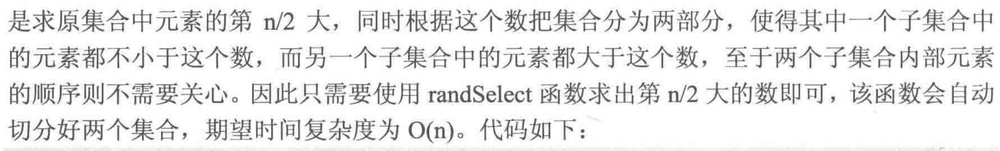

# 算法笔记

### cin cout 所花费的时间远大于printf和scanf 

### 不要在一段代码中同时使用cin和scanf，可能会出问题
### 四种基本数据类型

### long long

如果题目要求10^9以内或32位整数，就用int，如果10^{18}以内或64位整数，就用long long
### float 有效精度6至7位 double 15至16位
### 尽量用double 不用float
### 小写字母比大写字母的ASCII码大32
### 自增运算符


### 位运算符


### scanf格式符


### 常用的数学函数


### 数组可以作为参数，但不可以作为返回类型 需要将返回的数组作为参数传进去 
### 用函数交换两个变量的值


### 结构体的构造函数


### 浮点数的比较


```cpp
// 上面的输出false 下面的输出true
#include<cstdio>
#include<cmath>
const double eps = 1e-8;
#define Equ(a,b) ((fabs((a)-(b)))<(eps))
int main()
{
    double db1 = 4 * asin(sqrt(2.0) / 2);
    double db2 = 3 * asin(sqrt(3.0) / 2);
    if(db1 == db2) {
        printf("true\n");
    } else {
        printf("false\n");
    }
    if(Equ(db1,db2)) {
        printf("true\n");
    } else {
        printf("false\n");
    }
    return 0;
}
```
```cpp
const double eps = 1e-8;
const double Pi = acos(-1.0);
#define Equ(a,b) ((fabs((a)-(b)))<(eps))
#define More(a,b) (((a)-(b))>(eps))
#define Less(a,b) (((a)-(b))<(-eps))
#define MoreEqu(a,b) (((a)-(b))>(-eps))
#define LessEqu(a,b) (((a)-(b))<(eps))
```

### C++ algorithm中的sort函数
sort(首元素地址,尾元素地址的下一个地址,比较函数(选填))

```cpp
#include<iostream>
#include<algorithm>
using namespace std;
bool cmp(int a,int b) {
    return a>b; // 可以理解为a>b时把a放到b前面
}
int main(void)
{
    int a[5] = {3,1,4,2};
    sort(a,a+4,cmp);
    for(int i = 0;i<4;i++) {
        cout<<a[i]<<" ";
    }
    return 0;
}
```

```cpp
#include<iostream>
#include<algorithm>
using namespace std;
struct node{
    int x;
    int y;
}ssd[10];

bool cmp(node a,node b){
    if(a.x!=b.x) return a.x>b.x; // x不等时按x从大到小排序
    else return a.y<b.y; // x相等时按y从小到大排序
}
int main()
{
    ssd[0].x = 2;
    ssd[0].y = 2;
    ssd[1].x = 1;
    ssd[1].y = 3;
    ssd[2].x = 2;
    ssd[2].y = 1;
    sort(ssd,ssd + 3,cmp);
    for(int i = 0;i<3;i++) {
        printf("%d %d\n",ssd[i].x,ssd[i].y);
    }
    return 0;
}
// 输出
2 1
2 2
1 3
```
### 容器的排序 (STL中只有vector,string,deque可以用sort()函数)因为set,map使用红黑树存储,本身有序
* vector
```cpp
#include <cstdio>
#include <vector>
#include <algorithm>
using namespace std;
bool cmp(int a, int b)
{
    return a > b;
}
int main()
{
    vector<int> vi;
    vi.push_back(3);
    vi.push_back(1);
    vi.push_back(2);
    sort(vi.begin(), vi.end(), cmp);
    for (int i = 0; i < 3; i++)
    {
        printf("%d ", vi[i]);
    }
    return 0;
}
```
* string
```cpp
#include <iostream>
#include <string>
#include <algorithm>
using namespace std;
bool cmp(string str1, string str2)
{ //按string的长度从小到大排序
    return str1.length() < str2.length();
}
int main()
{
    string str[3] = {"bbbb", "cc", "aaa"};
    sort(str, str + 3, cmp);
    for (int i = 0; i < 3; i++)
    {
        cout << str[i] << endl;
    }
    return 0;
}
// 输出
cc
aaa
bbbb
```
### n皇后问题


### 二分幂

```cpp
typedef long long LL;
LL binaryPow(LL a, LL b, LL m) {
    // a ^ b % m
    if(b == 0) return 1;
    if(b % 2 == 1) return a * binaryPow(a, b - 1, m);
    else {
        LL mul = binaryPow(a, b / 2, m);
        return mul * mul % m;
    }
}
// if(b % 2 == 1)可以替换为 if(b & 1) 位与操作 判断b的末位是否为1
```

### C语言生成随机数

```cpp
#include<stdio.h>
#include<stdlib.h>
#include<time.h>
int main() {
    srand((unsigned)time(NULL));
    for(int i = 0; i <  10; i++) {
        printf("%d", rand());
    }
    return 0;
}

// rand() % (b - a + 1)的范围是[0,b-a], rand() % (b - a + 1) + a 的范围是[a, b]
// 如果想要生成范围大于RAND_MAX的随机数 
(int)((double)rand() / 32767 * (b - a + 1) + a)

#include<stdio.h>
#include<stdlib.h>
#include<time.h>
#include<math.h>
int main() {
    srand((unsigned)time(NULL));
    printf("%d %d\n", INT_MIN, INT_MAX);
    printf("%d\n",RAND_MAX);
    for(int i = 0; i < 10; i++) {
        // [10000,60000]
        printf("%d ", (int)(round(1.0*rand() / RAND_MAX * 50000 + 10000)));
    }
    return 0;
}
```


### quickSort.cpp

```cpp
int Partition(int A[], int left, int right) {
    // 对区间[left, right]进行划分
    int temp = A[left];
    while(left < right) {
        while(left < right && A[right] > temp) right--;
        A[left] = A[right];
        while(left < right && A[left] <= temp) left++;
        A[right] = A[left];
    }
    A[left] = temp;
    return left;
}

int randPartition(int A[], int left, int right) {
    int p = (round(1.0 * rand() / RAND_MAX * (right - left)+left));
    swap(A[p], A[left]);
    // 对区间[left, right]进行划分
    int temp = A[left];
    while(left < right) {
        while(left < right && A[right] > temp) right--;
        A[left] = A[right];
        while(left < right && A[left] <= temp) left++;
        A[right] = A[left];
    }
    A[left] = temp;
    return left;
}

void quickSort(int A[], int left, int right) {
    if(left < right) {
        int pos = Partition(A,left,right);
        quickSort(A, left, pos - 1);
        quickSort(A, pos + 1, right);
    }
}
```


```cpp
#include<cstdio>
#include<cstdlib>
#include<ctime>
#include<algorithm>
#include<cmath>
using namespace std;
const int MAXN = 100010;
int A[MAXN], n;
int randPartition(int A[], int left, int right) {
    int p = (round(1.0 * rand() / RAND_MAX * (right - left) + left));
    swap(A[p], A[left]);
    // 对区间[left, right]进行划分
    int temp = A[left];
    while(left < right) {
        while(left < right && A[right] > temp) right--;
        A[left] = A[right];
        while(left < right && A[left] <= temp) left++;
        A[right] = A[left];
    }
    A[left] = temp;
    return left;
}

void randSelect(int A[], int left, int right, int K) {
    // 随机选择算法 从A[left, right]中返回第K大的数
    if(left == right) return;
    int p = randPartition(A, left, right);
    int M = p -left + 1; // A[p]是A[left, right]中的第M大
    if(K == M) return; // 找到第K大的元素
    if(K < M) { // 第K大的数在主元左侧
        randSelect(A, left, p - 1, K);
    } else { // 第K大的数在主元右侧
        randSelect(A, p + 1, right, K - M);
    }
}

int main() {
    srand((unsigned)time(NULL));
    // sum和sum1记录所有整数之和与切分后前n/2个元素之和
    int sum = 0, sum1 = 0;
    scanf("%d", &n);// 整数个数
    for(int i = 0; i < n; i++) {
        scanf("%d", &A[i]);
        sum +=A[i];
    }
    randSelect(A, 0, n - 1, n / 2);
    for(int i = 0; i < n / 2; i++) {
        sum1 += A[i];
    }
    printf("%d\n", (sum - sum1) -sum1);
    return 0;
}
```
### 最大公约数 gcd(a, b) = gcd(b, a % b) 
### 最小公倍数 lcm(a, b) = a / (b * d)  (d是a与b的最大公约数)

```c
// 最大公约数
int gcd(int a, int b) {
    return !b ? a : gcd(b, a % b);
}
```

### 分数

```cpp
struct Fraction {
    long long up, down;
};
int gcd(int a, int b) {
    return !b ? a : gcd(b, a % b);
}
// (1) 确保down为非负数，如果分数为复数，则使分子为负
// (2) 若分数为0，则规定分子为0，分母为1
// (3) 分子和分母没有除了1以外的公约数

Fraction reduction(Fraction res) {
    if(res.down < 0) {
        res.down = -res.down;
        res.up = -res.up;
    }
    if(res.up == 0) {
        res.down = 1;
    } else {
        int d = gcd(abs(res.up), abs(res.down));
        res.up /= d;
        res.down /= d;
    }
    return res;
}

Fraction add(Fraction f1, Fraction f2) {
    Fraction res;
    res.up = f1.up * f2.down + f2.up * f1.down;
    res.down = f1.down * f2.down;
    return reduction(res);
}

Fraction minu(Fraction f1, Fraction f2) {
    Fraction res;
    res.up = f1.up * f2.down - f2.up * f1.down;
    res.down = f1.down * f2.down;
    return reduction(res);
}

Fraction multi(Fraction f1, Fraction f2) {
    Fraction res;
    res.up = f1.up * f2.up;
    res.down = f1.down * f2.down;
    return reduction(res);
}

Fraction divide(Fraction f1, Fraction f2) {
    Fraction res;
    res.up = f1.up * f2.down;
    res.down = f1.down * f2.up;
    return reduction(res);
}

void Print(Fraction r) {
    r = reduction(r);
    if(r.down == 1) printf("%lld", r.up);
    else if(abs(r.up) > r.down) {
        printf("%lld %lld %lld", r.up / r.down, abs(r.up) % r.down, r.down);
    } else {
        printf("%lld/%lld", r.up, r.down);
    }
}
```

### 求素数法一

```cpp
#include<cstdio>
#include<cmath>
#define MAXN 10001
bool isPrime(int n) {
    if(n <= 1) return false;
    int sqr = (int) sqrt(1.0 * n);
    for(int i = 2; i <= sqr; i++) {
        if(n % i == 0) return false;
    }
    return true;
}
int prime[MAXN], pNum = 0;
bool p[MAXN] = {0};
void findPrime() {
    for(int i = 0; i < MAXN; i++) {
        if(isPrime(i) == true) {
            prime[pNum++] = i;
            p[i] = true;
        }
    }
}

int main() {
    findPrime();
    for(int i = 0; i < pNum; i++) {
        printf("%04d ",prime[i]);
    }
    printf("\n");
    return 0;
}
```

### 求素数法二 线性筛法 

```cpp
#include<cstdio>
const int MAXN = 10001;
int prime[MAXN], pNum = 0;
bool p[MAXN] = {0};
void Find_Prime() {
    for(int i = 2; i < MAXN; i++) {
        if(p[i] == false) {
            prime[pNum++] = i;
            for(int j = i + i; j < MAXN; j += i) {
                // 筛去所有i的倍数
                p[j] = true;
            }
        }
    }
}

int main() {
    Find_Prime();
    for(int i = 0; i < pNum; i++) {
        printf("%d ", prime[i]);
    }
    printf("\n");
    return 0;
}
```

### STL

#### set
```cpp
#include<stdio.h>
#include<set>

using namespace std;
int main() {
    set<int> st;
    st.insert(3);
    st.insert(5);
    st.insert(2);
    st.insert(3);

    for(set<int>::iterator it = st.begin(); it != st.end(); it++) {
        printf("%d",*it);// 235
    }
    return 0;
}
```
#### map
```cpp
#include<stdio.h>
#include<map>
using namespace std;
int main() {
    map<char, int> mp;
    mp['m'] = 20;
    mp['r'] = 30;
    mp['a'] = 40;
    for(map<char, int>::iterator it = mp.begin(); it != mp.end(); it ++) {
        printf("%c %d\n", it->first, it->second);
    }
    return 0;
}
```

#### priority_queue

```cpp
#include<stdio.h>
#include<queue>
using namespace std;
int main() {
    // 想让优先队列总是把最小的元素放在队首
    priority_queue<int, vector<int>, greater<int>>q;
    q.push(3);
    q.push(4);
    q.push(5);
    printf("%d",q.top());
    return 0;
}
```

```cpp
#include<iostream>
#include<string>
#include<queue>
using namespace std;
struct fruit {
    string name;
    int price;
    friend bool operator < (fruit f1, fruit f2) {
        return f1.price < f2.price;
    }
}f1, f2, f3;

int main() {
    priority_queue<fruit>q;
    f1.name = "桃子";
    f1.price = 3;
    f2.name = "栗子";
    f2.price = 4;
    f3.name = "苹果";
    f3.price = 1;
    q.push(f1);
    q.push(f2);
    q.push(f3);
    cout<< q.top().name << " "<< q.top().price<<endl;
    return 0;
}
```
#### pair
```cpp
#include<iostream>
#include<utility>
#include<string>
using namespace std;
// 使用pair 需要添加上面的头文件 因为map中包含pair 所以添加map也可以
int main() {
    // 定义一个pair 并初始化
    pair<string, int> p1,p2,p3;
    p1.first = "haha";
    p1.second = 5;
    cout<<p1.first<<" "<<p1.second<<endl;
    p2 = make_pair("xixi", 6);
    cout<<p2.first<<" "<<p2.second<<endl;
    p3 = pair<string, int>("ababa",7);
    cout<<p3.first<<" "<<p3.second<<endl;
    cout<<(p1<p2)<<endl;
    return 0;
}
```
* pair 作为map的键值对来进行插入
```cpp
#include<iostream>
#include<map>
#include<string>
using namespace std;
int main() {
    map<string, int> mp;
    mp.insert(make_pair("abb", 5));
    mp.insert(pair<string, int>("lalala", 55));
    for(map<string, int>::iterator it = mp.begin(); it != mp.end(); it++) {
        cout<<it->first<<" "<<it->second<<endl;
    }
    return 0;
}
```
### algorithm头文件中的常用函数
#### abs()
* abs(x) 返回整数x的绝对值，浮点型应使用<math.h>中的fabs()