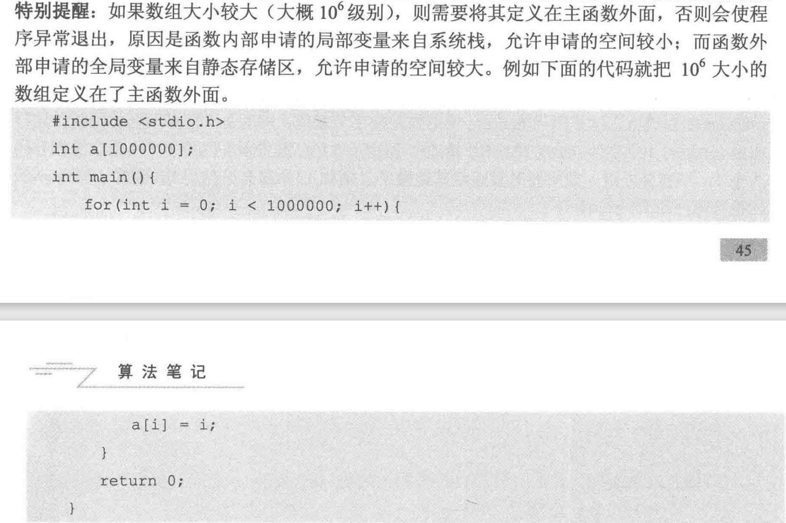

# 算法笔记

* cin cout 所花费的时间远大于printf和scanf 
* 不要在一段代码中同时使用cin和scanf，可能会出问题

## 四种基本数据类型


## long long

* 如果题目要求10^9以内或32位整数，就用int，如果10^{18}以内或64位整数，就用long long
*  float 有效精度6至7位 double 15至16位
*  尽量用double 不用float
*  小写字母比大写字母的ASCII码大32

## 自增运算符


## 位运算符


## scanf格式符


## 常用的数学函数




* 数组可以作为参数，但不可以作为返回类型 需要将返回的数组作为参数传进去 

## 用函数交换两个变量的值


## 结构体的构造函数


## 浮点数的比较


```cpp
// 上面的输出false 下面的输出true
#include<cstdio>
#include<cmath>
const double eps = 1e-8;
#define Equ(a,b) ((fabs((a)-(b)))<(eps))
int main()
{
    double db1 = 4 * asin(sqrt(2.0) / 2);
    double db2 = 3 * asin(sqrt(3.0) / 2);
    if(db1 == db2) {
        printf("true\n");
    } else {
        printf("false\n");
    }
    if(Equ(db1,db2)) {
        printf("true\n");
    } else {
        printf("false\n");
    }
    return 0;
}
```

```cpp
const double eps = 1e-8;
const double Pi = acos(-1.0);
#define Equ(a,b) ((fabs((a)-(b)))<(eps))
#define More(a,b) (((a)-(b))>(eps))
#define Less(a,b) (((a)-(b))<(-eps))
#define MoreEqu(a,b) (((a)-(b))>(-eps))
#define LessEqu(a,b) (((a)-(b))<(eps))
```


## 无穷大
int型变量的取值范围：[-2^31, 2^31 - 1]  ->  [-2147483648, 2147483647]

0x7fffffff = 2147483647 = (2^31 - 1) = (1 << 31) - 1

0x3fffffff = 1073741823 = (2^30 - 1) = (1 << 30) - 1

0x3f3f3f3f = 1061109567

* 使用memset赋值
memset是按字节赋值的，它能够对数组清零 

```cpp
// 全部赋值0
memset(arr, 0, sizeof(arr));  // 0的每个字节都是0 
// 全部赋值-1
memset(arr, -1, sizeof(arr)); // -1在计算机中的表示形式为111...每个字节都是11111111）
// 全部赋值无穷大
memset(arr, 0x3f, sizeof(arr));

// 不推荐使用下面的宏定义
#define INF1 0x7fffffff
#define INE2 0x3fffffff
#define INF3 0x3f3f3f3f

// 我们只是设置一个常量而已，使用 const 就好
const int INF4 = 0x7fffffff;
const int INF5 = 0x3fffffff;
const int INF6 = 0x3f3f3f3f;
```

## C++ algorithm中的sort函数
* sort(首元素地址,尾元素地址的下一个地址,比较函数(选填))

```cpp
#include<iostream>
#include<algorithm>
using namespace std;
bool cmp(int a,int b) {
    return a>b; // 可以理解为a>b时把a放到b前面
}
int main(void)
{
    int a[5] = {3,1,4,2};
    sort(a,a+4,cmp);
    for(int i = 0;i<4;i++) {
        cout<<a[i]<<" ";
    }
    return 0;
}
```

```cpp
#include<iostream>
#include<algorithm>
using namespace std;
struct node{
    int x;
    int y;
}ssd[10];

bool cmp(node a,node b){
    if(a.x!=b.x) return a.x>b.x; // x不等时按x从大到小排序
    else return a.y<b.y; // x相等时按y从小到大排序
}
int main()
{
    ssd[0].x = 2;
    ssd[0].y = 2;
    ssd[1].x = 1;
    ssd[1].y = 3;
    ssd[2].x = 2;
    ssd[2].y = 1;
    sort(ssd,ssd + 3,cmp);
    for(int i = 0;i<3;i++) {
        printf("%d %d\n",ssd[i].x,ssd[i].y);
    }
    return 0;
}
// 输出
2 1
2 2
1 3
```
### 容器的排序 
STL中只有vector,string,deque可以用sort()函数,因为set,map使用红黑树存储,本身有序
* vector
```cpp
#include <cstdio>
#include <vector>
#include <algorithm>
using namespace std;
bool cmp(int a, int b)
{
    return a > b;
}
int main()
{
    vector<int> vi;
    vi.push_back(3);
    vi.push_back(1);
    vi.push_back(2);
    sort(vi.begin(), vi.end(), cmp);
    for (int i = 0; i < 3; i++)
    {
        printf("%d ", vi[i]);
    }
    return 0;
}
```

* string

```cpp
#include <iostream>
#include <string>
#include <algorithm>
using namespace std;
bool cmp(string str1, string str2)
{ //按string的长度从小到大排序
    return str1.length() < str2.length();
}
int main()
{
    string str[3] = {"bbbb", "cc", "aaa"};
    sort(str, str + 3, cmp);
    for (int i = 0; i < 3; i++)
    {
        cout << str[i] << endl;
    }
    return 0;
}
// 输出
cc
aaa
bbbb
```

## n皇后问题


## 二分幂

```cpp
typedef long long LL;
LL binaryPow(LL a, LL b, LL m) {
    // a ^ b % m
    if(b == 0) return 1;
    if(b % 2 == 1) return a * binaryPow(a, b - 1, m);
    else {
        LL mul = binaryPow(a, b / 2, m);
        return mul * mul % m;
    }
}
// if(b % 2 == 1)可以替换为 if(b & 1) 位与操作 判断b的末位是否为1
```

## C语言生成随机数

```cpp
#include<stdio.h>
#include<stdlib.h>
#include<time.h>
int main() {
    srand((unsigned)time(NULL));
    for(int i = 0; i <  10; i++) {
        printf("%d", rand());
    }
    return 0;
}

// rand() % (b - a + 1)的范围是[0,b-a], rand() % (b - a + 1) + a 的范围是[a, b]
// 如果想要生成范围大于RAND_MAX的随机数 
(int)((double)rand() / 32767 * (b - a + 1) + a)

#include<stdio.h>
#include<stdlib.h>
#include<time.h>
#include<math.h>
int main() {
    srand((unsigned)time(NULL));
    printf("%d %d\n", INT_MIN, INT_MAX);
    printf("%d\n",RAND_MAX);
    for(int i = 0; i < 10; i++) {
        // [10000,60000]
        printf("%d ", (int)(round(1.0*rand() / RAND_MAX * 50000 + 10000)));
    }
    return 0;
}
```


## quickSort.cpp

```cpp
int Partition(int A[], int left, int right) {
    // 对区间[left, right]进行划分
    int temp = A[left];
    while(left < right) {
        while(left < right && A[right] > temp) right--;
        A[left] = A[right];
        while(left < right && A[left] <= temp) left++;
        A[right] = A[left];
    }
    A[left] = temp;
    return left;
}

int randPartition(int A[], int left, int right) {
    int p = (round(1.0 * rand() / RAND_MAX * (right - left)+left));
    swap(A[p], A[left]);
    // 对区间[left, right]进行划分
    int temp = A[left];
    while(left < right) {
        while(left < right && A[right] > temp) right--;
        A[left] = A[right];
        while(left < right && A[left] <= temp) left++;
        A[right] = A[left];
    }
    A[left] = temp;
    return left;
}

void quickSort(int A[], int left, int right) {
    if(left < right) {
        int pos = Partition(A,left,right);
        quickSort(A, left, pos - 1);
        quickSort(A, pos + 1, right);
    }
}
```


```cpp
#include<cstdio>
#include<cstdlib>
#include<ctime>
#include<algorithm>
#include<cmath>
using namespace std;
const int MAXN = 100010;
int A[MAXN], n;
int randPartition(int A[], int left, int right) {
    int p = (round(1.0 * rand() / RAND_MAX * (right - left) + left));
    swap(A[p], A[left]);
    // 对区间[left, right]进行划分
    int temp = A[left];
    while(left < right) {
        while(left < right && A[right] > temp) right--;
        A[left] = A[right];
        while(left < right && A[left] <= temp) left++;
        A[right] = A[left];
    }
    A[left] = temp;
    return left;
}

void randSelect(int A[], int left, int right, int K) {
    // 随机选择算法 从A[left, right]中返回第K大的数
    if(left == right) return;
    int p = randPartition(A, left, right);
    int M = p -left + 1; // A[p]是A[left, right]中的第M大
    if(K == M) return; // 找到第K大的元素
    if(K < M) { // 第K大的数在主元左侧
        randSelect(A, left, p - 1, K);
    } else { // 第K大的数在主元右侧
        randSelect(A, p + 1, right, K - M);
    }
}

int main() {
    srand((unsigned)time(NULL));
    // sum和sum1记录所有整数之和与切分后前n/2个元素之和
    int sum = 0, sum1 = 0;
    scanf("%d", &n);// 整数个数
    for(int i = 0; i < n; i++) {
        scanf("%d", &A[i]);
        sum +=A[i];
    }
    randSelect(A, 0, n - 1, n / 2);
    for(int i = 0; i < n / 2; i++) {
        sum1 += A[i];
    }
    printf("%d\n", (sum - sum1) -sum1);
    return 0;
}
```

## 数学 / 数论

### 高精度运算

```cpp
#include<cstdio>
#include<cstring>

struct bign {
    int d[1000];
    int len;
    bign() {
        memset(d, 0, sizeof(d));
        len = 0;
    }
};

bign change(char str[]) {
    bign a;
    a.len = strlen(str);
    for (int i = 0; i < a.len; i++) {
        a.d[i] = str[a.len - i - 1] - '0';
    }
    return a;
}

int cmp(bign a, bign b) {
    if (a.len > b.len) {
        return 1;
    } else if (a.len < b.len) {
        return -1;
    } else {
        for (int i = a.len - 1; i >= 0; i--) {
            // 从高位到低位
            if (a.d[i] > b.d[i]) {
                return 1;
            } else if (a.d[i] < b.d[i]) {
                return -1;
            }
        }
        return 0;
    }
}

bign add(bign a, bign b) {
    bign c;
    int carry = 0; // 表示是否进位
    for (int i = 0; i < a.len || i < b.len; i++) {
        int temp = a.d[i] + b.d[i] + carry;
        c.d[c.len++] = temp % 10;
        carry = temp / 10;
    }
    if (carry != 0) {
        c.d[c.len++] = carry;
    }
    return c;
}

void print(bign a) {
    for (int i = a.len - 1; i >= 0; i--) {
        printf("%d",a.d[i]);
    }
}

int main() {
    char str1[100], str2[100];
    scanf("%s%s", str1, str2);
    bign a = change(str1);
    bign b = change(str2);
    print(add(a, b));
    return 0;
}
```

### 判断奇偶

如果 a&1 == 1则a为奇数，a&1 == 0则a为偶数

### 分数

```cpp
struct Fraction {
    long long up, down;
};
int gcd(int a, int b) {
    return !b ? a : gcd(b, a % b);
}
// (1) 确保down为非负数，如果分数为复数，则使分子为负
// (2) 若分数为0，则规定分子为0，分母为1
// (3) 分子和分母没有除了1以外的公约数

Fraction reduction(Fraction res) {
    if(res.down < 0) {
        res.down = -res.down;
        res.up = -res.up;
    }
    if(res.up == 0) {
        res.down = 1;
    } else {
        int d = gcd(abs(res.up), abs(res.down));
        res.up /= d;
        res.down /= d;
    }
    return res;
}

Fraction add(Fraction f1, Fraction f2) {
    Fraction res;
    res.up = f1.up * f2.down + f2.up * f1.down;
    res.down = f1.down * f2.down;
    return reduction(res);
}

Fraction minu(Fraction f1, Fraction f2) {
    Fraction res;
    res.up = f1.up * f2.down - f2.up * f1.down;
    res.down = f1.down * f2.down;
    return reduction(res);
}

Fraction multi(Fraction f1, Fraction f2) {
    Fraction res;
    res.up = f1.up * f2.up;
    res.down = f1.down * f2.down;
    return reduction(res);
}

Fraction divide(Fraction f1, Fraction f2) {
    Fraction res;
    res.up = f1.up * f2.down;
    res.down = f1.down * f2.up;
    return reduction(res);
}

void Print(Fraction r) {
    r = reduction(r);
    if(r.down == 1) printf("%lld", r.up);
    else if(abs(r.up) > r.down) {
        printf("%lld %lld %lld", r.up / r.down, abs(r.up) % r.down, r.down);
    } else {
        printf("%lld/%lld", r.up, r.down);
    }
}
```

### 求素数

#### 法一

```cpp
#include<cstdio>
#include<cmath>
#define MAXN 10001
bool isPrime(int n) {
    if(n <= 1) return false;
    int sqr = (int) sqrt(1.0 * n);
    for(int i = 2; i <= sqr; i++) {
        if(n % i == 0) return false;
    }
    return true;
}
int prime[MAXN], pNum = 0;
bool p[MAXN] = {0};
void findPrime() {
    for(int i = 0; i < MAXN; i++) {
        if(isPrime(i) == true) {
            prime[pNum++] = i;
            p[i] = true;
        }
    }
}

int main() {
    findPrime();
    for(int i = 0; i < pNum; i++) {
        printf("%04d ",prime[i]);
    }
    printf("\n");
    return 0;
}
```

#### 法二 线性筛法 

```cpp
#include<cstdio>
const int MAXN = 10001;
int prime[MAXN], pNum = 0;
bool p[MAXN] = {0};
void Find_Prime() {
    for(int i = 2; i < MAXN; i++) {
        if(p[i] == false) {
            prime[pNum++] = i;
            for(int j = i + i; j < MAXN; j += i) {
                // 筛去所有i的倍数
                p[j] = true;
            }
        }
    }
}

int main() {
    Find_Prime();
    for(int i = 0; i < pNum; i++) {
        printf("%d ", prime[i]);
    }
    printf("\n");
    return 0;
}
```

### 最大公约数和最小公倍数

最大公约数 gcd(a, b) = gcd(b, a % b) 

最小公倍数 lcm(a, b) = a / (b * d) = a * b / gcd(a, b)

前面的更好 因为两数相乘有可能会溢出 d是a与b的最大公约数
                          
```c
// 最大公约数
int gcd(int a, int b) {
    return !b ? a : gcd(b, a % b);
}
```

### 组合数

```cpp
//计算C(a，b) a在下面 b在上面 a比b大 a中选取b个
LL C(int a, int b) {
    LL res = 1;
    for(LL i = 1;i <= b; i++) {
        res = res * (a - b + i) / i;
    }
    return res;
}
```

### 杨辉三角形与二项式定理


* 杨辉三角形第n行第k个数即为C(n, k) 即C_n^k 
* 如果直接计算n!如30!可能会溢出可以使用以下公式推导


## STL

### 指定vector的大小

**指定一维vector的大小**

如果我们声明了一个vector: *vector v1;*
此时我们不能使用v1[i]来访问它。

如果调用 *v1.resize(5);* 我们就把v1的大小设置成了5，就可以使用v[i]来访问它。

**指定二维vector的大小**

在对二维vector如

```cpp
vector<vector<int>> dp
```
如果我们使用dp.push_back()是没有问题的。但是如果使用dp[i].push_back()会出现下标越界。
这是因为此时的dp为空，无论是dp还是dp[i]的size都是0，这个时候取dp[i]会出现下标越界情况。
解决办法是在push_back之前先定义dp的长度，如dp.resize(5);
此时我们就可以使用dp[i].push_back()了，但是dp[i][j]仍然会出现下标越界。
如果想使用dp[i][j]，需要同时指定dp和dp[i]的大小，此时用到一个临时一维vector,代码如下：

```cpp
vector <vector<int> > v1;
vector<int> temp(4);
v1.resize(5,temp);
```
————————————————

版权声明：本文为CSDN博主「Lavi_qq_2910138025」的原创文章，遵循CC 4.0 BY-SA版权协议，转载请附上原文出处链接及本声明。
原文链接：https://blog.csdn.net/liuweiyuxiang/article/details/88692708

### set
```cpp
#include<stdio.h>
#include<set>

using namespace std;
int main() {
    set<int> st;
    st.insert(3);
    st.insert(5);
    st.insert(2);
    st.insert(3);

    for(set<int>::iterator it = st.begin(); it != st.end(); it++) {
        printf("%d",*it);// 235
    }
    return 0;
}
```
### map
```cpp
#include<stdio.h>
#include<map>
using namespace std;
int main() {
    map<char, int> mp;
    mp['m'] = 20;
    mp['r'] = 30;
    mp['a'] = 40;
    for(map<char, int>::iterator it = mp.begin(); it != mp.end(); it ++) {
        printf("%c %d\n", it->first, it->second);
    }
    return 0;
}
```

### priority_queue

```cpp
#include<stdio.h>
#include<queue>
using namespace std;
int main() {
    // 想让优先队列总是把最小的元素放在队首
    priority_queue<int, vector<int>, greater<int>>q;
    q.push(3);
    q.push(4);
    q.push(5);
    printf("%d",q.top());
    return 0;
}
```

```cpp
#include<iostream>
#include<string>
#include<queue>
using namespace std;
struct fruit {
    string name;
    int price;
    friend bool operator < (fruit f1, fruit f2) {
        return f1.price < f2.price;
    }
}f1, f2, f3;

int main() {
    priority_queue<fruit>q;
    f1.name = "桃子";
    f1.price = 3;
    f2.name = "栗子";
    f2.price = 4;
    f3.name = "苹果";
    f3.price = 1;
    q.push(f1);
    q.push(f2);
    q.push(f3);
    cout<< q.top().name << " "<< q.top().price<<endl;
    return 0;
}
```
### pair
```cpp
#include<iostream>
#include<utility>
#include<string>
using namespace std;
// 使用pair 需要添加上面的头文件 因为map中包含pair 所以添加map也可以
int main() {
    // 定义一个pair 并初始化
    pair<string, int> p1,p2,p3;
    p1.first = "haha";
    p1.second = 5;
    cout<<p1.first<<" "<<p1.second<<endl;
    p2 = make_pair("xixi", 6);
    cout<<p2.first<<" "<<p2.second<<endl;
    p3 = pair<string, int>("ababa",7);
    cout<<p3.first<<" "<<p3.second<<endl;
    cout<<(p1<p2)<<endl;
    return 0;
}
```
* pair 作为map的键值对来进行插入
```cpp
#include<iostream>
#include<map>
#include<string>
using namespace std;
int main() {
    map<string, int> mp;
    mp.insert(make_pair("abb", 5));
    mp.insert(pair<string, int>("lalala", 55));
    for(map<string, int>::iterator it = mp.begin(); it != mp.end(); it++) {
        cout<<it->first<<" "<<it->second<<endl;
    }
    return 0;
}
```
## Algorithm头文件中的常用函数
### abs()
* abs(x) 返回整数x的绝对值，浮点型应使用<math.h>中的fabs()

### 并查集
```cpp
// 并查集
// 初始化
void init() {
    for(int i = 1; i <= N; i++) {
        father[i] = i;
    }
}

// 查找其根结点 
// 递推版
int findFather(int x) {
    while(x != father[x]) {
        x = father[x];
    }
    return x;
}

// 递归版
int findFatherR(int x) {
    if(x == father[x]) return x;
    else return findFatherR(father[x]);
}

// 合并
void Union(int a, int b) {
    int faA = findFather(a);
    int faB = findFather(b);
    if(faA != faB) {
        father[faA] = faB;
    }
}

// 路径压缩
int findFatherC(int x) {
    int a = x;
    while (x != father[x]) {
        x = father[x];
    }

    while(a != father[a]) {
        int z = a;
        a = father[a];
    }
}

// 递归版
int findFatherCR(int v) {
    if(v == father[v]) return v;
    else {
        int F = findFatherCR(father[v]);
        father[v] = F;
        return F;
    }
}
```

## 图
* 邻接矩阵存储只适用于顶点数不超过1000的图
* 在边数超过1000的情况下，一般用邻接表来存储图
* 如果是不带权图，可以直接将vector的元素类型定义为int

```cpp
vector<int> Adj[N];
Adj[1].push_back(3);
```

* 存放带权图，需要定义结构体Node

```cpp
struct Node {
    int v;// 边的终点编号
    int w;// 边的权值
    Node(int _v, int _w) : v(_v), w(_w) {}
};
vector<Node> Adj[N];
Adj[1].push_back(Node(3, 4));
```
### DFS搜索
* DFS搜索 邻接矩阵版

```cpp
const int MAXV = 1000;
const int INF = 0x3f3f3f3f;
// 邻接矩阵版 带权图 INF为最大值 表示两个顶点间无边
int n, G[MAXV][MAXV];// n为顶点数，MAXV为最大顶点数
bool visited[MAXV] = {false};

void DFS(int u, int depth) {
    visited[u] = true;
    // 此处可写要对u进行的操作
    // 下面对所有从u出发能到达的分支顶点进行枚举
    for(int v = 0; v < n; v++) {
        if(visited[v] == false && G[u][v] != INF) { // 如果v没有被访问过且u可达v
            DFS(v, depth + 1); // 访问v，深度+1
        }
    }
}

void DFSTraverse() {// 遍历图G
    for(int u = 0; u < n; u++) {
        if(visited[u] == false) {
            DFS(u, 1);
        }
    }
}
```
* DFS搜索 邻接表版

```cpp
const int MAXV = 1000;
const int INF = 0x3f3f3f3f;
vector<int> Adj[MAXV];
int n;// 顶点数
bool visited[MAXV] = {false};

void DFS(int u, int depth) {
    visited[u] = true;
    // 此处可写要对u进行的操作
    for(int i = 0; i < Adj[u].size(); i++) { // 遍历u点出发所有可达的点
        int v = Adj[u][i];
        if(visited[v] == false) {
            DFS(v, depth + 1);
        }
    }
}

void DFSTraverse() {
    for(int u = 0; u < n; u++) {
        if(visited[u] == false) {
            DFS(u, 1);
        }
    }
}
```

### BFS搜索
* BFS搜索 邻接矩阵版

```cpp
const int MAXV = 1000;
const int INF = 0x3f3f3f3f;

int n, G[MAXV][MAXV];
bool inq[MAXV] = {false};

void BFS(int u) { // 遍历u所在的连通块
    queue<int> q;
    q.push(u); // 初始点u入队
    inq[u] = true;
    while(!q.empty()) {
        int u = q.front(); // 取出队首元素
        q.pop(); // 队首元素出队
        for(int v = 0; v < n; v++) {
            // 如果u的邻接点v没有入队
            if(inq[v] == false && G[u][v] != INF) {
                q.push(v);
                inq[v] = true;
            }
        }
    }
}

void BFSTraverse() {
    for(int u = 0; u < n; u++) {
        if(inq[u] == false) {
            BFS(q);
        }
    }
}
```
* BFS搜索 邻接表版

```cpp
const int MAXV = 1000;
const int INF = 0x3f3f3f3f;
vector<int> Adj[MAXV]; // Adj[u]存放从顶点u出发所有可以到达的顶点
int n; // n为顶点数 MAXV为最大顶点数
bool inq[MAXV] = false;

void BFS(int u) {
    queue<int> q;
    q.push(u);
    inq[u] = true;
    while(!q.empty()) {
        int u = q.front();
        q.pop();
        for(int i = 0; i < Adj[u].size(); i++) {
            int v = Adj[u][i];
            if(inq[v] == false) {
                q.push(v);
                inq[v] = true;
            }
        }
    }
}

void BFSTraverse() {
    for(int u = 0; u < n; u++) {
        if(inq[u] == false) {
            BFS(q);
        }
    }
}
```
* 输出该连通块内所有其他顶点的层号

```cpp
struct Node{
    int v; // 顶点编号
    int layer; // 顶点层号
};
vector<Node> Adj[N];

void BFS(int s) { // s为起始顶点编号
    queue<Node> q;
    Node start; // 起始顶点
    start.v = s; // 起始顶点编号
    start.layer = 0; // 起始顶点层号为0
    q.push(start);
    inq[start.v] = true;
    while(!q.empty()) {
        Node topNode = q.front();
        q.pop();
        int u = topNode.v;
        for(int i = 0; i < Adj[u].size(); i++) {
            Node next = Adj[u][i];
            next.layer = topNode.layer + 1;
            if(inq[next.v] == false) {
                q.push(next);
                inq[next.v] = true;
            }
        }
    }
}
```

### 最短路径

#### Dijkstra

* 邻接矩阵版 适用于v不超过1000的情况

```cpp
const int MAXV = 1000;
const int INF = 0x3fffffff;

int n, G[MAXV][MAXV];
int d[MAXV]; // 起点到达各点的最短路径长度
bool visited[MAXV] = {false};

void Dijkstra(int s) {// s为起点
    fill(d, d + MAXV, INF);
    d[s] = 0; // 起点到自身的距离为0
    for(int i = 0; i < n; i++) {
        int u = -1, MIN = INF; // u是d[u]最小，MIN存放最小的d[u]
        for(int j = 0; j < n; j++) {
            if(visited[j] == false && d[j] < MIN) {
                u = j;
                MIN = d[j];
            }
        }
        if(u == -1) return;
        visited[u] = true;
        for(int v = 0; v < n; v++) {
            // 如果v未访问 && u能到达v && 以u为中介点可使d[v]更优
            if(visited[v] == false && G[u][v] != INF && d[u] + G[u][v] < d[v]) {
                d[v] = G[u][v] + d[u]; // 优化d[v]
            }
        }
    }
}
```

* 邻接表版

```cpp
const int MAXV = 1000;
const int INF = 0x3fffffff;

struct Node {
    int v, dis; // v 为目标顶点，dis为边权
};
vector<Node> Adj[MAXV]; // 图G Adj[u]存放从顶点u出发的所有可达顶点
int n; // 顶点数
int d[MAXV];
bool visited[MAXV] = {false};

void Dijkstra(int s) {
    fill(d, d + MAXV, INF);
    d[s] = 0;
    for(int i = 0; i < n; i++) {
        int u = -1, MIN = INF;
        for(int j = 0; j < n; j++) {
            if(visited[j] == false && d[j] < MIN) {
                u = j;
                MIN = d[j];
            }
        }
        if(u == -1) return;
        visited[u] = true;
        for(int j = 0; j < Adj.size(); j++) {
            int v = Adj[u][j].v; // u能到达的顶点
            if(visited[v] == false && d[u] + Adj[u][j].dis > d[v]) {
                d[v] = d[u] + Adj[u][j].dis;
            }
        }
    }
}
```

## 动态规划

### 斐波拉契数列

```cpp
// 求斐波拉契数列的第n项
#include<iostream>
#include<algorithm>
using namespace std;
const int MAXN = 100000;
unsigned long long dp[MAXN];

// 记忆化搜索 T(n) = O(n) 空间 O(n)
unsigned long long F(int n) {
    if(n == 1 || n == 2) {
        // dp[n] = 1;
        return 1;
    }
    if(dp[n] != -1) {
        return dp[n];
    } else {
        dp[n] = F(n - 1) + F(n - 2);
        return dp[n];
    }
}

// 传统递归写法 T(n) = O(2^n) 空间O(1)
unsigned long long trad_Fib(int n) {
    if(n == 1 || n == 2) {
        return 1;
    } else return F(n - 1) + F(n - 2);
}

int main() {
    fill(dp, dp + MAXN, -1);
    int n = 80000;
    // cin>>n;
    cout<<trad_Fib(n)<<endl;
    cout<<F(n)<<endl;
    return 0;
}
```

### 数塔问题


* 递推：自底向上 递归：自顶向下

输入
```
5
5
8 3
12 7 16
4 10 11 6
9 5 3 9 4
```
输出
```
44 // 路径5->3->16->11->9 最大和为44
```

```cpp
#include<cstdio>
#include<algorithm>
using namespace std;
const int maxn = 1000;
int f[maxn][maxn], dp[maxn][maxn];
int main() {
    int n;
    scanf("%d", &n);
    for(int i = 1; i <= n; i++) {
        for(int j = 1; j <= i; j++) {
            scanf("%d",&f[i][j]);
        }
    }

    //边界
    for(int j = 1; j <= n; j++) {
        dp[n][j] = f[n][j];
    }
    // 从第n-1层起不断向上计算出dp[i][j]
    for(int i = n - 1; i >= 1; i--) {
        for(int j = 1; j <= i; j++) {
            // 状态转移方程
            dp[i][j] = max(dp[i + 1][j], dp[i + 1][j + 1]) + f[i][j];
        }
    }
    printf("%d\n",dp[1][1]);
    return 0;
}
```

### 背包问题

#### 0-1背包

* 有n个物品，每件物品的重量为w[i], 价值为c[i], 现有一个容量为V的背包, 问如何让背包里装入的物品具有最大的价值总和,每种物品仅有1件.
* dp[i][v]表示前i件物品(1 <= i <= n, 0 <= v <= V)恰好装入容量为v的背包所能获得的最大价值(v背包当前已放入的重量)
* ① 不放第i件物品，问题转化为前i - 1件物品恰好装入容量为v的背包所能获得的最大价值，即dp[i - 1][v]
* ② 放第i件物品，问题转化为前i - 1件物品恰好装入容量为v-w[i]的背包所能获得的最大价值，即dp[i - 1][v - w[i]] + c[i]

```
dp[i][v] = max{dp[i - 1][v], dp[i - 1][v - w[i] + c[i]]} (1 <= i <= n, 0 <= v <= V)
边界: dp[0][v] = 0 (0 <= v <= V)
```

```cpp
for(int i = 1; i <= n; i++) {
    for(int v = w[i]; v <= V; v++) {
        dp[i][v] = max(dp[i - 1][v], dp[i - 1][v - w[i]] + c[i]);
    }
}
```

* 优化为一维数组

```
dp[v] = max(dp[v], dp[v - w[i]] + c[i]) (1 <= i <= n, w[i] <= v <= V)
边界: dp[v] = 0 (0 <= v <= V)
```

```cpp
for(int i = 1; i < n; i++) {
    for(int v = V; v >= w[i]; v--) { // 一维数组 v必须逆序
        dp[v] = max(dp[v], dp[v - w[i]] + c[i]);
    }
}
```

* 完整实例

输入
```
5 8
3 5 1 2 2
4 5 2 1 3
```

输出
```
10
```

```cpp
#include<cstdio>
#include<algorithm>
using namespace std;
const int maxn = 100; // 物品最多件数
const int maxv = 1000; // 容量v的上限
int w[maxn], c[maxn], dp[maxv]; // w[maxn]每个物品的重量 c[maxn]每个物品的价值
int main() {
    int n, V;
    scanf("%d%d", &n, &V);
    for(int i = 0; i < n; i++) {
        scanf("%d", &w[i]);
    }
    for(int i = 0; i < n; i++) {
        scanf("%d", &c[i]);
    }
    // 边界
    for(int v = 0; v <= V; v++) {
        dp[v] = 0;
    }
    for(int i = 1; i <= n; i++) {
        for(int v = V; v >= w[i]; v--) {
            // 状态转移方程
            dp[v] = max(dp[v], dp[v - w[i]] + c[i]);
        }
    }
    // 寻找dp[]中最大的即为答案
    int max = 0;
    for(int v = 0; v <= V; v++) {
        if(dp[v] > max) {
            max = dp[v];
        }
    }
    printf("%d\n", max);
    return 0;
}
```

#### 完全背包

* 有n个物品，每件物品的重量为w[i], 价值为c[i], 现有一个容量为V的背包, 问如何让背包里装入的物品具有最大的价值总和,每种物品都有无穷件.
* dp[i][v]表示前i件物品(1 <= i <= n, 0 <= v <= V)恰好装入容量为v的背包所能获得的最大价值(v背包当前已放入的重量)
* ① 不放第i件物品，问题转化为前i - 1件物品恰好装入容量为v的背包所能获得的最大价值，即dp[i - 1][v] (与01背包相同)
* ② 放第i件物品，问题转化为dp[i][v - w[i]] (放了第i件物品后还可以放第i件物品，直到v - w[i]无法满足大于等于0为止)
* 状态转移方程 二维

```
dp[i][v] = max(dp[i - 1][v], dp[i][v - w[i]] + c[i]) (1 <= i <= n, w[i] <= v <= V)
边界: dp[0][v] = 0 (0 <= v <= V)
```

* 状态转移方程 一维

```
dp[v] = max(dp[v], dp[v - w[i]] + c[i]) (1 <= i <= n, w[i] <= v <= V)
边界: dp[v] = 0 (0 <= v <= V)
```

```cpp
for(int i = 1; i <= n; i++) {
    for(int v = w[i]; v <= V; v++) {
        dp[v] = max(dp[v], dp[v - w[i]] + c[i]);
    }
}
```
* 一维形式与01背包完全相同 v的枚举顺序正向枚举 01背包中v必须逆序枚举