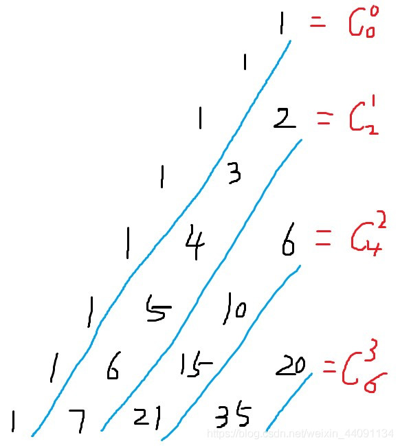
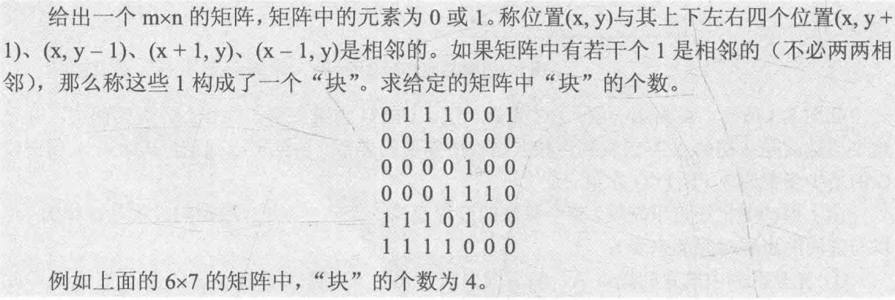

# 十二届蓝桥杯C++ B组 

## A题：空间(5分)
小蓝准备用 256MB 的内存空间开一个数组，数组的每个元素都是 32 位二进制整数，如果不考虑程序占用的空间和维护内存需要的辅助空间，请问256MB 的空间可以存储多少个 32 位二进制整数？

解：256MB = 256 * 1024 * 1024 * 8 / 32 = 256 * 1024 * 1024 / 4 = 67108864
* 在cpp中直接算会溢出

## B题：卡片(5分)
小蓝有很多数字卡片，每张卡片上都是数字0到9。

小蓝准备用这些卡片来拼一些数，他想从1开始拼出正整数，每拼一个，就保存起来，卡片就不能用来拼其它数了。

小蓝想知道自己能从1拼到多少。例如，当小蓝有30张卡片，其中0到9各3张，则小蓝可以拼出1到10，但是拼11时卡片1已经只有一张了，不够拼出11。

现在小蓝手里有0到9的卡片各2021张，共20210张，请问小蓝可以从1拼到多少？

```cpp
#include<iostream>
using namespace std;
int a[10] = {0};
bool f(int x) {
    while(x) {
        int temp = x % 10;
        x /= 10;
        if(a[temp] > 0) {
            a[temp]--;
        } else {
            return false;
        }
    }
    return true;
}
int main() {
    for(int i = 0; i < 10; i++) {
        a[i] = 2021;
    }
    int cnt = 1;
    while(true) {
        if(f(cnt)) {
            cnt++;
        } else {
            break;
        }
    }
    cout<<cnt-1<<endl;
    return 0;
}
```
答案 3181

## C题：直线(10分)
在平面直角坐标系中，两点可以确定一条直线。如果有多点在一条直线上，那么这些点中任意两点确定的直线是同一条。

给定平面上2×3个整点{(x, y)|0 ≤ x < 2, 0 ≤ y < 3, x ∈ Z, y ∈ Z}，即横坐标是0到1(包含0和1)之间的整数、纵坐标是0到2(包含0和2)之间的整数的点。
这些点一共确定了11条不同的直线。

给定平面上20×21个整点{(x, y)|0 ≤ x < 20, 0 ≤ y < 21, x ∈ Z, y ∈ Z}，即横坐标是0到19(包含0和19)之间的整数、纵坐标是0到20(包含0和20)之间的整数的点。请问这些点一共确定了多少条不同的直线。

```cpp
#include<iostream>
#include<cstring>
#include<cmath>
#include<map>
#include<algorithm>
using namespace std;
typedef pair<double, double> PII;
PII l[200000];
int main() {
    int n = 0;
    for(int x1 = 0; x1 < 20; x1++) {
        for(int y1 = 0; y1 < 21; y1++) {
            for(int x2 = 0; x2 < 20; x2++) {
                for(int y2 = 0; y2 <21; y2++) {
                    if(x1 != x2) {
                        double k = (double) (y2 - y1) / (x2 - x1);
                        double b = y1 - k * x1;
                        l[n++] = {k, b};
                    }
                }
            }
        }
    }
    sort(l, l + n);
    int res = 21;
    for(int i = 1; i < n; i++) {
        if(fabs(l[i].first-l[i-1].first) > 1e-8 || fabs(l[i].second - l[i-1].second) > 1e-8) {
            res++;
        }
    }
    cout<<res<<endl;
    return 0;
}
```
答案：40257

## D题：货物摆放(10分)
小蓝有一个超大的仓库，可以摆放很多货物。

现在，小蓝有 n 箱货物要摆放在仓库，每箱货物都是规则的正方体。小蓝规定了长、宽、高三个互相垂直的方向，每箱货物的边都必须严格平行于长、宽、高。

小蓝希望所有的货物最终摆成一个大的立方体。即在长、宽、高的方向上分别堆 L、W、H 的货物，满足 n = L × W × H。

给定 n，请问有多少种堆放货物的方案满足要求。

例如，当 n = 4 时，有以下 6 种方案：1×1×4、1×2×2、1×4×1、2×1×2、 2 × 2 × 1、4 × 1 × 1。

请问，当 n = 2021041820210418 （注意有 16 位数字）时，总共有多少种方案？

```cpp
#include<iostream>
#include<vector>
using namespace std;
typedef long long ll;
vector<ll>num;
int main() {
    ll n = 2021041820210418;
    for(ll i = 1; i * i <= n; i++) {
        if(n % i == 0) {
            num.push_back(i);
            if(n / i != i) {
              num.push_back(n / i);
            }
        }
    }
    int res = 0;
    // int l = num.size();
    // for(int i = 0; i < l; i++) {
    //     for(int j = 0; j < l; j++) {
    //         for(int k = 0; k < l; k++) {
    //             if(num[i] * num[j] * num[k] == n) {
    //                 res++;
    //             }
    //         }
    //     }
    // }
    // for(vector<ll>::iterator i = num.begin(); i != num.end(); i++) {
    //     for(vector<ll>::iterator j = num.begin(); j != num.end(); j++) {
    //         for(vector<ll>::iterator k = num.begin(); k != num.end(); k++) {
    //             if((*i) * (*j) * (*k) == n ) {
    //                 res++;
    //             }
    //         }
    //     }
    // }
    for (auto a: num)
        for (auto b: num)
            for (auto c: num)
                if (a * b * c == n)
                    res ++;
    cout<<res<<endl;
    return 0;
}
```
答案： 2430

## E题：路径(15分)
小蓝学习了最短路径之后特别高兴，他定义了一个特别的图，希望找到图中的最短路径。

小蓝的图由 2021 个结点组成，依次编号 1 至 2021。

对于两个不同的结点 a, b，如果 a 和 b 的差的绝对值大于 21，则两个结点之间没有边相连；如果 a 和 b 的差的绝对值小于等于 21，则两个点之间有一条长度为 a 和 b 的最小公倍数的无向边相连。

例如：结点 1 和结点 23 之间没有边相连；结点 3 和结点 24 之间有一条无向边，长度为 24；结点 15 和结点 25 之间有一条无向边，长度为 75。

请计算，结点 1 和结点 2021 之间的最短路径长度是多少。

```cpp
#include<cstdio>
#include<cstring> // memset函数需要 不建议使用
#include<algorithm> // fill函数需要

using namespace std;

const int MAXV = 2025; // 最大顶点数
const int INF = 0x3f3f3f3f; // 本题不能用0x3fffffff 不知道为什么

int n = 2021, G[MAXV][MAXV]; // n顶点数 邻接矩阵表示图
int d[MAXV]; // 用于存放最短路径
bool visited[MAXV] = {false};

int gcd(int a, int b) {
    return !b ? a : gcd(b, a % b);
}

// 构造图
void initGraph() {
    fill(G[0], G[0] + MAXV * MAXV, INF);
    for (int i = 1; i <= n; i++)
        G[i][i] = 0;
    for (int i = 1; i <= n; i++) {
        for (int j = i + 1; j <= n && j <= i + 21; j++) {
            int w = i * j / gcd(i, j); // 最小公倍数
            G[i][j] = G[j][i] = w; // 无向图
        }
    }
}

void Dijkstra(int s) { // s为起点
    fill(d, d + MAXV, INF);
    d[s] = 0; // 起点到自身的距离为0
    for (int i = 1; i <= n; i++) {
        int u = -1, MIN = INF; // u使d[u]最小，MIN存放最小的d[u]
        for (int j = 1; j <= n; j++) { // 找到未访问的顶点中d[]最小的
            if (!visited[j] && d[j] < MIN) {
                u = j;
                MIN = d[j];
            }
        }
        if (u == -1) return;
        visited[u] = true;
        for (int v = 1; v <= n; v++) {
            // 如果v未访问 && u能到达v && 以u为中介点可使d[v]更优
            if (!visited[v] && G[u][v] != INF && d[u] + G[u][v] < d[v]) {
                d[v] = G[u][v] + d[u]; // 优化d[v]
            }
        }
    }
}

// 网上的方法
void Dijkstra2(int s) {
    memset(d, INF, sizeof(d));
    d[s] = 0;
    for (int i = 1; i <= n; i++) {
        int x = 0;
        for (int j = 1; j <= n; j++) {
            if (!visited[j] && d[j] < d[x]) {
                x = j;
            }
        }
        visited[x] = true;
        for (int j = max(1, x - 21); j <= min(n, x + 21); j++) {
            //剪值，只有这些点有边
            d[j] = min(d[j], d[x] + G[x][j]);
        }
    }
}

int main() {
    initGraph();
    Dijkstra(1);
//    Dijkstra2(1);
    printf("%d\n", d[n]);
    return 0;
}
```
答案：10266837

## F题：时间显示(15分)
时间限制：1.0s 内存限制：256.0MB

小蓝要和朋友合作开发一个时间显示的网站。在服务器上，朋友已经获取了当前的时间，用一个整数表示，值为从1970年1月1日00 : 00 : 00到当前时刻经过的毫秒数。

现在，小蓝要在客户端显示出这个时间。小蓝不用显示出年月日，只需要显示出时分秒即可，毫秒也不用显示，直接舍去即可。

给定一个用整数表示的时间，请将这个时间对应的时分秒输出。

【输入格式】

输入一行包含一个整数，表示时间。

【输出格式】

输出时分秒表示的当前时间，格式形如HH : MM : SS，其中HH表示时，值为0到23，MM表示分，值为0到59，SS表示秒，值为0到59。时、分、秒不足两位时补前导0。

【样例输入 1】
```
46800999
```
【样例输出 1】
```
13:00:00
```
【样例输入 2】
```
1618708103123
```
【样例输出 2】
```
01:08:23
```
【评测用例规模与约定】

对于所有评测用例，给定的时间为不超过10^18的正整数。

```cpp
#include <iostream>
#include <cstdio>
typedef long long ll;
using namespace std;
int main()
{
  ll n;
  cin >> n;
  n /= 1000; // 舍去毫秒 此时n的单位为秒
  int h = n / 3600 % 24; // 除3600后单位为小时，%24约掉前面的天数
  int m = n / 60 % 60; // 除60后单位为分钟，%60约掉前面的
  int s = n % 60;
  printf("%02d:%02d:%02d\n", h, m, s);
  return 0;
}
```
## G题：砝码称重(20分)
时间限制：1.0s 内存限制：256.0MB

【问题描述】
你有一架天平和 N 个砝码，这 N 个砝码重量依次是 W1, W2, · · · , WN。

请你计算一共可以称出多少种不同的重量？

注意砝码可以放在天平两边。

【输入格式】

输入的第一行包含一个整数 N。

第二行包含 N 个整数：W1, W2, W3, · · · , WN。

【输出格式】

输出一个整数代表答案。

【样例输入】
```
3
1 4 6
```
【样例输出】
```
10
```

【样例说明】

能称出的 10 种重量是：1、2、3、4、5、6、7、9、10、11。

1 = 1；

2 = 6 − 4 (天平一边放 6，另一边放 4)；

3 = 4 − 1；

4 = 4；

5 = 6 − 1；

6 = 6；

7 = 1 + 6；

9 = 4 + 6 − 1；

10 = 4 + 6；

11 = 1 + 4 + 6。

【评测用例规模与约定】

对于 50% 的评测用例，1 ≤ N ≤ 15。对于所有评测用例，1 ≤ N ≤ 100，N 个砝码总重不超过 100000。

```cpp
#include<cstdio>
#include<algorithm>

using namespace std;

// 砝码总重 相当于背包容量v
const int V = 100000;
int dp[V];
// 砝码最大数量 相当于物品数量n
int w[105];

int main() {
    int n;
    scanf("%d", &n);
    for (int i = 1; i <= n; i++) {
        scanf("%d", &w[i]);
    }
    fill(dp, dp + V, 0);
    dp[0] = 1;
    // 两次01背包
    // 第一遍 加砝码 第i个砝码与第i - 1 个砝码在同一侧 传统背包
    for (int i = 1; i <= n; i++) {
        for (int v = V; v >= w[i]; v--) {
            dp[v] = max(dp[v], dp[v - w[i]]);
        }
    }
    // 第二遍 减砝码 第i个砝码与第i - 1个砝码在另一侧
    // 如果已经加上了当前的砝码，则相当于把砝码拿下来
    // 如果没有加当前的砝码，则相当于把砝码放在天平另一边
    for (int i = 1; i <= n; i++) {
        int siz = V - w[i];
        for (int v = 1; v <= siz; v++) {
            dp[v] = max(dp[v], dp[v + w[i]]);
        }
    }
    int ans = 0;
    for (int i = 1; i <= V; i++) {
        ans += dp[i];
    }
    printf("%d\n", ans);
    return 0;
}
```

## H题：杨辉三角形(20分)

时间限制：1.0s 内存限制：256.0MB

下面的图形是著名的杨辉三角形：


【问题描述】

如果我们按从上到下、从左到右的顺序把所有数排成一列，可以得到如下数列：

1, 1, 1, 1, 2, 1, 1, 3, 3, 1, 1, 4, 6, 4, 1, …

给定一个正整数 N，请你输出数列中第一次出现 N 是在第几个数？

【输入格式】

输入一个整数 N。

【输出格式】

输出一个整数代表答案。

【样例输入】
```
6
```

【样例输出】
```
13
```

【评测用例规模与约定】
对于 20% 的评测用例，1 ≤ N ≤ 10；对于所有评测用例，1 ≤ N ≤ 1000000000。


思路：
* 第一个数为第零行第零列，则第i行j列为组合数C(i,j)

* 发现杨辉三角是对称的，所以n最早出现的位置一定在左半边

* 第i行最大的数为C(i/2,i)，在最中间


* 第1斜行的1=C（0,0），第二斜行的2=C（2,1），第三斜行的6=C（4,2）...第 i 斜行的第一个数为C（2*i，i），同时它是该斜行中最小的数字




* 显然C（32,16）< 1e9，而C（34,17）> 1e9，因此我们可以对前17行进行枚举

* 杨辉三角前n行共有n*(n+1)/2个数

[参考链接](https://blog.csdn.net/weixin_44091134/article/details/116748883)

```cpp
#include<iostream>
#include<cstring>
#include<algorithm>

using namespace std;
typedef LL = long long;
int n;

LL C(LL a, LL b) { // 计算组合数C(a，b)
    LL res = 1;
    for(int i = a, j = 1; j <= b; j++, i--) {
        res = res * i / j;
        if(res > n) {
            return res; // 大于n已无意义，且防止爆LL
        }
    }
    return res;
}

bool check(int k) {
    // k指斜行数 从17递减遍历 全是1的那一行记作第零斜行
    // 二分该斜行,找到大于等于该值的第一个数
    // 左边界2k，右边界为max(l, n)取二者最大，避免右边界小于左边界
    int l = 2 * k, r = max(n, l);
    // 二分查找 边界是怎么定的
    // 此处C(r,k)指正常意义第r+1行第k+1个数
    while(l < r) {
        // >> 1 二进制右移一位 相当于除以2 优先级比加减低
        int mid = l + r >> 1;
        if(C(mid, k) >= n) r = mid;
        else l = mid + 1;
    }
    if(C(r, k) != n) {
        return false;
    }
    // 前n行共有n*(n+1)/2个数,加上第r+1行的k+1个数
    cout << 1ll * (r + 1) * r / 2 + k + 1 << endl;
    return true;
}

int main()
{
    cin >> n;
    int k = 17;
    while(k--) {
        if(check(k)) break;
    }
    return 0;
}
```

# 十一届蓝桥杯C++ B组 省赛 第一场

[试题下载](https://files.cnblogs.com/files/Angel-Demon/CB.zip)

## A题：跑步训练(5分)

【问题描述】

小明要做一个跑步训练。

初始时，小明充满体力，体力值计为 10000 。如果小明跑步，每分钟损耗 600 的体力。如果小明休息，每分钟增加 300 的体力。体力的损耗和增加都是均匀变化的。

小明打算跑一分钟、休息一分钟、再跑一分钟、再休息一分钟……如此循环。如果某个时刻小明的体力到达 0 ，他就停止锻炼。

请问小明在多久后停止锻炼。为了使答案为整数，请以秒为单位输出答案。答案中只填写数，不填写单位。

```cpp
#include<cstdio>

int slove(int n) {
    int miu, sec;
    for (int i = 0; ; i++) {
        if (i % 2 == 0) { // 跑
			if (n > 600) {
                n -= 600;
			} else { // 体力不足跑完一分钟
				miu = i;
				sec = n / 10;
				break;
			}
		} else { // 休息
			n += 300;
		}
	}
	return (miu * 60 + sec);	
}
int main() {
    printf("%d\n", slove(10000));
    return 0;
}
```

## B题：纪念日(5分)

【问题描述】

2020 年 7 月 1 日是中国共产党成立 99 周年纪念日。

中国共产党成立于 1921 年 7 月 23 日。

请问从 1921 年 7 月 23 日中午 12 时到 2020 年 7 月 1 日中午 12 时一共包
含多少分钟？

【答案提交】

这是一道结果填空题，你只需要算出结果后提交即可。本题的结果为一个整数，在提交答案时只填写这个整数，填写多余的内容将无法得分。


## C题：合并检测(10分)

【问题描述】

新冠疫情由新冠病毒引起，最近在 A 国蔓延，为了尽快控制疫情， A 国准备给大量民众进病毒核酸检测。

然而，用于检测的试剂盒紧缺。

为了解决这一困难，科学家想了一个办法：合并检测。即将从多个人（ k 个）采集的标本放到同一个试剂盒中进行检测。如果结果为阴性，则说明这 k 个人都是阴性，用一个试剂盒完成了 k 个人的检测。如果结果为阳性，则说明至少有一个人为阳性，需要将这 k 个人的样本全部重新独立检测（从理论上看，如果检测前 k−1 个人都是阴性可以推断出第 k 个人是阳性，但是在实际操作中不会利用此推断，而是将 k 个人独立检测），加上最开始的合并检测，一共使用了 k+1 个试剂盒完成了 k 个人的检测。

A 国估计被测的民众的感染率大概是1%，呈均匀分布。请问 k 取多少能最节省试剂盒？

【我的题解】

题意即为 100 人，其中有 1 个感染者。也就是求使得 ⌈100 / k⌉ + k 最小的那个 k，当 k 取 10 时 ⌈100 / k⌉ + k 达到最小值,即为10。

## D题：REPEAT程序(10分)

【问题描述】

附件[prog.txt](https://blog.csdn.net/zranxi/article/details/107630173)中是一个用某种语言写的程序。

其中 REPEAT k 表示一个次数为 k 的循环。循环控制的范围由缩进表达，从次行开始连续的缩进比该行多的（前面的空白更长的）为循环包含的内容。

例如如下片段：

该片段中从 A = A + 4 所在的行到 A = A + 8 所在的行都在第一行的循环两次中。

REPEAT 6: 所在的行到 A = A + 7 所在的行都在 REPEAT 5: 循环中。

A = A + 5 实际总共的循环次数是 2×5×6 = 60 次。

请问该程序执行完毕之后，A 的值是多少？

【答案提交】

这是一道结果填空题，你只需要算出结果后提交即可。本题的结果为一个整数，在提交答案时只填写这个整数，填写多余的内容将无法得分。

【离谱做法】


```cpp
#include <cstdio>
using namespace std;
const int MAXN = 2020;
char s[MAXN];
// a[i] -> 第 i 层循环的缩进，b[i] -> 第 i 层循环的循环次数
int a[MAXN], b[MAXN];
int main() {
    freopen("prog.txt", "r", stdin);
    int pos = 0, ans = 0, w = 1;
    gets(s); // 读走第一行的 A = 0
    a[pos] = -1, b[pos] = 1; // 防止在栈空的时候弹栈
    while (gets(s)) {
        int n = strlen(s), p = 0;
        while (s[p] == ' ') p++; // 统计缩进
        while (a[pos] >= p) w /= b[pos--];// 弹掉栈里缩进大于等于当前行的
        if (s[n - 1] == ':') { // 当前行是循环，压栈
            int k = s[n - 2] - '0';
            pos = pos + 1;
            w *= k;
            a[pos] = p, b[pos] = k;
        } else {
            int k = s[n - 1] - '0';
            ans += k * w;
        }
    }
    printf("%d\n", ans);
    return 0;
}
```

答案： 241830

## E题：矩阵(15分)

【问题描述】
把 1∼2020 放在 2×1010 的矩阵里。要求同一行中右边的比左边大，同一列中下边的比上边的大。一共有多少种方案？

答案很大，你只需要给出方案数除以 2020 的余数即可。

```cpp
#include <cstdio>
using namespace std;
typedef long long LL;
const int MAXN = 2030;
const int MOD = 2020;
int dp[MAXN][MAXN];
int main() {
    int n = 2020;
    dp[1][1] = 1; // 1必然放在第一行
    for (int i = 2; i <= n; i++) {
        for (int j = 1; j <= i; j++) {
            dp[i][j] += dp[i - 1][j - 1]; // 将第i个数放第一行
            if (i - j <= j) {
                // 因为是正向枚举，后面的数只会越来越大
                // 要随时保持第一行的个数不能比第二行的少
                // 否则必然出现这一列第二行比第一行小的情况
                dp[i][j] += dp[i - 1][j];
            }
            dp[i][j] %= MOD;
        }
    }
    printf("%d\n", dp[2020][1010]);
    return 0;
}
```

答案 1340

## F题：整除序列(15分)

【问题描述】

有一个序列，序列的第一个数是 n，后面的每个数是前一个数整除 2，请输出这个序列中值为正数的项。

【输入格式】

输入一行包含一个整数 n。

【输出格式】

输出一行，包含多个整数，相邻的整数之间用一个空格分隔，表示答案。

【评测用例规模与约定】

对于 80% 的评测用例，1≤n≤109。
对于所有评测用例，1≤n≤1018。

```cpp
#include<iostream>
using namespace std;
typedef long long LL;
int main() {
    LL n;
    scanf("%lld", &n);
    while(n >= 1) {
        printf("%lld ", n);
        n /= 2;
    }
    // for (cin >> n; n != 0; n >>= 1) {
    //     cout << n;
    //     if (n != 1) putchar(' ');
    //     else putchar('\n');
    // }
    return 0;
}
```

## G题: 解码(20分)

【问题描述】

小明有一串很长的英文字母，可能包含大写和小写。

在这串字母中，有很多连续的是重复的。小明想了一个办法将这串字母表达得更短：将连续的几个相同字母写成字母 + 出现次数的形式。

例如，连续的 $5 个 a，即 aaaaa，小明可以简写成 a5（也可能简写成 a4a、aa3a 等）。对于这个例子：HHHellllloo，小明可以简写成 H3el5o2。为了方便表达，小明不会将连续的超过 9 个相同的字符写成简写的形式。

现在给出简写后的字符串，请帮助小明还原成原来的串。

【输入格式】

输入一行包含一个字符串。

【输出格式】

输出一个字符串，表示还原后的串。

【评测用例规模与约定】

对于所有评测用例，字符串由大小写英文字母和数字组成，长度不超过 100。请注意原来的串长度可能超过 100。

```cpp
// #include <cstdio>
// using namespace std;
// const int MAXN = 110;
// char s[MAXN];
// int main() {
//     scanf("%s", s);
//     for (int i = 0; s[i]; i++) {
//         if (s[i] >= 'a' && s[i] <= 'z') {
//             putchar(s[i]);
//         } else if (s[i] >= 'A' && s[i] <= 'Z') {
//             putchar(s[i]);
//         } else {
//             int k = s[i] - '0' - 1;
//             while (k--) putchar(s[i - 1]);
//         }
//     }
//     puts("");
//     return 0;
// }

#include <iostream>
#include <cctype>
using namespace std;
int main() {
    string str;
    cin >> str;
    for(int i = 0; i < str.length(); i++) {
        if(isdigit(str[i])) {
            for(int j = 0; j < (int)(str[i] - '0') - 1; j++)
                cout << str[i-1];
        } else {
            cout << str[i];
        }
    }
    return 0;
}
```

## H题: 走方格(20分)

【问题描述】

在平面上有一些二维的点阵。

这些点的编号就像二维数组的编号一样，从上到下依次为第 1至第 n 行，从左到右依次为第 1 至第 m 列，每一个点可以用行号和列号来表示。

现在有个人站在第 1 行第 1 列，要走到第 n 行第 m 列。只能向右或者向下走。

注意，如果行号和列数都是偶数，不能走入这一格中。

问有多少种方案。

【输入格式】

输入一行包含两个整数 n, m。

【输出格式】

输出一个整数，表示答案。

【评测用例规模与约定】

对于所有评测用例，1≤n≤30,1≤m≤30。

```cpp
#include <cstdio>
using namespace std;
const int MAXN = 40;
int dp[MAXN][MAXN];
int main() {
    int n, m;
    scanf("%d%d", &n, &m);
    for (int i = 1; i <= n; i++) {
        for (int j = 1; j <= m; j++) {
            if (i == 1 && j == 1) {
                dp[i][j] = 1;
                continue;
            }
            if ((i & 1) || (j & 1)) {
                dp[i][j] = dp[i - 1][j] + dp[i][j - 1];
            }
        }
    }
    printf("%d\n", dp[n][m]);
    return 0;
}
```

# 十一届蓝桥杯C++ B组 省赛 第二场

## D题:跑步训练

【问题描述】

小蓝每天都锻炼身体。

正常情况下，小蓝每天跑 1 千米。如果某天是周一或者月初（1 日），为了激励自己，小蓝要跑 2 千米。如果同时是周一或月初，小蓝也是跑 2 千米。小蓝跑步已经坚持了很长时间，从 2000 年 1 月 1 日周六（含）到 2020 年10 月 1 日周四（含）。请问这段时间小蓝总共跑步多少千米？

【答案提交】

这是一道结果填空的题，你只需要算出结果后提交即可。本题的结果为一个整数，在提交答案时只填写这个整数，填写多余的内容将无法得分。

答案：8879

```cpp
#include<iostream>
using namespace std;
int judge(int year) {
    return ((year % 4 == 0 && year % 100 != 0) || year % 400 == 0) ? 1 : 0;
}
int main() {
    int day[13] = {0, 31, 28, 31, 30, 31, 30, 31, 31, 30, 31, 30, 31};
    int y, m, d;
    int w = 6;
    int res = 0;
    for (y = 2000; y <= 2020; y++) {
        for (m = 1; m <= 12; m++) {
            for (d = 1; d <= day[m] + (m == 2 ? judge(y) : 0); d++, w = w % 7 + 1) {
                res++;
                if (w == 1 || d == 1) {
                    res++;
                }
                if (y == 2020 && m == 10 && d == 1) {
                    cout<<res<<endl;
                }
            }
        }
    }
    return 0;
}
```

## F题:成绩统计


【问题描述】

小蓝给学生们组织了一场考试，卷面总分为 100 分，每个学生的得分都是一个 0 到 100 的整数。如果得分至少是 60 分，则称为及格。如果得分至少为 85 分，则称为优秀。

请计算及格率和优秀率，用百分数表示，百分号前的部分四舍五入保留整数。

【输入格式】

输入的第一行包含一个整数 n，表示考试人数。接下来 n 行，每行包含一个 0 至 100 的整数，表示一个学生的得分。

【输出格式】

输出两行，每行一个百分数，分别表示及格率和优秀率。百分号前的部分四舍五入保留整数。

【样例输入】

```
7
80
92
56
74
88
100
```

【样例输出】

```
71%
43%
```

【评测用例规模与约定】

对于50% 的评测用例， 1 ≤ n ≤ 100。

对于所有评测用例，1 ≤ n ≤10000。

```cpp
#include<iostream>
#include<vector>
#include<cstdio>
using namespace std;
int main() {
    int n;
    float count_pass;
    float count_good;
    cin>>n;
    vector<int> num(n);
    for (int i = 0; i < n; i++) {
        cin>>num[i];
        if (num[i] >= 60) {
            count_pass++;
        }
        if (num[i] >= 85) {
            count_good++;
        }
    }
    // float pass = (count_pass / n + 0.005) * 100;
	// float good = (count_good / n + 0.005) * 100;
    float pass = count_pass / n * 100;
	float good = count_good / n * 100;
    // cout<<(int)pass<<"%"<<endl;
    // cout<<(int)good<<"%"<<endl;
    printf("%.0f%%\n%.0f%%\n", pass, good);    
    return 0;
}
```
# 第十届蓝桥杯

## C: 数列求值 10 分

【问题描述】

给定数列 1, 1, 1, 3, 5, 9, 17, …，从第 4 项开始，每项都是前 3 项的和。求第 20190324 项的最后 4 位数字。

【答案提交】

这是一道结果填空的题，你只需要算出结果后提交即可。本题的结果为一个 4 位整数（提示：答案的千位不为 0），在提交答案时只填写这个整数，填写多余的内容将无法得分。

```cpp
#include<iostream>
using namespace std;
const int N = 20190324;
int main() {
    int a = 1, b = 1, c = 3, d = 0;
    for (int i = 4; i < N; i++) {
        d = (a + b + c) % 10000;
        a = b;
        b = c;
        c = d;
    }
    cout<<d<<endl;
}
```

## 试题 D: 数的分解 10 分

【问题描述】

把 2019 分解成 3 个各不相同的正整数之和，并且要求每个正整数都不包含数字 2 和 4，一共有多少种不同的分解方法？

注 意 交 换 3 个 整 数 的 顺 序 被 视 为 同 一 种 方 法，例 如 1000+1001+18 和1001+1000+18 被视为同一种。

【答案提交】

这是一道结果填空的题，你只需要算出结果后提交即可。本题的结果为一个整数，在提交答案时只填写这个整数，填写多余的内容将无法得分。

```cpp
#include<iostream>
using namespace std;
int judge(int n) {
    int flag = 0;
    while (n > 0) {
        int temp = n % 10;
        if (temp == 2 || temp == 4) {
            flag = 1;
        }
        n /= 10;
    }
    return flag;
}

int check(int a, int b, int c) {
    if (judge(a) || judge(b) || judge(c) || a == b || a == c || b == c) {
        return 0;
    } else {
        return 1;
    }
}
int main() {
    int res = 0;
    for (int i = 1; i <= 2019 / 3; i++) {
        for (int j = i + 1; j <= 2019 - i; j++) {
            for (int k = j + 1; k <= 2019 - i - j; k++) {
                if (i + j + k == 2019) {
                    res += check(i, j ,k);
                }
            }
        }
    }
    cout<<res<<endl;
    return 0;
}
```

## F: 特别数的和

时间限制: 1.0s

内存限制: 256.0MB

本题总分：15 分

【问题描述】

小明对数位中含有 2、0、1、9 的数字很感兴趣（不包括前导 0），在 1 到40 中这样的数包括 1、2、9、10 至 32、39 和 40，共 28 个，他们的和是 574。

请问，在 1 到 n 中，所有这样的数的和是多少？

【输入格式】

输入一行包含两个整数 n。

【输出格式】

输出一行，包含一个整数，表示满足条件的数的和。

【样例输入】

40

【样例输出】

574

【评测用例规模与约定】

对于 20% 的评测用例，1 ≤ n ≤ 10。

对于 50% 的评测用例，1 ≤ n ≤ 100。

对于 80% 的评测用例，1 ≤ n ≤ 1000。

对于所有评测用例，1 ≤ n ≤ 10000。

```cpp
#include<iostream>
#include<string>
using namespace std;
int main() {
    int n;
    cin>>n;
    int sum = 0;
    for (int i = 1; i <= n; i++) {
        string temp = to_string(i);
        for (int j = 0; j < temp.size(); j++) {
            if (temp[j] == '2' || temp[j] == '0' || temp[j] == '1' || temp[j] == '9') {
                sum += i;
                break;
            }
        }
    }
    cout<<sum<<endl;
    return 0;
}
```

# 第十一届 蓝桥杯省模拟赛

## 括号序列

问题描述

由1对括号，可以组成一种合法括号序列：()。

由2对括号，可以组成两种合法括号序列：()()、(())。

由4对括号组成的合法括号序列一共有多少种？

答案提交

这是一道结果填空的题，你只需要算出结果后提交即可。本题的结果为一个整数，在提交答案时只填写这个整数，填写多余的内容将无法得分。

```java
import java.util.Scanner;
public class Test {
	static int num = 0;
	public static void printPar(int l, int r, char[] str, int count){
		if(l<0 || r<l){ //注意是r<l不是r<1
			return;
		}
		if(l == 0 && r == 0){
			num++;
			System.out.println(str);//char数组可直接如此打印
		} else {
			if(l>0){
				str[count]='(';
				printPar(l-1, r, str, count+1);
			}
			if(r>l){//注意是>l,不是>1,即剩余右括号的数量大于左括号的数量
				str[count]=')';
				printPar(l, r-1, str, count+1);
			}
		}
		
	}
	
	public static void main(String[] args){
        Scanner in = new Scanner(System.in);
        int count = in.nextInt();
		char str[] = new char[count*2];
		printPar(count, count, str, 0);
		System.out.println(num);
        in.close();
	}
}
```

## 凯撒密码

【问题描述】

给定一个单词，请使用凯撒密码将这个单词加密。

凯撒密码是一种替换加密的技术，单词中的所有字母都在字母表上向后偏移3位后被替换成密文。即a变为d，b变为e，…，w变为z，x变为a，y变为b，z变为c。

例如，lanqiao会变成odqtldr。

【输入格式】

输入一行，包含一个单词，单词中只包含小写英文字母。

【输出格式】

输出一行，表示加密后的密文。

【样例输入】

```
lanqiao
```

【样例输出】

```
odqtldr
```

【评测用例规模与约定】

对于所有评测用例，单词中的字母个数不超过100。

## 反倍数

【问题描述】
给定三个整数 a, b, c，如果一个整数既不是 a 的整数倍也不是 b 的整数倍还不是 c 的整数倍，则这个数称为反倍数。

请问在 1 至 n 中有多少个反倍数。

【输入格式】

输入的第一行包含一个整数 n。第二行包含三个整数 a, b, c，相邻两个数之间用一个空格分隔。

【输出格式】

输出一行包含一个整数，表示答案。

【样例输入】

```
30
2 3 6
```

【样例输出】

```
10
```

【样例说明】

以下这些数满足要求：1, 5, 7, 11, 13, 17, 19, 23, 25, 29。

【评测用例规模与约定】

对于 40% 的评测用例，1 <= n <= 10000。

对于 80% 的评测用例，1 <= n <= 100000。

对于所有评测用例，1 <= n <= 1000000，1 <= a <= n，1 <= b <= n，1 <= c <= n。

```cpp
#include<cstdio>
int main() {
    int n,ans = 0;
    int a,b,c;
    scanf("%d%d%d%d",&n,&a,&b,&c);
    for(int i = 1; i < n; i++) {
        if((i % a != 0) && (i % b != 0) && (i % c != 0 )) {
            ans++;
            printf("%d ",i);
        }
    }
    printf("\n%d\n", ans);
    return 0;
}
```

## 摆动序列

【问题描述】

如果一个序列的奇数项都比前一项大，偶数项都比前一项小，则称为一个摆动序列。即 a[2i]<a[2i-1], a[2i+1]>a[2i]。

小明想知道，长度为 m，每个数都是 1 到 n 之间的正整数的摆动序列一共有多少个。

【输入格式】

输入一行包含两个整数 m，n。

【输出格式】

输出一个整数，表示答案。答案可能很大，请输出答案除以10000的余数。

【样例输入】

```
3 4
```

【样例输出】

```
14
```

【样例说明】

以下是符合要求的摆动序列：
```
2 1 2
2 1 3
2 1 4
3 1 2
3 1 3
3 1 4
3 2 3
3 2 4
4 1 2
4 1 3
4 1 4
4 2 3
4 2 4
4 3 4
```

【评测用例规模与约定】

对于 20% 的评测用例，1 <= n, m <= 5；

对于 50% 的评测用例，1 <= n, m <= 10；

对于 80% 的评测用例，1 <= n, m <= 100；

对于所有评测用例，1 <= n, m <= 1000。

# 蓝桥杯练习系统

## 芯片测试

问题描述

有n（2≤n≤20）块芯片，有好有坏，已知好芯片比坏芯片多。

每个芯片都能用来测试其他芯片。用好芯片测试其他芯片时，能正确给出被测试芯片是好还是坏。而用坏芯片测试其他芯片时，会随机给出好或是坏的测试结果（即此结果与被测试芯片实际的好坏无关）。

给出所有芯片的测试结果，问哪些芯片是好芯片。

输入格式
　　
输入数据第一行为一个整数n，表示芯片个数。

第二行到第n+1行为n*n的一张表，每行n个数据。表中的每个数据为0或1，在这n行中的第i行第j列（1≤i, j≤n）的数据表示用第i块芯片测试第j块芯片时得到的测试结果，1表示好，0表示坏，i=j时一律为1（并不表示该芯片对本身的测试结果。芯片不能对本身进行测试）。

输出格式

按从小到大的顺序输出所有好芯片的编号

样例输入

```
3
1 0 1
0 1 0
1 0 1
```

样例输出
```
1 3
```

```cpp
// 由题意可知好的芯片的个数一定比坏的芯片个数多，因此我们可以得出总会有一半以上的芯片显示正确结果。
#include<iostream>
#include<vector>
using namespace std;
int main() {
    int n;
    cin >> n;
    vector<vector<int> > a(n, vector<int>(n,0));
    vector<int> test(n, 0);
    for (int i = 0; i < n; i++) {
        for (int j = 0; j < n; j++) {
            cin >> a[i][j];
            test[i] = test[i] * 10 + a[i][j];
        }
    }
    int most, t = 0, ans = 0;
    // 题目中说到好芯片的数量比坏芯片的数量多，因此只要判断每一个芯片的合格次数大于n/2即可
    while (ans < n / 2) {
        ans = 0;
        most = test[t++];
        for (int i = 0; i < n; i++) {
            if (test[i] == most) {
                ans++;
            }
        }
    }
    for (int i = 0; i < n; i++) {
        if (test[i] == most) {
            cout<<i + 1<<" ";
        }
    }
    return 0;
}
```

## 接水问题II

问题描述

有N个人排队到M个水龙头去打水，他们装满水桶的时间T1,T2……Tn为整数且各不相等，应如何安排他们的打水顺序才能使他们花费的总时间最少？

输入格式

第1行：两个整数n和m，n表示人的个数，m表示水龙头的个数；

第2行，n个数分别表示n个人装水的时间

数据范围：m<=n/3,n<=1000,t<3000。

输出格式

一个整数，表示总花费的最少时间。

样例输入

```
6 2
5 4 6 2 1 7
```

样例输出

```
40
```

```cpp
#include<iostream>
#include<vector>
#include<algorithm>
using namespace std;
int main() {
    int n, m, sum = 0;
    cin>>n>>m;
    // 有N个人排队到M个水龙头去打
    vector<int> time(n, 0);
    vector<int> num(m, 0); // 表示到第i个水龙头接水所需的时间
    for (int i = 0; i < n; i++) {
        cin>>time[i];
    }
    sort(time.begin(), time.end());
    for (int i = 0; i < n; i++) {
        num[i % m] += time[i];
        sum += num[i % m];
    }
    cout<<sum<<endl;
    return 0;
}
```

## 分解质因数

问题描述

求出区间[a,b]中所有整数的质因数分解。

输入格式

输入两个整数a，b。

输出格式
每行输出一个数的分解，形如k=a1*a2*a3...(a1<=a2<=a3...，k也是从小到大的)(具体可看样例)

样例输入

```
3 10
```

样例输出

```
3=3
4=2*2
5=5
6=2*3
7=7
8=2*2*2
9=3*3
10=2*5
```

提示
　　
先筛出所有素数，然后再分解。

数据规模和约定

2<=a<=b<=10000

```cpp
#include<cstdio>
#include<cmath>
const int MAXN = 100010;

bool is_prime(int n) {
    if(n == 1) return false;
    int sqr = (int)sqrt(1.0 * n);
    for(int i = 2; i < sqr; i++) {
        if(n % i == 0) return false;
    }
    return true;
}
int prime[MAXN], pNum = 0;

void Find_Prime() {
    for(int i = 1; i < MAXN; i++) {
        if(is_prime(i) == true) {
            prime[pNum++] = i;
        }
    }
}

struct factor {
    int x, cnt;
}fac[10];

void f(int n) {
    int num = 0;
    printf("%d=", n);
    int sqr = (int)sqrt(1.0 * n);
    for(int i = 0; i < pNum && prime[i] <= sqr; i++) {
        if(n % prime[i] == 0) {
            fac[num].x = prime[i];
            fac[num].cnt = 0;
            while(n % prime[i] == 0) {
                fac[num].cnt++;
                n /= prime[i];
            }
            num++;
        }
        if(n == 1) break;
    }
    if(n != 1) {
        fac[num].x = n;
        fac[num++].cnt = 1;
    }
    for(int i = 0; i < num; i++) {
        if(i > 0) printf("*");
        printf("%d",fac[i].x);
        if(fac[i].cnt > 1) {
            for (int j = 0; j < fac[i].cnt - 1;j++) {
                printf("*%d",fac[i].x);
            }
        }
    }
    printf("\n");
}

int main() {
    Find_Prime();
    int a, b;
    scanf("%d %d", &a, &b);
    for(int i = a; i <= b; i++) {
        f(i);
    }
    return 0;
}
```

## 各位之和

给定一个非负整数 num，反复将各个位上的数字相加，直到结果为一位数。返回这个结果。

```cpp
int addDigits(int num) {
    return (num - 1) % 9 + 1;
}
```

## 字符串对比

资源限制

内存限制：512.0MB   C/C++时间限制：1.0s   Java时间限制：3.0s   Python时间限制：5.0s

问题描述

给定两个仅由大写字母或小写字母组成的字符串(长度介于1到10之间)，它们之间的关系是以下4中情况之一：

1：两个字符串长度不等。比如 Beijing 和 Hebei

2：两个字符串不仅长度相等，而且相应位置上的字符完全一致(区分大小写)，比如 Beijing 和 Beijing

3：两个字符串长度相等，相应位置上的字符仅在不区分大小写的前提下才能达到完全一致（也就是说，它并不满足情况2）。比如 beijing 和 BEIjing

4：两个字符串长度相等，但是即使是不区分大小写也不能使这两个字符串一致。比如 Beijing 和 Nanjing
　　
编程判断输入的两个字符串之间的关系属于这四类中的哪一类，给出所属的类的编号。

输入格式

包括两行，每行都是一个字符串

输出格式

仅有一个数字，表明这两个字符串的关系编号

样例输入

```
BEIjing
beiJing 
```

样例输出
```
3
```

```cpp
#include<iostream>
#include<string>
#include<algorithm>
using namespace std;
int main() {
    string s1, s2;
    cin>>s1>>s2;
    if (s1.size() != s2.size()) {
        cout<<"1"<<endl;
        return 0;
    }
    int cnt = 0;
    for (int i = 0; i < s1.size(); i++) {
        if (s1[i] == s2[i]) {
            cnt++;
        }
    }
    if (cnt == s1.size()) {
        cout<<"2"<<endl;
        return 0;
    }
    cnt = 0;
    transform(s1.begin(),s1.end(),s1.begin(),::toupper);
    transform(s2.begin(),s2.end(),s2.begin(),::toupper);
    for (int i = 0; i < s1.size(); i++) {
        if (s1[i] == s2[i]) {
            cnt++;
        } 
    }
    if (cnt == s1.size()) {
        cout<<"3"<<endl;
    } else {
        cout<<"4"<<endl;
    }
    return 0;
}
```

## A的B的C次方次方

资源限制

内存限制：256.0MB   C/C++时间限制：1.0s   Java时间限制：3.0s   Python时间限制：5.0s

问题描述

就是叫你算A的B的C次方次方。

当然了，为了方便起见，把答案%1,000,000,007输出就好。

输入格式

一行，三个整数A，B，C，以空格隔开。

输出格式

输出A的B的C次方次方%1,000,000,007。

样例输入
```
3 4 5
```

样例输出
```
763327764
```
数据规模和约定

0≤A,B,C≤1,000,000,000

```cpp
#include<iostream>
using namespace std;
typedef long long LL;
LL pow(LL a, LL b,LL p){
	LL sum = 1;
	while (b > 0) {
	    if (b % 2 == 0) {
			b /= 2;
			a = a * a % p;
		} else {
			b--;
			sum = sum * a % p;
			b /= 2;
			a = a * a % p;
		}
	}
	return sum;
}
int main() {
	LL a, b, c;
	LL p = 1000000007;
    cin>>a>>b>>c;
	cout<<pow(a,pow(b,c,p-1),p)<<endl;
	return 0;
}
```
## 高精度加法

资源限制

内存限制：512.0MB   C/C++时间限制：1.0s   Java时间限制：3.0s   Python时间限制：5.0s

问题描述

输入两个整数a和b，输出这两个整数的和。a和b都不超过100位。

算法描述

由于a和b都比较大，所以不能直接使用语言中的标准数据类型来存储。对于这种问题，一般使用数组来处理。

定义一个数组A，A[0]用于存储a的个位，A[1]用于存储a的十位，依此类推。同样可以用一个数组B来存储b。

计算c = a + b的时候，首先将A[0]与B[0]相加，如果有进位产生，则把进位（即和的十位数）存入r，把和的个位数存入C[0]，即C[0]等于(A[0]+B[0])%10。然后计算A[1]与B[1]相加，这时还应将低位进上来的值r也加起来，即C[1]应该是A[1]、B[1]和r三个数的和．如果又有进位产生，则仍可将新的进位存入到r中，和的个位存到C[1]中。依此类推，即可求出C的所有位。最后将C输出即可。

输入格式

输入包括两行，第一行为一个非负整数a，第二行为一个非负整数b。两个整数都不超过100位，两数的最高位都不是0。

输出格式

输出一行，表示a + b的值。

样例输入

```
20100122201001221234567890
2010012220100122
```

样例输出

```
20100122203011233454668012
```

```cpp
#include<cstdio>
#include<cstring>

struct bign {
    int d[1000];
    int len;
    bign() {
        memset(d, 0, sizeof(d));
        len = 0;
    }
};

bign change(char str[]) {
    bign a;
    a.len = strlen(str);
    for (int i = 0; i < a.len; i++) {
        a.d[i] = str[a.len - i - 1] - '0';
    }
    return a;
}

int cmp(bign a, bign b) {
    if (a.len > b.len) {
        return 1;
    } else if (a.len < b.len) {
        return -1;
    } else {
        for (int i = a.len - 1; i >= 0; i--) {
            // 从高位到低位
            if (a.d[i] > b.d[i]) {
                return 1;
            } else if (a.d[i] < b.d[i]) {
                return -1;
            }
        }
        return 0;
    }
}

bign add(bign a, bign b) {
    bign c;
    int carry = 0; // 表示是否进位
    for (int i = 0; i < a.len || i < b.len; i++) {
        int temp = a.d[i] + b.d[i] + carry;
        c.d[c.len++] = temp % 10;
        carry = temp / 10;
    }
    if (carry != 0) {
        c.d[c.len++] = carry;
    }
    return c;
}

void print(bign a) {
    for (int i = a.len - 1; i >= 0; i--) {
        printf("%d",a.d[i]);
    }
}

int main() {
    char str1[100], str2[100];
    scanf("%s%s", str1, str2);
    bign a = change(str1);
    bign b = change(str2);
    print(add(a, b));
    return 0;
}
```

## 时间转换

资源限制

内存限制：512.0MB   C/C++时间限制：1.0s   Java时间限制：3.0s   Python时间限制：5.0s

问题描述
```
给定一个以秒为单位的时间t，要求用“<H>:<M>:<S>”的格式来表示这个时间。
<H>表示时间，<M>表示分钟，而<S>表示秒，它们都是整数且没有前导的“0”。
例如，若t=0，则应输出是“0:0:0”；若t=3661，则输出“1:1:1”。
```
输入格式

输入只有一行，是一个整数t (0<=t<=86399)。

输出格式
```
输出只有一行，是以“<H>:<M>:<S>”的格式所表示的时间，不包括引号。
```
样例输入

```
0
```

样例输出

```
0:0:0
```

```cpp
#include<iostream>
using namespace std;
int main() {
    int s;
    cin>>s;
    int m = s / 60;
    int h = m / 60;
    s = s % 60;
    m = m % 60;
    cout<<h<<":"<<m<<":"<<s<<endl;
    return 0;
}
```

## 拿金币

资源限制

内存限制：256.0MB   C/C++时间限制：1.0s   Java时间限制：3.0s   Python时间限制：5.0s

问题描述

　　有一个N x N的方格,每一个格子都有一些金币,只要站在格子里就能拿到里面的金币。你站在最左上角的格子里,每次可以从一个格子走到它右边或下边的格子里。请问如何走才能拿到最多的金币。

输入格式

　　第一行输入一个正整数n。

　　以下n行描述该方格。金币数保证是不超过1000的正整数。

输出格式

　　最多能拿金币数量。

样例输入

```
3
1 3 3
2 2 2
3 1 2
```

样例输出

```
11
```

数据规模和约定

　　n<=1000

```cpp
#include<iostream>
#include<vector>
using namespace std;
int main() {
    int n;
    cin>>n;
    vector<vector<int> > num(n, vector<int>(n, 0));
    for (int i = 0; i < n; i++) {
        for (int j = 0; j < n; j++) {
            cin>>num[i][j];
        }
    }
    vector<vector<int> > dp(n, vector<int>(n, 0));
    dp[0][0] = num[0][0];
    for (int i = 1 ; i < n; i++) {
        dp[0][i] += dp[0][i - 1] + num[0][i];
        dp[i][0] += dp[i - 1][0] + num[i][0]; 
    }
    for (int i = 1; i < n; i++) {
        for (int j = 1; j < n; j++) {
            dp[i][j] = max(dp[i][j - 1], dp[i - 1][j]) + num[i][j];
        }
    }
    cout<<dp[n - 1][n - 1]<<endl;
    return 0;
}
```

## 孪生素数对

资源限制

内存限制：512.0MB   C/C++时间限制：1.0s   Java时间限制：3.0s   Python
时间限制：5.0s

问题描述

　　差为2的两个素数被称为孪生素数对,例如3和5, 11和13.

　　给定一个区间，请输出区间内所有的孪生素数对.

输入格式

　　两个正整数a,b,其中a<b，以空格分开

输出格式

　　区间[a,b]内的所有孪生素数对，按从小到大顺序。每行一个素数对，其中小的在前，大的在后，以空格分开。

　　如果区间内没有素数对的话，输出-1.

样例输入

```
2 15
```

样例输出

```
3 5
5 7
11 13
```

样例输入

```
14 18
```

样例输出

```
-1
```

```cpp
#include<iostream>
#include<cmath>
#include<vector>
using namespace std;
bool isPrime(int n) {
    if (n <= 1) {
        return false;
    }
    int sqr = (int) sqrt(1.0 * n);
    for (int i = 2; i <= sqr; i++) {
        if (n % i == 0) {
            return false;
        }
    }
    return true;
}
int main() {
    int a, b;
    cin>>a>>b;
    int ans = 0;
    vector<int> num(b + 1, 0);
    for (int i = a; i <= b ; i++) {
        if (isPrime(i) && i != 0 && i != 2){
            num.push_back(i);
        }
    }
    for (int i = 3; i < num.size(); i++) {
        if (num[i] - num[i - 1] == 2) {
            ans = 1;
            cout<<num[i - 1]<<" "<<num[i]<<endl;
        }
    }
    if (!ans) {
        cout<<"-1"<<endl;
    }
    return 0;
}
```

## 回文数

资源限制

内存限制：512.0MB   C/C++时间限制：1.0s   Java时间限制：3.0s   Python时间限制：5.0s

问题描述

　　1221是一个非常特殊的数，它从左边读和从右边读是一样的，编程求所有这样的四位十进制数。

输出格式

　　按从小到大的顺序输出满足条件的四位十进制数。

```cpp
#include<cstdio>
int main(){
	int a,b,c,d;
	for(int i = 1000;i<10000;i++){
		a = i/1000;
		b = i/100%10;
		c = i/10%10;
		d = i%10;
		if(a==d&&b==c) printf("%d\n",i);
	}
	return 0;	
}
```

## 美丽的 2 (5 分)

问题描述

小蓝特别喜欢 2 ，今年是公元 2020 年，他特别高兴。

他很好奇，在公元 1 年到公元 2020年（包含）中，有多少个年份的数位中包含数字 2？

答案提交

这是一道结果填空的题，你只需要算出结果后提交即可。本题的结果为一个整数，在提交答案时只填写这个整数，填写多余的内容将无法得分。

```cpp
#include<iostream>
#include<string>
#include<algorithm>
using namespace std;
int main() {
    int res = 0;
    for (int i = 1; i <= 2020; i++) {
        string a = to_string(i);
        // string::iterator it;
        // for (it = a.begin(); it < a.end(); it++) {
        //     cout<<*it;
        // }
        // cout<<endl;
        int num = count(a.begin(), a.end(), '2');
        res += num;
    }
    cout<<res<<endl;
    return 0;
}
```

## 解立方根

题目描述

给定一个正整数N，请你求N的立方根是多少。

输入描述

第1行为一个整数T，表示测试数据数量。

接下来的T行每行包含一个正整数N。

1≤T≤10^5 

0≤N≤10^5

输出描述

输出仅一行，包含一个整数表示答案（答案保留 33 位有效数字）。

输入样例

```
3
0
1
8
```

输出样例

```
0.000
1.000
2.000
```

```cpp
#include <iostream>
#include <iomanip>
#include <cmath>
using namespace std;
#define double long double
const double eps = 1e-12;
int main()
{
    int T = 1;
    cin >> T;
    while (T--)
    {
        double n;
        bool flag = 0;
        cin >> n;
        double l = 0, r = 100000, res = -1;
        while (l <= r)
        {
            double mid = (l + r) / 2;
            if (fabs(mid * mid * mid - n) <= eps)
            {
                res = mid;
                break;
            }
            if (mid * mid * mid > n)
            {
                r = mid - 0.0001;
            }
            else if (mid * mid * mid < n)
            {
                l = mid + 0.0001;
                res = mid;
            }
        }
        cout << setprecision(3) << fixed << res << '\n';
    }
    return 0;
}
```

## 走迷宫

题目描述

给定一个 N×M 的网格迷宫G。G的每个格子要么是道路，要么是障碍物（道路用 1 表示，障碍物用 0 表示）。

已知迷宫的入口位置为 (x_1,y_1)，出口位置为 (x_2 , y_2)。问从入口走到出口，最少要走多少个格子。

输入描述

输入第 1 行包含两个正整数 N,M，分别表示迷宫的大小。

接下来输入一个 N×M 的矩阵。若 G_{i,j} = 1表示其为道路，否则表示其为障碍物。

最后一行输入四个整数 x_1,y_1,x_2,y_2表示入口的位置和出口的位置。

1<=N,M<=10^2，0<=G_{i,j}<=1,1<=x1,x2<=N,1<=y1,y2<=M

输出描述

输出仅一行，包含一个整数表示答案。若无法从入口到出口，则输出 -1−1。

输入样例

```
5 5 
1 0 1 1 0
1 1 0 1 1 
0 1 0 1 1
1 1 1 1 1
1 0 0 0 1
1 1 5 5 
```

输出样例

```
8
```

```cpp
#include <iostream>
#include <queue>
using namespace std;
const int N = 1e2 + 10;
int n, m, g[N][N], vis[N][N];
int xx, yy, x2, y2;
int nex[4][2] = {{1, 0}, {-1, 0}, {0, 1}, {0, -1}};
struct node
{
    int a, b, c;
};
bool check(int x, int y)
{
    if (x < 1 || x > n || y < 1 || y > m || !g[x][y] || vis[x][y])
    {
        return false;
    }
    return true;
}

int bfs(int x, int y)
{
    queue<node> que;
    que.push(node{x,y,0};
    vis[x][y] = 1;
    while(!que.empty()) {
        node u = que.front;
        que.pop();
        if (u.a == x2 && u.b == y2)
        {
            return u.c;
        }
        for (int i = 0; i <= 3; i++)
        {
            int tx = nex[i][0] + u.a;
            int ty = nex[i][1] + u.b;
            if (!check(tx, ty))
            {
                continue;
            }
            vis[tx][ty] = 1;
            que.push(node{tx, ty, u.c + 1});
        }
    }
    return -1;
}
int main()
{
    cin >> n >> m;
    for (int i = 1; i <= n; i++)
    {
        for (int j = 1; j <= m; j++)
        {
            cin >> g[i][j];
        }
    }
    cin >> xx >> yy >> x2 >> y2;
    cout << bfs(xx, yy) << '\n';
    return 0;
}
```
## BFS例题


```cpp
#include <cstdio>
#include <queue>
using namespace std;
const int maxn = 100;
struct node
{
    int x, y;
} Node;
int n, m;               // 给定一个n*m的矩阵
int matrix[maxn][maxn]; // 01矩阵
bool inq[maxn][maxn] = {false};
// 当前位置(x,y)与其相邻的四个位置(x,y+1)(x,y-1)(x+1,y)(x-1,y)
// 竖着看以下两个数组
int X[] = {0, 0, 1, -1};
int Y[] = {1, -1, 0, 0};

bool judge(int x, int y)
{
    if (x >= n || x < 0 || y >= m || y < 0)
    {
        return false;
    }
    if (matrix[x][y] == 0 || inq[x][y] == true)
    {
        return false;
    }
    return true;
}

void BFS(int x, int y)
{
    queue<node> Q;
    Node.x = x, Node.y = y;
    Q.push(Node);
    inq[x][y] = true;
    while (!Q.empty())
    {
        node top = Q.front();
        Q.pop();
        for (int i = 0; i < 4; i++)
        {
            int newX = top.x + X[i];
            int newY = top.y + Y[i];
            if (judge(newX, newY))
            {
                Node.x = newX;
                Node.y = newY;
                Q.push(Node);
                inq[newX][newY] = true;
            }
        }
    }
}
int main()
{
    scanf("%d%d", &n, &m);
    for (int x = 0; x < n; x++)
    {
        for (int y = 0; y < m; y++)
        {
            scanf("%d", &matrix[x][y]);
        }
    }
    int ans = 0;
    for (int x = 0; x < n; x++)
    {
        for (int y = 0; y < m; y++)
        {
            if (matrix[x][y] == 1 && inq[x][y] == false)
            {
                ans++;
                BFS(x, y);
            }
        }
    }
    printf("%d\n", ans);
    return 0;
}
```