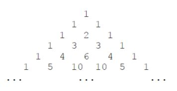

# 十二届蓝桥杯C++ B组

## A题：空间(5分)
小蓝准备用 256MB 的内存空间开一个数组，数组的每个元素都是 32 位二进制整数，如果不考虑程序占用的空间和维护内存需要的辅助空间，请问256MB 的空间可以存储多少个 32 位二进制整数？

解：256MB = 256 * 1024 * 1024 * 8 / 32 = 256 * 1024 * 1024 / 4 = 67108864
* 在cpp中直接算会溢出

## B题：卡片(5分)
小蓝有很多数字卡片，每张卡片上都是数字0到9。

小蓝准备用这些卡片来拼一些数，他想从1开始拼出正整数，每拼一个，就保存起来，卡片就不能用来拼其它数了。

小蓝想知道自己能从1拼到多少。例如，当小蓝有30张卡片，其中0到9各3张，则小蓝可以拼出1到10，但是拼11时卡片1已经只有一张了，不够拼出11。

现在小蓝手里有0到9的卡片各2021张，共20210张，请问小蓝可以从1拼到多少？

```cpp
#include<iostream>
using namespace std;
int a[10] = {0};
bool f(int x) {
    while(x) {
        int temp = x % 10;
        x /= 10;
        if(a[temp] > 0) {
            a[temp]--;
        } else {
            return false;
        }
    }
    return true;
}
int main() {
    for(int i = 0; i < 10; i++) {
        a[i] = 2021;
    }
    int cnt = 1;
    while(true) {
        if(f(cnt)) {
            cnt++;
        } else {
            break;
        }
    }
    cout<<cnt-1<<endl;
    return 0;
}
```
答案 3181

## C题：直线(10分)
在平面直角坐标系中，两点可以确定一条直线。如果有多点在一条直线上，那么这些点中任意两点确定的直线是同一条。

给定平面上2×3个整点{(x, y)|0 ≤ x < 2, 0 ≤ y < 3, x ∈ Z, y ∈ Z}，即横坐标是0到1(包含0和1)之间的整数、纵坐标是0到2(包含0和2)之间的整数的点。
这些点一共确定了11条不同的直线。

给定平面上20×21个整点{(x, y)|0 ≤ x < 20, 0 ≤ y < 21, x ∈ Z, y ∈ Z}，即横坐标是0到19(包含0和19)之间的整数、纵坐标是0到20(包含0和20)之间的整数的点。请问这些点一共确定了多少条不同的直线。

```cpp
#include<iostream>
#include<cstring>
#include<cmath>
#include<map>
#include<algorithm>
using namespace std;
typedef pair<double, double> PII;
PII l[200000];
int main() {
    int n = 0;
    for(int x1 = 0; x1 < 20; x1++) {
        for(int y1 = 0; y1 < 21; y1++) {
            for(int x2 = 0; x2 < 20; x2++) {
                for(int y2 = 0; y2 <21; y2++) {
                    if(x1 != x2) {
                        double k = (double) (y2 - y1) / (x2 - x1);
                        double b = y1 - k * x1;
                        l[n++] = {k, b};
                    }
                }
            }
        }
    }
    sort(l, l + n);
    int res = 21;
    for(int i = 1; i < n; i++) {
        if(fabs(l[i].first-l[i-1].first) > 1e-8 || fabs(l[i].second - l[i-1].second) > 1e-8) {
            res++;
        }
    }
    cout<<res<<endl;
    return 0;
}
```
答案：40257

## D题：货物摆放(10分)
小蓝有一个超大的仓库，可以摆放很多货物。

现在，小蓝有 n 箱货物要摆放在仓库，每箱货物都是规则的正方体。小蓝规定了长、宽、高三个互相垂直的方向，每箱货物的边都必须严格平行于长、宽、高。

小蓝希望所有的货物最终摆成一个大的立方体。即在长、宽、高的方向上分别堆 L、W、H 的货物，满足 n = L × W × H。

给定 n，请问有多少种堆放货物的方案满足要求。

例如，当 n = 4 时，有以下 6 种方案：1×1×4、1×2×2、1×4×1、2×1×2、 2 × 2 × 1、4 × 1 × 1。

请问，当 n = 2021041820210418 （注意有 16 位数字）时，总共有多少种方案？

```cpp
#include<iostream>
#include<vector>
using namespace std;
typedef long long ll;
vector<ll>num;
int main() {
    ll n = 2021041820210418;
    for(ll i = 1; i * i <= n; i++) {
        if(n % i == 0) {
            num.push_back(i);
            if(n / i != i) {
              num.push_back(n / i);
            }
        }
    }
    int res = 0;
    // int l = num.size();
    // for(int i = 0; i < l; i++) {
    //     for(int j = 0; j < l; j++) {
    //         for(int k = 0; k < l; k++) {
    //             if(num[i] * num[j] * num[k] == n) {
    //                 res++;
    //             }
    //         }
    //     }
    // }
    // for(vector<ll>::iterator i = num.begin(); i != num.end(); i++) {
    //     for(vector<ll>::iterator j = num.begin(); j != num.end(); j++) {
    //         for(vector<ll>::iterator k = num.begin(); k != num.end(); k++) {
    //             if((*i) * (*j) * (*k) == n ) {
    //                 res++;
    //             }
    //         }
    //     }
    // }
    for (auto a: num)
        for (auto b: num)
            for (auto c: num)
                if (a * b * c == n)
                    res ++;
    cout<<res<<endl;
    return 0;
}
```
答案： 2430

## E题：路径(15分)
小蓝学习了最短路径之后特别高兴，他定义了一个特别的图，希望找到图中的最短路径。

小蓝的图由 2021 个结点组成，依次编号 1 至 2021。

对于两个不同的结点 a, b，如果 a 和 b 的差的绝对值大于 21，则两个结点之间没有边相连；如果 a 和 b 的差的绝对值小于等于 21，则两个点之间有一条长度为 a 和 b 的最小公倍数的无向边相连。

例如：结点 1 和结点 23 之间没有边相连；结点 3 和结点 24 之间有一条无向边，长度为 24；结点 15 和结点 25 之间有一条无向边，长度为 75。

请计算，结点 1 和结点 2021 之间的最短路径长度是多少。

```cpp
#include<cstdio>
#include<cstring> // memset函数需要 不建议使用
#include<algorithm> // fill函数需要

using namespace std;

const int MAXV = 2025; // 最大顶点数
const int INF = 0x3f3f3f3f; // 本题不能用0x3fffffff 不知道为什么

int n = 2021, G[MAXV][MAXV]; // n顶点数 邻接矩阵表示图
int d[MAXV]; // 用于存放最短路径
bool visited[MAXV] = {false};

int gcd(int a, int b) {
    return !b ? a : gcd(b, a % b);
}

// 构造图
void initGraph() {
    fill(G[0], G[0] + MAXV * MAXV, INF);
    for (int i = 1; i <= n; i++)
        G[i][i] = 0;
    for (int i = 1; i <= n; i++) {
        for (int j = i + 1; j <= n && j <= i + 21; j++) {
            int w = i * j / gcd(i, j); // 最小公倍数
            G[i][j] = G[j][i] = w; // 无向图
        }
    }
}

void Dijkstra(int s) { // s为起点
    fill(d, d + MAXV, INF);
    d[s] = 0; // 起点到自身的距离为0
    for (int i = 1; i <= n; i++) {
        int u = -1, MIN = INF; // u使d[u]最小，MIN存放最小的d[u]
        for (int j = 1; j <= n; j++) { // 找到未访问的顶点中d[]最小的
            if (!visited[j] && d[j] < MIN) {
                u = j;
                MIN = d[j];
            }
        }
        if (u == -1) return;
        visited[u] = true;
        for (int v = 1; v <= n; v++) {
            // 如果v未访问 && u能到达v && 以u为中介点可使d[v]更优
            if (!visited[v] && G[u][v] != INF && d[u] + G[u][v] < d[v]) {
                d[v] = G[u][v] + d[u]; // 优化d[v]
            }
        }
    }
}

// 网上的方法
void Dijkstra2(int s) {
    memset(d, INF, sizeof(d));
    d[s] = 0;
    for (int i = 1; i <= n; i++) {
        int x = 0;
        for (int j = 1; j <= n; j++) {
            if (!visited[j] && d[j] < d[x]) {
                x = j;
            }
        }
        visited[x] = true;
        for (int j = max(1, x - 21); j <= min(n, x + 21); j++) {
            //剪值，只有这些点有边
            d[j] = min(d[j], d[x] + G[x][j]);
        }
    }
}

int main() {
    initGraph();
    Dijkstra(1);
//    Dijkstra2(1);
    printf("%d\n", d[n]);
    return 0;
}
```
答案：10266837

## F题：时间显示(15分)
时间限制：1.0s 内存限制：256.0MB

小蓝要和朋友合作开发一个时间显示的网站。在服务器上，朋友已经获取了当前的时间，用一个整数表示，值为从1970年1月1日00 : 00 : 00到当前时刻经过的毫秒数。

现在，小蓝要在客户端显示出这个时间。小蓝不用显示出年月日，只需要显示出时分秒即可，毫秒也不用显示，直接舍去即可。

给定一个用整数表示的时间，请将这个时间对应的时分秒输出。

【输入格式】

输入一行包含一个整数，表示时间。

【输出格式】

输出时分秒表示的当前时间，格式形如HH : MM : SS，其中HH表示时，值为0到23，MM表示分，值为0到59，SS表示秒，值为0到59。时、分、秒不足两位时补前导0。

【样例输入 1】
```
46800999
```
【样例输出 1】
```
13:00:00
```
【样例输入 2】
```
1618708103123
```
【样例输出 2】
```
01:08:23
```
【评测用例规模与约定】

对于所有评测用例，给定的时间为不超过10^18的正整数。

```cpp
#include <iostream>
#include <cstdio>
typedef long long ll;
using namespace std;
int main()
{
  ll n;
  cin >> n;
  n /= 1000; // 舍去毫秒 此时n的单位为秒
  int h = n / 3600 % 24; // 除3600后单位为小时，%24约掉前面的天数
  int m = n / 60 % 60; // 除60后单位为分钟，%60约掉前面的
  int s = n % 60;
  printf("%02d:%02d:%02d\n", h, m, s);
  return 0;
}
```
## G题：砝码称重(20分)
时间限制：1.0s 内存限制：256.0MB

【问题描述】
你有一架天平和 N 个砝码，这 N 个砝码重量依次是 W1, W2, · · · , WN。

请你计算一共可以称出多少种不同的重量？

注意砝码可以放在天平两边。

【输入格式】

输入的第一行包含一个整数 N。

第二行包含 N 个整数：W1, W2, W3, · · · , WN。

【输出格式】

输出一个整数代表答案。

【样例输入】
```
3
1 4 6
```
【样例输出】
```
10
```

【样例说明】

能称出的 10 种重量是：1、2、3、4、5、6、7、9、10、11。

1 = 1；

2 = 6 − 4 (天平一边放 6，另一边放 4)；

3 = 4 − 1；

4 = 4；

5 = 6 − 1；

6 = 6；

7 = 1 + 6；

9 = 4 + 6 − 1；

10 = 4 + 6；

11 = 1 + 4 + 6。

【评测用例规模与约定】

对于 50% 的评测用例，1 ≤ N ≤ 15。对于所有评测用例，1 ≤ N ≤ 100，N 个砝码总重不超过 100000。

```cpp
#include<cstdio>
#include<algorithm>

using namespace std;

// 砝码总重 相当于背包容量v
const int V = 100000;
int dp[V];
// 砝码最大数量 相当于物品数量n
int w[105];

int main() {
    int n;
    scanf("%d", &n);
    for (int i = 1; i <= n; i++) {
        scanf("%d", &w[i]);
    }
    fill(dp, dp + V, 0);
    dp[0] = 1;
    // 两次01背包
    // 第一遍 加砝码 第i个砝码与第i - 1 个砝码在同一侧 传统背包
    for (int i = 1; i <= n; i++) {
        for (int v = V; v >= w[i]; v--) {
            dp[v] = max(dp[v], dp[v - w[i]]);
        }
    }
    // 第二遍 减砝码 第i个砝码与第i - 1个砝码在另一侧
    // 如果已经加上了当前的砝码，则相当于把砝码拿下来
    // 如果没有加当前的砝码，则相当于把砝码放在天平另一边
    for (int i = 1; i <= n; i++) {
        int siz = V - w[i];
        for (int v = 1; v <= siz; v++) {
            dp[v] = max(dp[v], dp[v + w[i]]);
        }
    }
    int ans = 0;
    for (int i = 1; i <= V; i++) {
        ans += dp[i];
    }
    printf("%d\n", ans);
    return 0;
}
```

## H题：杨辉三角形(20分)

时间限制：1.0s 内存限制：256.0MB

下面的图形是著名的杨辉三角形：


【问题描述】

如果我们按从上到下、从左到右的顺序把所有数排成一列，可以得到如下数列：

1, 1, 1, 1, 2, 1, 1, 3, 3, 1, 1, 4, 6, 4, 1, …

给定一个正整数 N，请你输出数列中第一次出现 N 是在第几个数？

【输入格式】

输入一个整数 N。

【输出格式】

输出一个整数代表答案。

【样例输入】
```
6
```

【样例输出】
```
13
```

【评测用例规模与约定】
对于 20% 的评测用例，1 ≤ N ≤ 10；对于所有评测用例，1 ≤ N ≤ 1000000000。


思路：
* 第一个数为第零行第零列，则第i行j列为组合数C(i,j)

* 发现杨辉三角是对称的，所以n最早出现的位置一定在左半边

* 第i行最大的数为C(i/2,i)，在最中间


* 第1斜行的1=C（0,0），第二斜行的2=C（2,1），第三斜行的6=C（4,2）...第 i 斜行的第一个数为C（2*i，i），同时它是该斜行中最小的数字


* 显然C（32,16）< 1e9，而C（34,17）> 1e9，因此我们可以对前17行进行枚举

* 杨辉三角前n行共有n*(n+1)/2个数

[参考链接](https://blog.csdn.net/weixin_44091134/article/details/116748883)

```cpp
#include<iostream>
#include<cstring>
#include<algorithm>

using namespace std;
typedef LL = long long;
int n;

LL C(LL a, LL b) { // 计算组合数C(a，b)
    LL res = 1;
    for(int i = a, j = 1; j <= b; j++, i--) {
        res = res * i / j;
        if(res > n) {
            return res; // 大于n已无意义，且防止爆LL
        }
    }
    return res;
}

bool check(int k) {
    // k指斜行数 从17递减遍历 全是1的那一行记作第零斜行
    // 二分该斜行,找到大于等于该值的第一个数
    // 左边界2k，右边界为max(l, n)取二者最大，避免右边界小于左边界
    int l = 2 * k, r = max(n, l);
    // 二分查找 边界是怎么定的
    // 此处C(r,k)指正常意义第r+1行第k+1个数
    while(l < r) {
        // >> 1 二进制右移一位 相当于除以2 优先级比加减低
        int mid = l + r >> 1;
        if(C(mid, k) >= n) r = mid;
        else l = mid + 1;
    }
    if(C(r, k) != n) {
        return false;
    }
    // 前n行共有n*(n+1)/2个数,加上第r+1行的k+1个数
    cout << 1ll * (r + 1) * r / 2 + k + 1 << endl;
    return true;
}

int main()
{
    cin >> n;
    int k = 17;
    while(k--) {
        if(check(k)) break;
    }
    return 0;
}
```

# 十一届蓝桥杯C++ B组 省赛 第一场

## A题：跑步训练(5分)

【问题描述】

小明要做一个跑步训练。

初始时，小明充满体力，体力值计为 10000 。如果小明跑步，每分钟损耗 600 的体力。如果小明休息，每分钟增加 300 的体力。体力的损耗和增加都是均匀变化的。

小明打算跑一分钟、休息一分钟、再跑一分钟、再休息一分钟……如此循环。如果某个时刻小明的体力到达 0 ，他就停止锻炼。

请问小明在多久后停止锻炼。为了使答案为整数，请以秒为单位输出答案。答案中只填写数，不填写单位。

```cpp
#include<cstdio>

int slove(int n) {
    int miu, sec;
    for (int i = 0; ; i++) {
        if (i % 2 == 0) { // 跑
			if (n > 600) {
                n -= 600;
			} else { // 体力不足跑完一分钟
				miu = i;
				sec = n / 10;
				break;
			}
		} else { // 休息
			n += 300;
		}
	}
	return (miu * 60 + sec);	
}
int main() {
    printf("%d\n", slove(10000));
    return 0;
}
```

## B题：纪念日(5分)

【问题描述】

2020 年 7 月 1 日是中国共产党成立 99 周年纪念日。

中国共产党成立于 1921 年 7 月 23 日。

请问从 1921 年 7 月 23 日中午 12 时到 2020 年 7 月 1 日中午 12 时一共包
含多少分钟？

【答案提交】

这是一道结果填空题，你只需要算出结果后提交即可。本题的结果为一个整数，在提交答案时只填写这个整数，填写多余的内容将无法得分。

